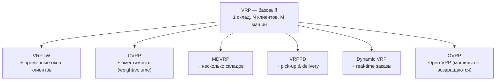
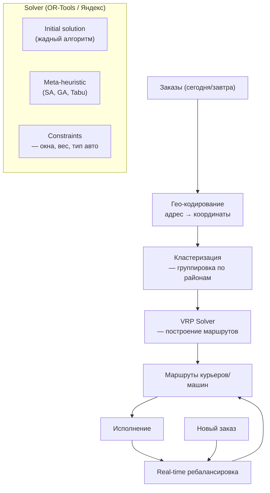

:::info[TL;DR]
Маршрутизация — построение оптимальных маршрутов для курьеров/транспорта с учётом временных окон (VRPTW), загрузки (CVRP), пробок и ограничений. Классическая задача VRP (Vehicle Routing Problem) на практике: кластеризация заказов → построение маршрута (solver) → ребалансировка в реальном времени (dynamic VRP). Аналитик описывает бизнес-ограничения (вес, объём, время, тип авто), выбирает solver (OR-Tools, Routific, Яндекс.Маршрутизация) и проектирует метрики (on-time rate, fill rate, cost per delivery).
:::

## Для кого эта статья

Senior SA, работающий над оптимизацией маршрутов. После прочтения вы:

- Поймёте VRP и его вариации (VRPTW, CVRP, MDVRP, VRPPD, Dynamic VRP)
- Узнаете архитектуру маршрутизации: кластеризация → solver → ребалансировка
- Сможете выбирать solver под задачу (OR-Tools vs коммерческие)
- Поймёте метрики маршрутизации и их влияние на cost per delivery

## 1. VRP — Vehicle Routing Problem

### 1.1 Классические вариации



| Вариант | Ограничение | Пример применения |
|---------|------------|-------------------|
| **VRP** | Базовый маршрут, 1 депо | Доставка товаров по магазинам |
| **VRPTW** | Временные окна клиентов | Последняя миля (слот 10:00-12:00) |
| **CVRP** | Max вес/объём на машину | Фуры (max 20 т, 82 м³) |
| **MDVRP** | Несколько точек выезда | Сеть складов и ПВЗ |
| **VRPPD** | Pick-up + Delivery (забрать и отвезти) | Курьер забирает возврат и везёт на склад |
| **Dynamic VRP** | Заказы добавляются в реальном времени | Яндекс.Доставка, такси |
| **OVRP** | Машины не возвращаются в депо | Почтальоны, полевые работники |

### 1.2 Math behind VRP

```
Минимизировать: Σ distance(route_i) + Σ penalty(time_window_violation)
Subject to:
  — Каждый клиент обслуживается 1 раз
  — Вместимость машины не превышена
  — Временные окна соблюдены (VRPTW)
  — Все маршруты начинаются и заканчиваются в депо (кроме OVRP)

Complexity: NP-hard (не решается точно для > 100 точек)
На практике: эвристики, ML, meta-heuristics (Simulated Annealing, Genetic Algorithm)
```

## 2. Архитектура маршрутизации



### 2.1 Кластеризация заказов

Первый шаг — группировка заказов по районам/кластерам:

| Метод кластеризации | Описание | Скорость | Точность |
|--------------------|----------|----------|----------|
| **Geo-квадраты** | Разбить карту на квадраты 500×500 м | Очень быстрый | Грубая |
| **K-Means на координатах** | K ближайших точек | Быстрый | Средняя |
| **DBSCAN** | Плотностная кластеризация | Средний | Хорошая |
| **H3 (Uber)** | Иерархическая гексагональная сетка | Быстрый | Хорошая |
| **ML-кластеризация** | Учитывает исторические паттерны | Медленный | Лучшая |

**Uber H3:** Open-source библиотека для гексагональной кластеризации. Масштаб: Uber использует для маршрутизации 5M+ поездок/день.

### 2.2 Solvers

| Solver | Open Source | Язык | VRP support | Масштаб | Пример |
|--------|-------------|------|-------------|---------|--------|
| **OR-Tools (Google)** | ✅ | Python, C++, Java, C# | VRPTW, CVRP, PDP | < 500 точек | Google Maps Routing |
| **Jan VRPSolver** | ✅ | C++ | VRP + ML | < 1000 точек | Академический |
| **OptaPlanner** | ✅ | Java | VRPTW, CVRP | < 1000 точек | Red Hat |
| **Routific** | ❌ (SaaS) | REST API | VRP + Dynamic | Enterprise | Логистика |
| **Яндекс.Маршрутизация** | ❌ (SaaS) | REST API | VRP + RT + Пробки | Enterprise | Яндекс.Доставка |
| **Locus Dispatch** | ❌ | REST API | VRP + Real-time | Enterprise | Amazon Flex |

**OR-Tools vs Яндекс.Маршрутизация:**

| Параметр | OR-Tools | Яндекс.Маршрутизация |
|----------|----------|---------------------|
| **Cost** | Free | Per request |
| **Точность** | Хорошая | Отличная (+ пробки) |
| **Real-time** | Нет (batch) | Да (ребалансировка) |
| **Пробки** | Нет (можно добавить) | Да (Яндекс.Пробки) |
| **Сложность внедрения** | Высокая (ML/OR) | Низкая (API) |
| **Когда выбрать** | Локальная оптимизация | Продакшн (e-commerce) |

## 3. Практика: ограничения маршрутизации

| Ограничение | Тип | Пример |
|-------------|-----|--------|
| **Временные окна** | VRPTW | Слот 10:00-12:00 |
| **Вместимость** | CVRP | Фура: 20 т, 82 м³ |
| **Тип авто** | Зависит | Рефрижератор (-18°C) |
| **Дорожные условия** | Real-time | Пробки: +30 мин |
| **Режим труда** | Hard | Курьер работает 8h, перерыв 30 мин |
| **Приоритеты клиентов** | Soft | VIP-клиент → первым |
| **Время на вручение** | Service time | 5 мин на клиента |
| **Интервал между точками** | Service window | Минимум 10 мин |

## 4. Real-time ребалансировка

**Проблема:** В течение дня поступают новые заказы. Перестраивать все маршруты заново — дорого (CPU) и нестабильно (курьеры получают новый маршрут каждые 5 мин).

**Решение двухуровневое:**

```
Level 1: Batch planning (ночью)
— Все заказы со слотом "завтра"
— Строим baseline маршруты (OR-Tools)

Level 2: Real-time rebalancing (днём)
— Новый заказ → ближайший курьер с fill rate < 90% и временем
— Insertion heuristic: "втиснуть" заказ в существующий маршрут
— Если не влезает → переназначение (swap между курьерами)
— Если некуда → новый курьер (Dynamic VRP)
```

**Алгоритм вставки (Insertion Heuristic):**

```
For each existing route:
    For each position in route:
        cost = new_distance - old_distance + penalty(window_violation)
        if cost < best_cost:
            best_route = route
            best_position = position
Insert at best_position in best_route
```

## 5. Метрики маршрутизации

| Метрика | Формула | Хорошо | Плохо |
|---------|---------|--------|-------|
| **On-time delivery rate** | delivered_in_slot / total | > 95% | < 85% |
| **Fill rate** | actual_load / capacity | > 85% | < 60% |
| **Cost per delivery** | total_cost / deliveries | $1-5 | > $10 |
| **Empty runs** | empty_km / total_km | < 10% | > 30% |
| **Total driving distance** | sum of all routes | Min | Max |
| **Stops per route** | deliveries / route | 15-25 | < 10 |
| **Utilisation** | active_time / total_shift | > 70% | < 50% |
| **Solution time** | time to compute | < 5 min (1000 points) | > 30 min |

## 6. Практический кейс: OR-Tools для оптимизации доставки

**Проблема:** Служба доставки (100 курьеров, 2000 заказов/день). Маршруты строятся вручную (логист распределяет по районам). Fill rate — 55%, on-time rate — 78%.

**Решение:** Внедрение OR-Tools VRP solver:

```
1. Гео-кодирование: все адреса → координаты
2. Кластеризация: H3 grid, level 8 (≈ 0.5 км²)
3. VRP solver (OR-Tools Python):
   - VRPTW: временные окна 10-14, 14-18, 18-22
   - CVRP: курьер = 50 кг, 0.5 м³
   - Meta-heuristic: Simulated Annealing
   - Time limit: 30 sec на batch
4. Real-time: простой insertion heuristic (Python microservice)
5. Выгрузка: REST API → приложение курьера (маршрут на карте)
```

**Роль аналитика:**
- Описал ограничения (вес, объём, окна, тип авто)
- Выбрал solver (OR-Tools — бесплатно, но нужен ML-инженер)
- Специфицировал API: input (заказы + ограничения) → output (маршруты с координатами)
- Согласовал SLA solver: < 30 sec на 500 точек

**Результат:**
- Fill rate: 55% → 82%
- On-time rate: 78% → 94%
- Cost per delivery: -18%
- Empty runs: 28% → 8%
- Manual work: 3 логиста → 1 (только exceptions)

## Ссылки для самостоятельного изучения

| Ресурс | Описание | Ссылка |
|--------|----------|--------|
| Google OR-Tools | Open-source VRP solver | https://developers.google.com/optimization/routing |
| Яндекс.Маршрутизация API | API для оптимизации маршрутов | https://yandex.ru/dev/routing/ |
| Routific | SaaS VRP solver | https://routific.com/ |
| OptaPlanner | Java VRP solver | https://www.optaplanner.org/ |
| Uber H3 | Hexagonal grid clustering | https://h3geo.org/ |
| VRP Guide (Stanford) | Детальное введение в VRP | https://web.stanford.edu/class/msande296/ |
| Dynamic VRP Survey | Обзор методов Dynamic VRP | https://www.sciencedirect.com/topics/engineering/vehicle-routing-problem |
| Locus Dispatch | Amazon маршрутизация | https://locusrobotics.com/ |

## Проверь себя

1. **Какие вариации VRP существуют?**
   *Ответ:* VRP (базовый), VRPTW (+временные окна), CVRP (+вместимость), MDVRP (+несколько складов), VRPPD (+pick-up и delivery), Dynamic VRP (+real-time), OVRP (машины не возвращаются). NP-hard — решается эвристиками.

2. **Как устроена архитектура маршрутизации?**
   *Ответ:* Гео-кодирование → Кластеризация (H3, K-Means, DBSCAN) → VRP Solver (OR-Tools, Яндекс) → Маршруты → Исполнение → Real-time ребалансировка (Insertion Heuristic).

3. **Чем OR-Tools отличается от Яндекс.Маршрутизации?**
   *Ответ:* OR-Tools — open-source, бесплатно, batch-only, нет пробок, сложное внедрение. Яндекс.Маршрутизация — SaaS, дороже, real-time, учитывает пробки, простое API. Выбор: если бюджет ограничен и есть ML-инженеры → OR-Tools. Если e-commerce с real-time → Яндекс.

4. **Как работает real-time ребалансировка?**
   *Ответ:* Новый заказ → Insertion Heuristic (вставить в существующий маршрут с минимальным приростом distance). Если не влезает → swap между курьерами. Если никуда → новый курьер. Двухуровнево: batch planning (ночью) + real-time (днём).

5. **Какие бизнес-ограничения учитывает маршрутизация?**
   *Ответ:* Твёрдые: временные окна (слоты), вместимость (вес/объём), тип авто (рефрижератор), режим труда (8h, перерыв), дорожные условия (пробки). Мягкие: приоритеты клиентов (VIP), интервал между точками (10 мин). Каждое ограничение — penalty в cost function solver.
