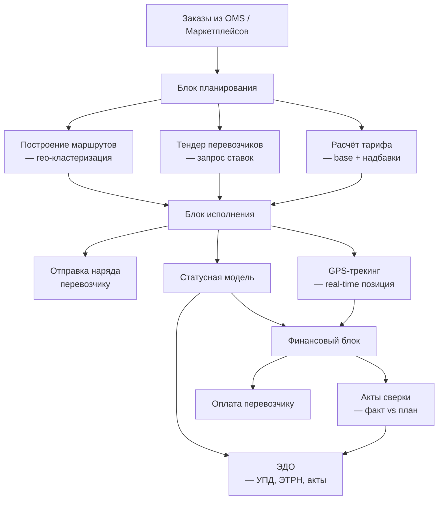
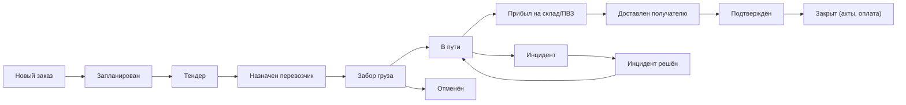
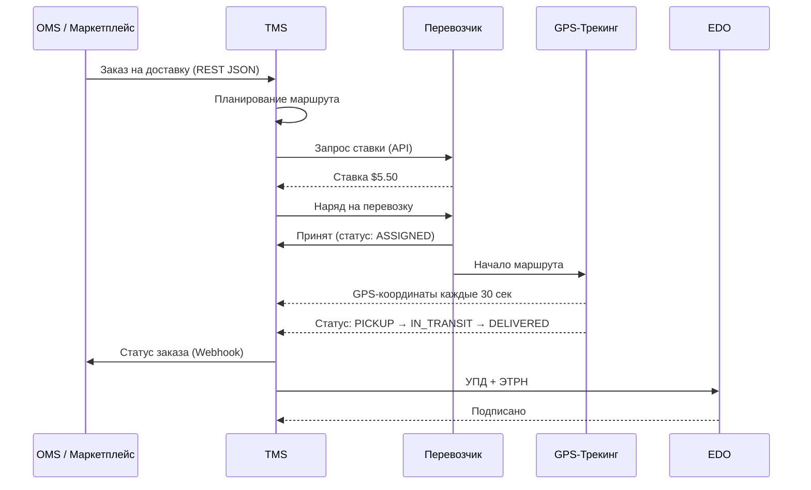

:::info[TL;DR]
TMS (Transportation Management System) — система управления перевозками. Покрывает: планирование маршрутов, выбор перевозчика (тендеры), расчёт тарифов (базовый rate + надбавки), отслеживание доставки (GPS-трекинг), ЭДО и взаиморасчёты. Аналитик проектирует статусную модель перевозки, интеграции с перевозчиками (через API/SOAP), тарифные схемы и SLA-контроль. Примеры TMS: SAP TM, Oracle OTM, Яндекс.Маршрутизация, 1С:TMS. Рынок: $5B+ глобально для TMS-систем.
:::

## Для кого эта статья

Middle SA, проектирующий систему перевозок. После прочтения вы:

- Поймёте модули TMS: планирование, тендеры, тарифы, исполнение, финансы, ЭДО
- Узнаете статусную модель перевозки и lifecycle заказа
- Сможете проектировать тарифные схемы и интеграции с перевозчиками
- Поймёте метрики TMS: on-time rate, cost per delivery, carrier score

## 1. Архитектура TMS



### 1.1 Модули TMS

| Модуль | Функция | Пример реализации |
|--------|---------|-------------------|
| **Планирование** | Построение маршрутов, расписание, объединение заказов | Кластеризация по районам, VRP-solver |
| **Тендеры** | Запрос ставок у перевозчиков, выбор победителя | Аукцион (цена + качество + срок) |
| **Тарифы** | Расчёт стоимости перевозки: base + надбавки | Weight/volume/distance matrix |
| **Исполнение** | Отправка наряда, трекинг, статусы, инциденты | Real-time GPS + статусная модель |
| **Финансы** | Акты сверки, расчёты с перевозчиком, P&L | План vs факт, штрафы за опоздание |
| **ЭДО** | Обмен УПД, ЭТРН, счетами-фактурами | Через операторов (Диадок, СБИС) |

## 2. Статусная модель перевозки



**Типы инцидентов:**

| Инцидент | SLA | Действие |
|----------|-----|----------|
| **Опоздание забора** | > 1 час от плана | Переключить перевозчика |
| **Опоздание доставки** | > слот ± 30 мин | Компенсация клиенту |
| **Повреждение груза** | Любое | Акт, фотофиксация |
| **Потеря груза** | Любое | Розыск + страховой случай |
| **Смена курьера** | > 30 мин | Уведомление клиента |

## 3. Тарифы в TMS

Тарифы — один из самых сложных доменов. Базовая структура:

```
Итоговая стоимость = Base Rate + Surcharges - Discount

Base Rate:
— Зависит от: вес, объём, расстояние, тип груза
— Матрица: вес_брекет × расстояние_брекет

Surcharges (надбавки):
— Срочность (express × 2.0)
— Этажность (lift needed + $5)
— Регион (Камчатка × 3.0)
— Время суток (ночная × 1.5)
— Терминальная обработка (cross-dock)
— Страхование (% от стоимости)

Discounts:
— Объём (от 100 заказов/мес)
— Постоянный клиент
— Предоплата
```

**Пример расчёта:**

| Параметр | Значение |
|----------|----------|
| Заказ | 5 кг, 10×10×20 см, Москва → Казань |
| Base rate | $3.00 (weight: 2-5 kg × distance: 800 km) |
| Express surcharge | × 2.0 |
| Lift surcharge | + $1.00 |
| Volume discount (500 orders/month) | -10% |
| **Итого** | ($3.00 × 2.0 + $1.00) × 0.9 = **$6.30** |

## 4. Интеграции TMS



### Типовые API перевозчиков

| Перевозчик | API | Формат | Особенность |
|-----------|-----|--------|-------------|
| **СДЭК** | REST v2 | JSON | Трекинг, ПВЗ, расчёт стоимости, создание заказа |
| **Boxberry** | REST | JSON/XML | Кассеты (группировка заказов), ПВЗ |
| **5Post** | REST | JSON | Магазины Пятёрочка как ПВЗ |
| **Почта России** | REST + SOAP | JSON/XML | 1 класс, EMS, посылки, отслеживание |
| **Яндекс.Доставка** | REST | JSON | Маршрутизация, трекинг, назначение курьера |
| **DPD** | SOAP | XML | Расчёт, заказ, накладная |

## 5. Метрики TMS

| Метрика | Формула | Норма | Описание |
|---------|---------|-------|----------|
| **On-time delivery** | delivered_on_time / total × 100% | > 95% | % доставок в срок |
| **Cost per delivery** | total_transport_cost / deliveries | Зависит | Средняя стоимость доставки |
| **Fill rate** | actual_load / capacity × 100% | > 80% | Загрузка транспорта |
| **Carrier score** | on_time × 0.5 + cost × 0.3 + quality × 0.2 | > 80/100 | Рейтинг перевозчика |
| **Transit time** | delivery_time - pickup_time | Зависит | Среднее время в пути |
| **Retry rate** | failed_deliveries / total × 100% | < 5% | Неудачные попытки |
| **Cost variance** | (actual_cost - planned_cost) / planned_cost | < 10% | Отклонение бюджета |

## 6. Практический кейс: Яндекс.Маршрутизация

**Проблема:** E-commerce платформа (1M+ заказов/день) — курьеры ездят по неоптимальным маршрутам, низкий fill rate, частые опоздания.

**Решение:** Внедрение Яндекс.Маршрутизации как TMS-оптимизатора:

```
1. API принимает заказы: адрес, вес, временное окно, тип груза
2. VRP-оптимизатор строит маршруты для 500+ курьеров
3. Учитывает: пробки (Яндекс.Пробки), тип авто, время на вручение
4. Real-time ребалансировка: новый заказ → ближайший курьер
5. Курьер получает маршрут в мобильном приложении
6. GPS-трекинг и ETA для клиента
```

**Результат:**
- Fill rate: +25% (65% → 90%)
- On-time rate: +15% (80% → 95%)
- Cost per delivery: -20%
- Retry rate: -5% (10% → 5%)
- Внедрение: 6 месяцев

**Что сделал аналитик:**
- Описал статусную модель и SLA (слоты ±15 мин)
- Специфицировал API интеграции с Яндекс.Маршрутизацией
- Согласовал тарифную матрицу с перевозчиками
- Спроектировал дашборд для контроля on-time rate и cost per delivery

## Ссылки для самостоятельного изучения

| Ресурс | Описание | Ссылка |
|--------|----------|--------|
| SAP TM Help | Документация SAP Transportation Management | https://help.sap.com/docs/SAP_TRANSPORTATION_MANAGEMENT |
| Oracle OTM | Oracle Transportation Management overview | https://www.oracle.com/scm/logistics/transportation-management/ |
| Яндекс.Маршрутизация API | API optimiser | https://yandex.ru/dev/routing/ |
| СДЭК API v2 | REST API интеграции | https://api.cdek.ru/v2/swagger/ |
| Boxberry API | Документация для интеграторов | https://boxberry.ru/business/dlya-integratorov |
| OR-Tools Google | Open-source VRP solver | https://developers.google.com/optimization/routing |
| 1С:TMS | TMS от 1С | https://solutions.1c.ru/catalog/tms/features |
| TMS vs WMS | Разница между TMS и WMS | https://www.logisticsbureau.com/tms-vs-wms/ |

## Проверь себя

1. **Какие модули входят в TMS?**
   *Ответ:* Планирование (маршруты, кластеризация), тендеры перевозчиков, тарифы (base + surcharges), исполнение (наряды, трекинг, статусы), финансы (акты, оплата), ЭДО (УПД, ЭТРН).

2. **Как TMS интегрируется с перевозчиками?**
   *Ответ:* Через REST API (JSON) или SOAP (XML): запрос ставок → создание заказа → трекинг (GPS) → получение статусов → ЭДО. Каждый перевозчик имеет свой API, нужна интеграционная шина с адаптерами.

3. **Как рассчитывается тариф в TMS?**
   *Ответ:* Base rate (матрица вес × расстояние) + надбавки (срочность × 2.0, этажность, регион, ночное время, страхование) - скидки (объём, лояльность). Важно: тарифы сильно отличаются по перевозчикам и регионам.

4. **Какие метрики важны для TMS?**
   *Ответ:* On-time delivery rate (> 95%), Cost per delivery, Fill rate (> 80%), Carrier score (on_time + cost + quality), Transit time, Retry rate (< 5%), Cost variance.

5. **Что делать при инциденте в перевозке?**
   *Ответ:* Статус ISSUE → оповещение ЛПР и клиента → фотофиксация → поиск решения (замена курьера, повторная доставка, компенсация) → RESOLVED → IN_TRANSIT. Типы: опоздание забора, опоздание доставки, повреждение, потеря, смена курьера.
