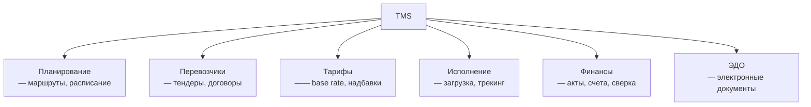
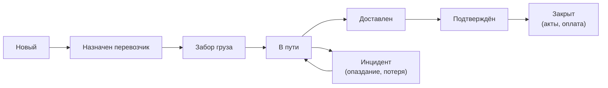

:::info[TL;DR]
TMS (Transportation Management System) — система управления перевозками. Покрывает: планирование маршрутов, выбор перевозчика, расчёт тарифов, отслеживание доставки, ЭДО и взаиморасчёты. Аналитик проектирует статусную модель заказа, интеграции с перевозчиками и тарифные схемы.
:::

## Модули TMS

## Статусная модель заказа перевозки

## Интеграции TMS

| С кем | Что передаётся |
|-------|---------------|
| **OMS / Маркетплейс** | Заказы на доставку |
| **WMS** | Готовые к отгрузке заказы |
| **Перевозчики** | API: ставки, трекинг, документы |
| **Курьерские службы** | Заказы последней мили |
| **ЭДО** | УПД, акты, счета-фактуры |

## Что дальше

- [Маршрутизация и оптимизация](/docs/specialization/logistics-routing)
- [ЭДО в логистике](/docs/specialization/logistics-edo)

## Проверь себя

1. **Какие модули входят в TMS?**
   *Ответ:* Планирование, перевозчики, тарифы, исполнение, финансы, ЭДО.

2. **Как TMS интегрируется с перевозчиками?**
   *Ответ:* Через API: ставки, трекинг-статусы, электронные документы.
