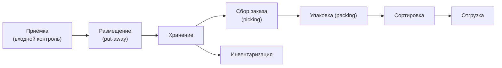

:::info[TL;DR]
WMS (Warehouse Management System) управляет складом: приёмка, размещение, хранение, сборка (pick/pack), отгрузка и инвентаризация. Ключевое для аналитика: типы складов (FBO, FBS, DBS), зоны склада, статусы товара и интеграции с TMS/OMS.
:::

## Процессы склада

## Типы складов в e-commerce

| Тип | Описание | WMS особенность |
|-----|----------|-----------------|
| **FBO** | Товар на складе маркетплейса | Полный цикл WMS + сортировка |
| **FBS** | Товар у продавца, доставка силами МП | Отгрузка паллетами |
| **DBS** | Продавец хранит и доставляет сам | Минимум WMS |
| **Кросс-док** | Товар не хранится, транзит | Нет хранения, только сортировка |

## Зоны склада

| Зона | Описание |
|------|----------|
| **Приёмка** | Разгрузка, проверка, штрихкодирование |
| **Основное хранение** | Паллетные стеллажи, адресное хранение |
| **Зона сборки** | Комплектация заказов |
| **Зона упаковки** | Packing stations, коробы, стрейч |
| **Экспедиция** | Сортировка по маршрутам |
| **Возвраты** | Реверс-логистика |

## Что дальше

- [Доставка последней мили](/docs/specialization/logistics-last-mile)
- [Интеграции с маркетплейсами и курьерами](/docs/specialization/logistics-integrations)

## Проверь себя

1. **Какие зоны есть на складе?**
   *Ответ:* Приёмка, хранение, сборка, упаковка, экспедиция, возвраты.

2. **Чем FBO отличается от FBS?**
   *Ответ:* FBO — товар на складе маркетплейса (полный WMS), FBS — у продавца, доставка силами МП.
