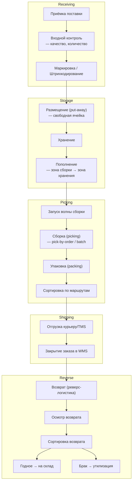
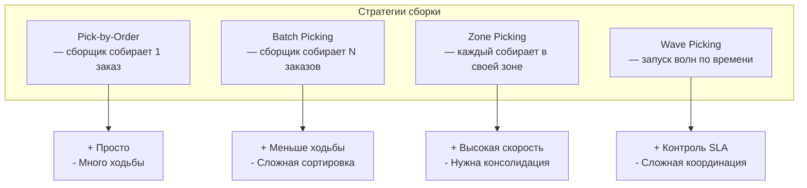
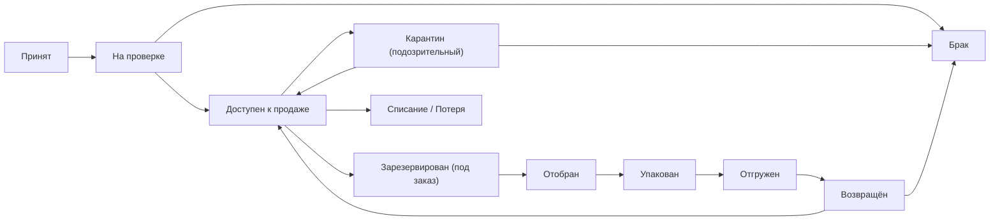

:::info[TL;DR]
WMS (Warehouse Management System) — информационная система управления складом: приёмка, размещение (put-away), хранение, сборка (pick/pack), сортировка, отгрузка и инвентаризация. E-commerce склад обрабатывает 100K+ заказов/день с точностью > 99.9%. Ключевое для аналитика: типы складов (FBO, FBS, DBS, кросс-док), зоны склада, статусы товара, интеграции с TMS/OMS. Примеры WMS: Manhattan, SAP EWM, Solvo, 1C:WMS, Korber.
:::

## Для кого эта статья

Middle SA, работающий со складскими процессами. После прочтения вы:

- Поймёте процессы склада: от приёмки до отгрузки
- Узнаете стратегии сборки (pick-by-order, batch, zone, wave) и их trade-off
- Сможете проектировать статусную модель товара и типы зон хранения
- Поймёте метрики WMS: pick rate, inventory accuracy, cycle time

## 1. Процессы склада



## 2. Типы складов в e-commerce

| Тип | Владелец товара | Описание | WMS особенность |
|-----|----------------|----------|-----------------|
| **FBO** (Fullfillment by Operator) | Маркетплейс | Товар на складе маркетплейса, полный цикл WMS | Полная интеграция WMS с OMS маркетплейса |
| **FBS** (Fullfillment by Seller) | Продавец | Товар у продавца, доставка силами маркетплейса | Отгрузка паллетами в сортировочный центр |
| **DBS** (Delivery by Seller) | Продавец | Продавец хранит и доставляет сам | Минимальный WMS (только учёт) |
| **Кросс-док** | Нет хранения | Транзит: приёмка → сортировка → отгрузка за < 24ч | Нет зоны хранения, только сортировка |
| **СЦ (Сортировочный центр)** | Маркетплейс | Сортировка заказов между складами и ПВЗ | Конвейер + сортировочные линии |

**Пример:** Wildberries FBO — 2M+ м² складов, 100K+ заказов/день, WMS на Manhattan Associates. Ozon — 1M+ м², собственная WMS + коробочные решения.

## 3. Зоны склада

| Зона | Назначение | Технологии |
|------|-----------|-----------|
| **Приёмка** | Разгрузка, проверка, штрихкодирование | Dock door назначение, ASN (Advanced Ship Notice) |
| **Основное хранение** | Паллетные стеллажи, адресное хранение | Адрес: Aisle-Bay-Level-Position → A-12-3-4 |
| **Зона сборки (pick face)** | Быстрый доступ к товарам (Front-pick) | Flow rack, carton flow |
| **Зона упаковки** | Packing stations, короба, стрейч-плёнка | Автоматическая упаковка (CVP Everest) |
| **Экспедиция** | Сортировка по маршрутам, загрузка | Сканеры, конвейер, dock назначение |
| **Возвраты** | Осмотр, сортировка возврата | Реверс-логистика, фотофиксация |

### Технологии адресного хранения

```
Формат адреса ячейки:
AA-BB-CC-DD
AA = Aisle (ряд), BB = Bay (секция), CC = Level (уровень), DD = Position (позиция)

Пример: A-12-3-4 → Ряд A, Бей 12, Уровень 3, Позиция 4

Типы ячеек:
1. Паллетное место (pallet location) — 1200×800 мм, 1.5 т
2. Полочное место (shelf location) — маленькие товары
3. Напольное место (floor location) — крупногабарит (холодильники)
4. Опасные грузы (hazmat location) — изолированная зона
```

## 4. Стратегии сборки (picking)



| Стратегия | Speed (order/hour) | Accuracy | Когда использовать |
|-----------|-------------------|----------|-------------------|
| **Pick-by-Order** | 50-80 | 99.9% | Мало заказов, крупные (1-2 товара) |
| **Batch Picking** | 100-150 | 99.5% | 3-5 товаров/заказ, похожие зоны |
| **Zone Picking** | 150-300 | 99.8% | Большие склады, 10+ зон |
| **Wave Picking** | 200-400 | 99.7% | SLA-контроль (утренняя/вечерняя волна) |
| **Voice Picking** | +15% vs scan | 99.9% | Handsfree, холодные склады |
| **Pick-by-Light** | +30% vs scan | 99.95% | Высокоскоростные зоны |

**Практический совет:** Для e-commerce склада (Wildberries, Ozon) — Zone + Wave. Zone разбивает склад на зоны (электроника, одежда, крупногабарит), Wave контролирует SLA (утренняя/дневная/вечерняя волна).

## 5. Статусная модель товара в WMS



**ABC-анализ товаров на складе:**

| Категория | % SKU | % оборота | Размещение |
|-----------|-------|-----------|-----------|
| **A** (хиты) | 10% | 70% | Ближе к сборке (pick face) |
| **B** (средние) | 25% | 25% | Средний уровень |
| **C** (остальные) | 65% | 5% | Дальние стеллажи, высокие уровни |

ABC-анализ определяет размещение: A-товары у pick face, C-товары на верхних ярусах. Экономия времени сборки: до 40%.

## 6. Интеграции WMS

| Система | Что передаётся | Протокол |
|---------|---------------|----------|
| **OMS / Маркетплейс** | Заказы на сборку, статусы заказа | REST API / Kafka |
| **TMS** | Готовые к отгрузке, трек-номера | REST API / MQ |
| **ERP** | Остатки, поступления, себестоимость | REST / SOAP / EDI |
| **E-Commerce (сайт)** | Остатки в реальном времени | REST API (low latency) |
| **Складское оборудование** | Задания на терминалы ТСД | MQTT / WebSocket |
| **Курьер** | Накладные, трекинг | REST / Webhook |

## 7. Метрики WMS

| Метрика | Формула | Хорошо | Плохо |
|---------|---------|--------|-------|
| **Inventory accuracy** | correct_count / total_sku | > 99.9% | < 99% |
| **Pick rate (lines/hour)** | picked_lines / hours | > 200 | < 100 |
| **Order cycle time** | receipt → shipped | < 4 hours | > 12 hours |
| **On-time ship rate** | shipped_on_time / total | > 99% | < 95% |
| **Put-away time** | receive → available | < 2 hours | > 6 hours |
| **Return processing** | returned → reshelved | < 24 hours | > 72 hours |
| **Damage rate** | damaged / total | < 0.3% | > 1% |
| **Capacity utilisation** | used / total capacity | 70-85% | > 95% (crowded) |

## 8. Практический кейс: Внедрение WMS для e-commerce склада

**Проблема:** Склад 50K м², 500K SKU, 20K заказов/день. Pick rate — 80 lines/hour, accuracy — 98%. Частые ошибки сборки (2%), возвраты растут.

**Решение:** Внедрение WMS (Solvo) с Voice Picking + Zone Picking:

```
1. Адресное хранение: A-B-C анализ, переразмещение A-товаров ближе к pick face
2. Voice picking: сборщик получает голосовые команды (handsfree)
3. Zone picking: 4 зоны (электроника, одежда, книги, крупногабарит)
4. Wave picking: 3 волны/день (10:00, 14:00, 18:00)
5. Batch picking: до 5 заказов за один проход
6. Real-time остатки: интеграция WMS → OMS (каждые 5 мин)
```

**Роль аналитика:**
- Специфицировал статусную модель товара и ABC-анализ
- Описал процесс Voice Picking (интеграция с голосовым движком)
- Согласовал зоны склада с операционным директором
- Спроектировал интеграцию WMS → TMS → Курьер

**Результат:**
- Pick rate: 80 → 240 lines/hour (+200%)
- Accuracy: 98% → 99.8% (ошибки в 10× меньше)
- Order cycle time: 8h → 3h
- Return rate: 2% → 0.8%
- Cost per order: -35%

## Ссылки для самостоятельного изучения

| Ресурс | Описание | Ссылка |
|--------|----------|--------|
| Manhattan Associates WMS | Ведущая WMS для e-commerce | https://www.manh.com/ |
| SAP EWM | Extended Warehouse Management | https://www.sap.com/products/ewm.html |
| Solvo WMS | Российская WMS | https://solvo.ru/ |
| 1C:WMS | WMS от 1С | https://solutions.1c.ru/catalog/wms |
| WMS vs ERP | Разница WMS и ERP | https://www.logisticsbureau.com/wms-vs-erp/ |
| ABC Analysis in WMS | Методика ABC-анализа на складе | https://www.logisticsbureau.com/abc-analysis/ |
| Voice Picking Guide | Голосовая сборка | https://www.vocollect.com/ |
| RFID в WMS | RFID для инвентаризации | https://www.rfidjournal.com/ |

## Проверь себя

1. **Какие зоны есть на складе?**
   *Ответ:* Приёмка (входной контроль), основное хранение (паллетные/полочные стеллажи), зона сборки (pick face), зона упаковки (packing stations), экспедиция (сортировка по маршрутам), возвраты (реверс-логистика). Адрес: Aisle-Bay-Level-Position.

2. **Чем FBO отличается от FBS?**
   *Ответ:* FBO — товар на складе маркетплейса (полный WMS-цикл, маркетплейс отвечает за всё). FBS — товар у продавца, доставка маркетплейсом. FBO дороже для продавца (комиссия), но выше конверсия. DBS — продавец всё делает сам.

3. **Какие стратегии сборки существуют?**
   *Ответ:* Pick-by-Order (1 заказ/проход), Batch Picking (N заказов/проход), Zone Picking (по зонам, затем консолидация), Wave Picking (по временным волнам). Лучший для e-commerce: Zone + Wave. Pick rate: 50-400 lines/hour.

4. **Что такое ABC-анализ и зачем он нужен?**
   *Ответ:* A (10% SKU, 70% оборота) → ближе к pick face. B (25% SKU, 25%) → средний уровень. C (65% SKU, 5%) → дальние стеллажи. Оптимизирует время сборки (до -40%). Основа для размещения товаров на складе.

5. **Какие метрики важны для WMS?**
   *Ответ:* Inventory accuracy (> 99.9%), Pick rate (> 200 lines/hour), Order cycle time (< 4h), On-time ship rate (> 99%), Put-away time (< 2h), Return processing (< 24h), Damage rate (< 0.3%), Capacity utilisation (70-85%).
