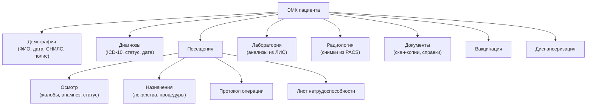
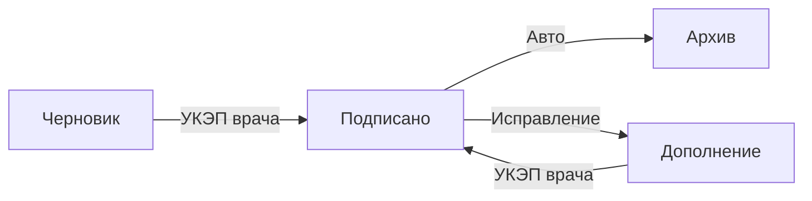
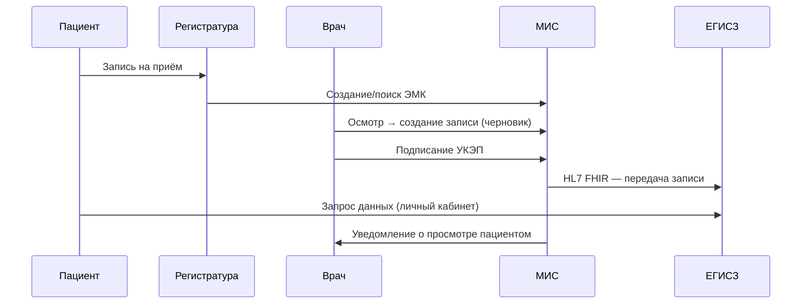

:::info[TL;DR]
ЭМК (электронная медицинская карта) — ядро любой МИС. Содержит: паспортную часть, диагнозы, назначения, результаты анализов, протоколы осмотров. Юридически значимый документ: каждая запись подписывается УКЭП врача. В РФ более 500M ЭМК в ЕГИСЗ (данные 2024). Аналитик проектирует структуру ЭМК, права доступа и жизненный цикл записей.
:::

## Для кого эта статья

- Вы Middle SA, проектирующий ЭМК для МИС
- Вы работаете над интеграцией с ЕГИСЗ и нужно понять структуру карты
- Вы начинающий аналитик в MedTech

После прочтения вы:
- Сможете спроектировать структуру ЭМК: разделы, статусы, обязательные поля
- Поймёте жизненный цикл записи: от черновика до архива с УКЭП
- Узнаете требования к правам доступа и юридической значимости

## Ключевые термины

| Термин | Описание |
|--------|----------|
| ЭМК | Электронная медкарта — набор структурированных записей о состоянии здоровья |
| ЕГИСЗ | Единая госсистема здравоохранения — получает данные из всех МИС |
| УКЭП | Усиленная квалифицированная электронная подпись — юридическая значимость записи |
| ICD-10 | Международная классификация болезней 10-го пересмотра |
| SNOMED CT | Систематизированная медицинская терминология |
| RBAC | Ролевой доступ: врач, медсестра, заведующий, администратор |
| HL7 FHIR | REST-стандарт обмена ЭМК между системами |

## Структура ЭМК

## Статусная модель ЭМК

| Статус | Описание | Кто меняет |
|--------|----------|-----------|
| Черновик | Запись создаётся, не завершена | Врач, медсестра |
| **Подписано** | Запись завершена и подписана УКЭП | Врач (только после подписи) |
| Дополнение | Исправление/добавление к подписанной записи | Врач (с пометкой «дополнение») |
| Архив | Закрытая запись, только чтение | Система (авто) |

Важно: после подписания УКЭП исходная запись не удаляется — дополнение создаётся как новая версия. Врач не может изменить уже подписанную запись, только дополнить.

## Права доступа к ЭМК

| Роль | Доступ | Пример использования |
|------|--------|---------------------|
| **Лечащий врач** | Полный доступ к карте | Осмотр, назначения, выписка рецептов |
| **Медсестра** | Назначения, витальные, вакцинация | Выполнение назначений, термометрия |
| **Заведующий отделением** | Полный + аудит + статистика | Контроль качества, разбор ошибок |
| **Врач-консультант** | По назначению (документ-основание) | Консилиум по сложному случаю |
| **Администратор** | Демография, расписание, запись | Поиск карты, оформление документов |
| **Пациент** | Личный кабинет (выборочно через ЕГИСЗ) | Просмотр диагнозов, запись к врачу |

## Требования к ЭМК по 323-ФЗ

| Параметр | Норма | Пример реализации |
|----------|-------|-------------------|
| Юридическая значимость | УКЭП врача на каждой записи | КриптоПро + Рутокен |
| Хранение | 50+ лет (архивное законодательство) | Терабайтные архивы с tiered storage |
| Резервное копирование | Ежедневно, off-site | Backup → S3 → второй регион |
| Интеграции | ЛИС, PACS, ЕГИСЗ, телемедицина | HL7 FHIR (REST) |
| Контроль доступа | RBAC + аудит каждого входа | Keycloak, аудит в ClickHouse |
| Передача в ЕГИСЗ | Постановление № 1275 | FHIR-транзакции по защищённому каналу |

## Жизненный цикл ЭМК

## Практический кейс: Рост доступности ЭМК

**Проблема:** Региональная поликлиника (100 000 пациентов). Среднее время поиска бумажной карты: 20 мин. 15% карт не найдены на приёме — приём без истории.

**Анализ:** За 2023 год 45 000 приёмов прошли без карты. Пациенты жалуются на повтор назначений.

**Решение:** Внедрение ЭМК на базе МИС. Все карты оцифрованы (скан + распознавание), новые — только электронные.

**Результат:**
- Время доступа к карте: 20 мин → 5 сек (240x быстрее)
- Доля приёмов без карты: 15% → 0.2%
- Экономия врачебного времени: 5 мин/пациент = 8 300 часов/год
- Стоимость проекта: 30 млн руб. Окупаемость: 1.8 года

## Проверь себя

1. **Какие разделы входят в типовую ЭМК?**
   *Ответ:* Демография, диагнозы (ICD-10), посещения (осмотры, назначения, протоколы), лаборатория, радиология, документы, вакцинация, диспансеризация.

2. **Как обеспечивается юридическая значимость ЭМК?**
   *Ответ:* Каждая запись подписывается УКЭП врача. После подписания запись нельзя удалить — только дополнить с пометкой.

3. **Сколько лет нужно хранить ЭМК?**
   *Ответ:* 50+ лет по архивному законодательству. Система должна поддерживать долговременное хранение с tiered storage.

4. **Какие роли имеют доступ к ЭМК, и чем отличаются права лечащего врача и врача-консультанта?**
   *Ответ:* Лечащий врач — полный доступ ко всей карте. Врач-консультант — доступ по назначению (документ-основание), только к нужной записи.

5. **Как передаётся ЭМК в ЕГИСЗ?**
   *Ответ:* По HL7 FHIR (REST/JSON). МИС отправляет транзакции: факт оказания услуги, диагноз, выписной эпикриз, счёт в ОМС.

## Ссылки для самостоятельного изучения

| Что | Описание | URL |
|-----|----------|-----|
| Приказ Минздрава № 947н | Правила ведения ЭМК | minzdrav.gov.ru |
| 323-ФЗ гл. 6 | Права пациента на ЭМК | consultant.ru |
| HL7 FHIR R4 (Patient, Observation) | Модели данных для ЭМК | hl7.org/fhir |
| ГОСТ Р ИСО 13606 | Информационная модель ЭМК | gost.ru |

## Что дальше

- [МИС — медицинские информационные системы](/docs/specialization/medtech-mis) — как ЭМК встраивается в МИС
- [ЛИС — лабораторные ИС](/docs/specialization/medtech-lis) — интеграция результатов анализов в ЭМК
- [HL7 FHIR — стандарт обмена](/tech/hl7) — как передавать ЭМК между системами
