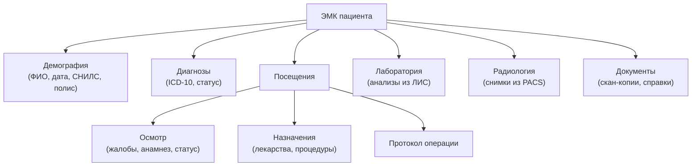
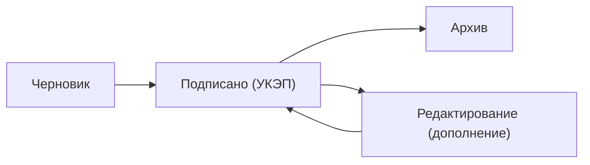

:::info[TL;DR]
ЭМК (электронная медицинская карта) — ядро любой МИС. Содержит: паспортную часть, диагнозы, назначения, результаты анализов, протоколы осмотров. Юридически значимый документ: каждая запись подписывается УКЭП врача. Аналитик проектирует структуру ЭМК, права доступа и жизненный цикл записей.
:::

## Структура ЭМК

## Жизненный цикл записи в ЭМК

## Права доступа к ЭМК

| Роль | Доступ |
|------|--------|
| **Лечащий врач** | Полный доступ к карте |
| **Медсестра** | Назначения, витальные |
| **Заведующий** | + аудит, статистика |
| **Другие врачи** | По назначению (консультация) |
| **Администратор** | Демография, запись |
| **Пациент** | Личный кабинет (выборочно) |

## Требования к ЭМК

| Параметр | Пример |
|----------|--------|
| Юридическая значимость | УКЭП врача на каждой записи |
| Хранение | 50+ лет (архивное законодательство) |
| Резервное копирование | Ежедневно |
| Интеграции | ЛИС, PACS, ЕГИСЗ, телемедицина |
| Контроль доступа | RBAC + аудит |

## Что дальше

- [МИС — медицинские информационные системы](/docs/specialization/medtech-mis)

## Проверь себя

1. **Какие данные содержит ЭМК?**
   *Ответ:* Демография, диагнозы, посещения, лаборатория, радиология, документы.

2. **Как обеспечивается юридическая значимость ЭМК?**
   *Ответ:* Каждая запись подписывается УКЭП врача.
