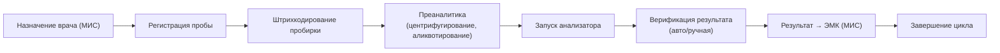
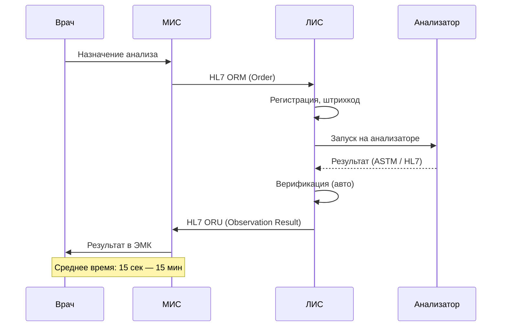

:::info[TL;DR]
ЛИС (лабораторная ИС) управляет процессом анализа биоматериалов: регистрация пробы, автоматизация анализаторов, контроль качества, выдача результатов. Интегрируется с МИС по HL7 FHIR. Ключевое: штрихкодирование пробирок, автоверификация (70%+ результатов без участия лаборанта), референсные интервалы и интеграция с лабораторными анализаторами. В типовой лаборатории — 10 000+ проб/день, до 500 видов анализов.
:::

## Для кого эта статья

- Middle SA, интегрирующий ЛИС с МИС
- Аналитик лаборатории, автоматизирующий процессы
- SA, работающий с HL7 ORM/ORU сообщениями

После прочтения вы:
- Поймёте полный цикл обработки пробы: от назначения до результата
- Узнаете протоколы интеграции (HL7 v2, ASTM)
- Сможете специфицировать требования к ЛИС: автоверификация, контроль качества, штрихкодирование

## Ключевые термины

| Термин | Описание |
|--------|----------|
| ЛИС | Лабораторная информационная система — управление анализами |
| HL7 ORM | Order Entry — сообщение-назначение на анализ |
| HL7 ORU | Observation Result — сообщение-результат анализа |
| ASTM | Протокол передачи данных с анализаторов (LIS2-A) |
| Референсный интервал | Нормальные значения по возрасту, полу и сроку беременности |
| Автоверификация | Автоматическая проверка результата по правилам без участия человека |
| IQC / EQAS | Internal Quality Control / External Quality Assessment |
| Штрихкод пробирки | Линейный (Code 128) или 2D (DataMatrix) для идентификации пробы |

## Процесс в лаборатории

## Интеграция ЛИС ↔ МИС

## Типы анализов и производительность

| Тип | Пример | Производительность анализатора | Популярные анализаторы |
|-----|--------|-------------------------------|----------------------|
| **Гематология** | ОАК, лейкоцитарная формула | 100 проб/час | Sysmex XN, Beckman Coulter DxH |
| **Биохимия** | АЛТ, АСТ, глюкоза, креатинин, билирубин | 800 тестов/час | Roche Cobas 8000, Abbott Architect |
| **Коагулогия** | INR, АЧТВ, фибриноген | 200 тестов/час | ACL TOP, Stago STA |
| **Иммунохимия** | ТТГ, онкомаркеры, гормоны | 200 тестов/час | Roche Elecsys, Abbott Alinity |
| **Микробиология** | Посевы, чувствительность к АБ | 48-96 ч | Vitek 2, BD Phoenix |

## Референсные интервалы

| Анализ | Взрослый мужчина | Взрослая женщина | Ребёнок | Беременная |
|--------|-----------------|------------------|---------|-----------|
| Гемоглобин (Hb) | 130-160 г/л | 120-140 г/л | 110-150 г/л | 110-130 г/л |
| Глюкоза | 3.3-5.5 ммоль/л | 3.3-5.5 ммоль/л | 3.3-5.5 ммоль/л | 3.3-5.1 ммоль/л |
| ТТГ | 0.4-4.0 мМЕ/л | 0.4-4.0 мМЕ/л | 0.3-5.0 мМЕ/л | 0.1-2.5 мМЕ/л |

Автоверификация учитывает эти интервалы: результат за пределами — отправляется на проверку лаборанту.

## Требования к ЛИС

| Параметр | Типовое значение | Почему это важно |
|----------|------------------|------------------|
| Производительность | 10 000+ проб/день | Пропускная способность лаборатории |
| Штрихкодирование | Code 128 или DataMatrix | Исключение перепутывания проб |
| Референсные интервалы | По возрасту, полу, сроку беременности | Корректная интерпретация |
| Автоверификация | 70%+ результатов | Сокращение времени выдачи результата |
| Контроль качества | IQC (ежедневно) + EQAS (ежеквартально) | Требования Росздравнадзора |
| Протоколы | HL7 v2 / FHIR, ASTM, LIS2-A | Совместимость с любыми анализаторами |

## Практический кейс: Автоматизация лаборатории

**Проблема:** Лаборатория областной больницы. 15 000 проб/день. Ручной ввод результатов с анализаторов. Ошибки: 3% — перепутывание проб, 5% — опечатки. Среднее время выдачи результата: 4 часа.

**Анализ:**
- 15 анализаторов разных производителей (Sysmex, Roche, Abbott)
- Нет единой ЛИС — каждый анализатор печатает на бумаге
- Лаборанты вручную переносят данные в Excel → импорт в МИС

**Решение:** Внедрение ЛИС с интеграцией:
1. Все анализаторы подключены по ASTM/HL7
2. Штрихкодирование пробирок при заборе (уникальный ID)
3. Автоверификация: 75% результатов проходят автоматически
4. Результаты → HL7 ORU → МИС → ЭМК

**Результат:**
- Среднее время: 4 часа → 25 мин (10x быстрее)
- Ошибки перепутывания: 3% → 0.01%
- Пропускная способность: 15 000 → 25 000 проб/день (без новых сотрудников)
- Стоимость проекта: 8 млн руб. Окупаемость: 1.5 года

## Проверь себя

1. **Как ЛИС взаимодействует с МИС?**
   *Ответ:* МИС → назначение (HL7 ORM) → ЛИС → результат (HL7 ORU) → МИС → ЭМК.

2. **Что такое автоверификация в ЛИС?**
   *Ответ:* Автоматическая проверка результатов по референсным интервалам и контрольным образцам. До 70%+ результатов не требуют участия лаборанта.

3. **Какие протоколы используются для передачи данных с анализаторов?**
   *Ответ:* ASTM (LIS2-A) — для подключения анализаторов, HL7 v2 (ORU) — для передачи в МИС.

4. **Почему автоверификация не может работать для 100% результатов?**
   *Ответ:* Результаты за пределами референсных интервалов, несовпадения с контрольными образцами, некоррелирующие показатели — всё это требует решения лаборанта.

5. **Что такое IQC и EQAS, и зачем они нужны ЛИС?**
   *Ответ:* IQC (Internal QC) — ежедневный внутренний контроль с контрольными образцами. EQAS — внешняя оценка качества (межлабораторные сличия). Без них лаборатория не может гарантировать точность результатов — Росздравнадзор может приостановить деятельность.

## Ссылки для самостоятельного изучения

| Что | Описание | URL |
|-----|----------|-----|
| HL7 v2 ORM/ORU | Спецификация сообщений | hl7.org/implement/standards |
| ASTM E1394 | Стандарт передачи данных с анализаторов | astm.org |
| ГОСТ Р ИСО 15189 | Требования к лабораториям | gost.ru |
| LIS2-A | Протокол CLSI для ЛИС | clsi.org |

## Что дальше

- [Фарма и маркировка (Честный ЗНАК)](/docs/specialization/medtech-pharma) — учёт лекарств и интеграция с МИС
- [Телемедицина](/docs/specialization/medtech-telemedicine) — удалённые консультации, рецепты
- [HL7 FHIR — стандарт обмена](/tech/hl7) — протокол интеграции
