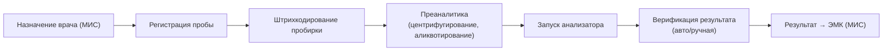
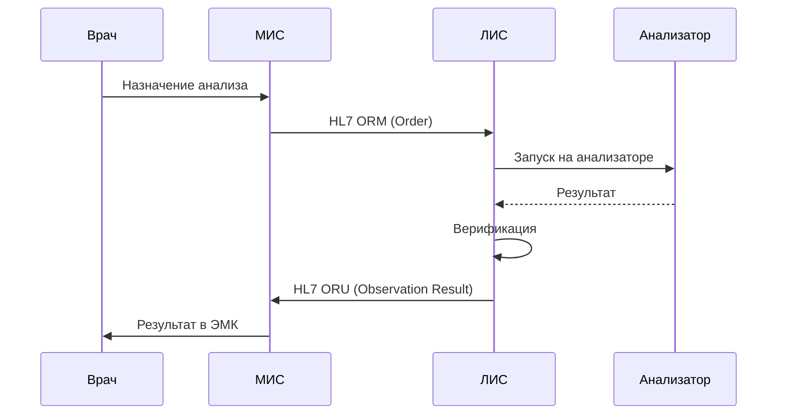

:::info[TL;DR]
ЛИС (лабораторная информационная система) управляет процессом анализа биоматериалов: регистрация пробы, автоматизация анализаторов, контроль качества, выдача результатов. Интегрируется с МИС по HL7 FHIR. Ключевое: штрихкодирование пробирок, автоверификация, референсные интервалы и интеграция с лабораторными анализаторами.
:::

## Процесс в лаборатории

## Интеграция ЛИС ↔ МИС

## Типы анализов

| Тип | Пример | Анализатор |
|-----|--------|-----------|
| **Гематология** | ОАК, лейкоцитарная формула | Sysmex, Beckman Coulter |
| **Биохимия** | АЛТ, АСТ, глюкоза, креатинин | Cobas, Architect |
| **Коагулогия** | INR, АЧТВ, фибриноген | ACL, Stago |
| **Иммунохимия** | Тиреоидные, онкомаркеры | Roche, Abbott |
| **Микробиология** | Посевы, чувствительность к АБ | Vitek, BD |

## Требования к ЛИС

| Параметр | Пример |
|----------|--------|
| Производительность | 10 000+ проб/день |
| Штрихкодирование | Линейный или 2D код |
| Референсные интервалы | По возрасту, полу, сроку беременности |
| Автоверификация | 70%+ результатов без участия лаборанта |
| Контроль качества | Внутренний (IQC) + внешний (EQAS) |
| Протоколы | HL7 v2 / FHIR, ASTM, LIS2-A |

## Что дальше

- [Фарма и маркировка (Честный ЗНАК)](/docs/specialization/medtech-pharma)
- [Телемедицина](/docs/specialization/medtech-telemedicine)

## Проверь себя

1. **Как ЛИС взаимодействует с МИС?**
   *Ответ:* МИС → назначение (HL7 ORM) → ЛИС → результат (HL7 ORU) → МИС → ЭМК.

2. **Что такое автоверификация в ЛИС?**
   *Ответ:* Автоматическая проверка результатов по референсным интервалам и контрольным образцам — до 70% результатов не требуют участия лаборанта.
