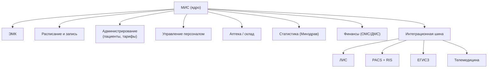
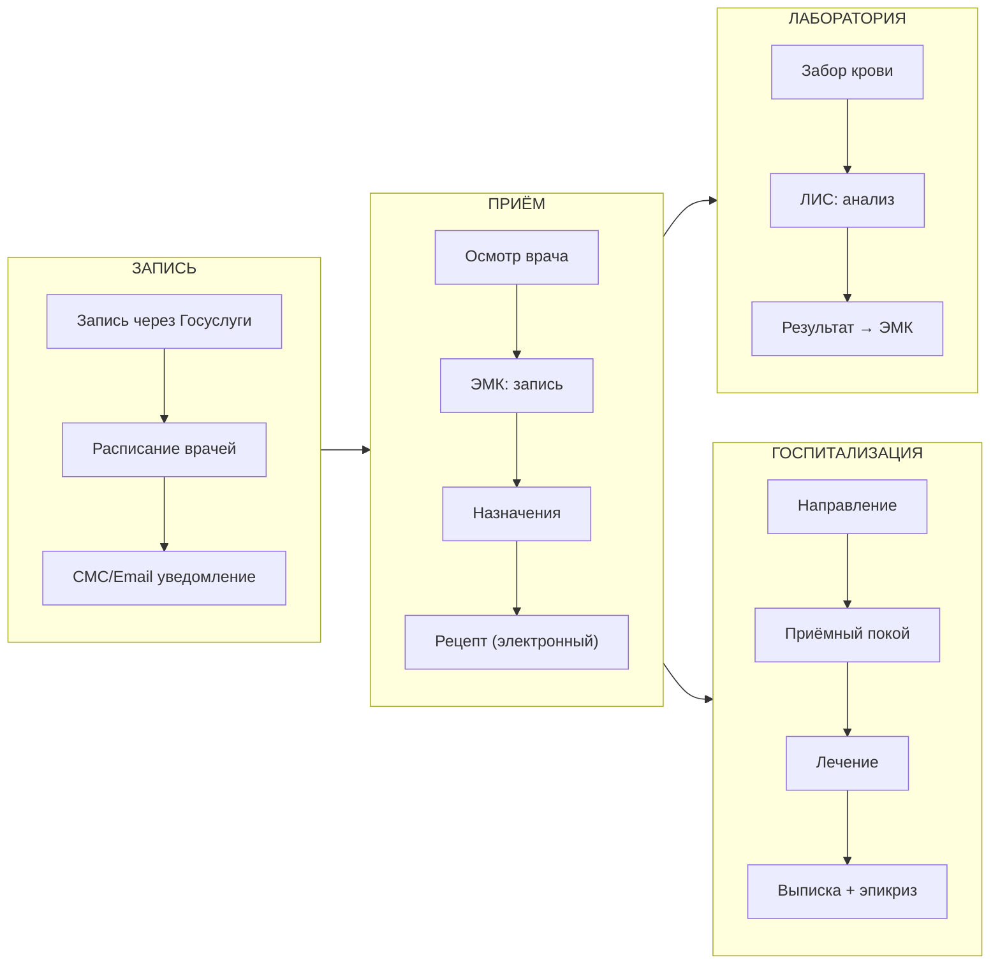
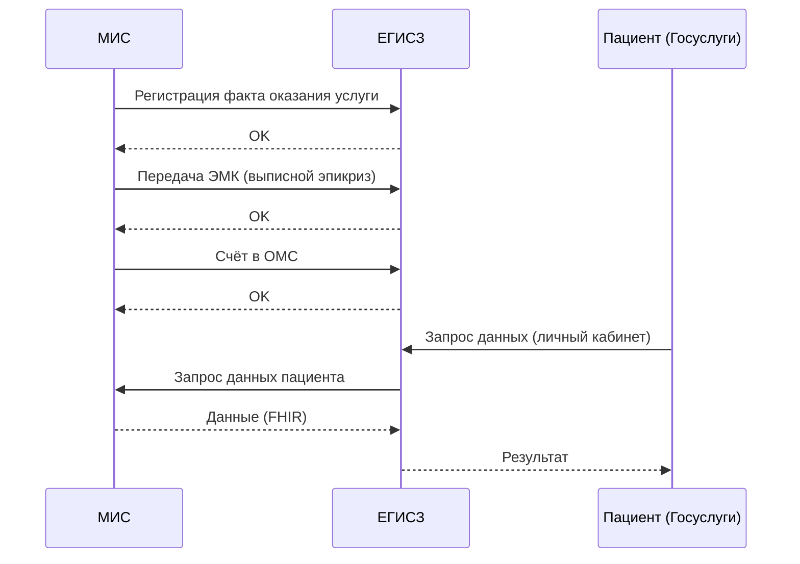

:::info[TL;DR]
МИС (медицинская информационная система) — основная система больницы или поликлиники. Объединяет ЭМК, расписание, лабораторию, радиологию, аптеку, отчётность и интеграцию с ЕГИСЗ. Ключевой вызов: сложность интеграций (10+ подсистем) и compliance (323-ФЗ, 152-ФЗ). Крупнейшая МИС РФ — ЕМИАС Москвы обрабатывает 100M+ записей/год.
:::

## Для кого эта статья

- Senior SA, проектирующий архитектуру МИС
- Middle SA, разбирающийся в модулях и процессах
- Enterprise-архитектор, выбирающий платформу для здравоохранения

После прочтения вы:
- Поймёте модульную структуру МИС (8+ модулей)
- Узнаете типовые процессы: запись, приём, госпитализация, интеграции
- Сможете спроектировать интеграцию МИС с ЕГИСЗ, ЛИС, PACS

## Ключевые термины

| Термин | Описание |
|--------|----------|
| МИС | Медицинская ИС — ядро цифровизации ЛПУ |
| ЕМИАС | Единая МИС Москвы — крупнейшая региональная МИС |
| ЕГИСЗ | Гос. система, куда МИС обязана передавать данные |
| HL7 FHIR | Стандарт интеграции МИС с внешними системами |
| УКЭП | Юридически значимая подпись для записей в МИС |
| RIS | Радиологическая ИС — система управления лучевой диагностикой |
| Организатор здравоохранения | Врач-статистик, отвечающий за отчётность в Минздрав |

## Модули МИС

## Типовые процессы в МИС

## Интеграция МИС с ЕГИСЗ

## Реальные МИС: сравнение

| Система | Масштаб | Тип | Цена |
|---------|---------|-----|------|
| **1С:Медицина** | 2000+ больниц | Универсальная | 5-50 млн руб. |
| **ЕМИАС (Москва)** | 1000+ поликлиник, 10M+ пациентов | Гос. региональная | Бюджет |
| **Medesk** | 500+ клиник, SaaS | Частная | Подписка |
| **БАРС Груп** | 40+ регионов РФ | Гос. региональная | Бюджет |
| **ТрастМед** | 300+ клиник | Частная | 3-15 млн руб. |

## Требования к МИС

| Параметр | Пример | Почему это важно |
|----------|--------|-----------------|
| Количество пациентов | 100K+ (районная больница) | Производительность и масштабирование |
| Записей в день | 10 000+ | Нагрузка на БД и интеграционную шину |
| Доступность | 99.9% | Перерыв в работе — остановка приёма пациентов |
| Интеграции | 10+ подсистем (HL7 FHIR) | Сложность ETL, синхронизация |
| Compliance | 323-ФЗ, 152-ФЗ, приказы Минздрава | Юридические риски, штрафы |
| Архивация | 50+ лет | Tiered storage, HSM |
| Отчётность | Ежемесячная + годовая в Минздрав | Автоматизация: 5 дней → 1 час |

## Практический кейс: Внедрение МИС в сети клиник

**Проблема:** Сеть из 15 частных клиник (Москва, СПб, регионы). Каждая клиника — своя система: три разные МИС, Excel, бумага. Нет единой ЭМК. Пациент переходит между клиниками — история не доступна.

**Анализ:**
- 15 разных баз данных, семь не интегрируются
- Среднее время администрирования пациента: 12 мин
- Ошибки дублирования назначений: 8% случаев

**Решение:** Единая МИС на базе Medesk (SaaS). Периметр:
1. Централизованная ЭМК в облаке
2. Интеграция с существующими ЛИС (HL7 FHIR, общий справочник анализов)
3. PACS в облаке (DICOM-шлюз)
4. Личный кабинет пациента на сайте сети

**Результат:**
- Объединение 15 клиник в единое пространство: пациент виден везде
- Время администрирования: 12 мин → 3 мин
- Ошибки дублирования: 8% → 0.5%
- Рост лояльности (NPS): +15 пунктов
- Стоимость: 3 млн руб./год (SaaS). Окупаемость: за счёт снижения административных расходов+ 15%

## Проверь себя

1. **Какие модули входят в типовую МИС?**
   *Ответ:* ЭМК, расписание, администрирование, персонал, аптека, статистика, финансы, интеграционная шина (с ЛИС, PACS, ЕГИСЗ).

2. **Как МИС интегрируется с ЕГИСЗ?**
   *Ответ:* По HL7 FHIR: факт услуги, ЭМК (выписной эпикриз), счёт в ОМС. Пациент может запросить данные через Госуслуги.

3. **Какая МИС — крупнейшая в РФ по числу пациентов?**
   *Ответ:* ЕМИАС Москвы — обслуживает 10M+ пациентов, 1000+ поликлиник, 100M+ записей/год.

4. **Что произойдёт, если МИС не передаёт данные в ЕГИСЗ?**
   *Ответ:* Штраф до 300 тыс. руб. по КоАП РФ за несоблюдение порядка ведения персонифицированного учёта.

5. **Почему МИС проектируется модульной, а не монолитной?**
   *Ответ:* Разные ЛПУ нуждаются в разном наборе функций (поликлинике не нужен PACS, стационару — да). Модульность позволяет кастомизировать без переписывания ядра. Также модули можно заменять независимо.

## Ссылки для самостоятельного изучения

| Что | Описание | URL |
|-----|----------|-----|
| ЕМИАС Москвы | Архитектура крупнейшей МИС | emias.info |
| 1С:Медицина | Документация МИС | solutions.1c.ru |
| HL7 FHIR R4 | Спецификация интеграции | hl7.org/fhir |
| Постановление № 1275 | О ЕГИСЗ | government.ru |
| Минздрав — методические материалы | Нормы по МИС | minzdrav.gov.ru |

## Что дальше

- [ЛИС — лабораторные ИС](/docs/specialization/medtech-lis) — как лаборатория интегрируется с МИС
- [PACS / DICOM](/docs/specialization/medtech-pacs) — радиология и изображения
- [HL7 FHIR — стандарт обмена](/tech/hl7) — техническая реализация интеграции
