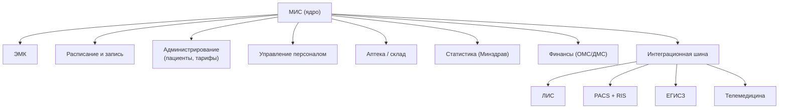
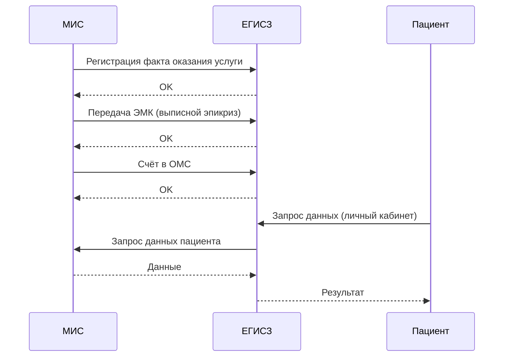

:::info[TL;DR]
МИС (медицинская информационная система) — основная система больницы или поликлиники. Объединяет ЭМК, расписание, лабораторию, радиологию, аптеку, отчётность и интеграцию с ЕГИСЗ. Ключевой вызов: сложность интеграций (10+ подсистем) и compliance (323-ФЗ, 152-ФЗ).
:::

## Модули МИС

## Типовые процессы

| Процесс | Описание |
|---------|----------|
| **Запись к врачу** | Пациент → Регистратура → Расписание → Приём |
| **Приём пациента** | Осмотр → Диагноз → Назначения → ЭМК → ЛИС/PACS |
| **Госпитализация** | Направление → Приёмный покой → Палата → Лечение → Выписка |
| **Интеграция с ЛИС** | Назначение → ЛИС → Забор → Анализ → Результат → ЭМК |

## Интеграция МИС с ЕГИСЗ

## Требования к МИС

| Параметр | Пример |
|----------|--------|
| Количество пациентов | 100K+ (для районной больницы) |
| Записей в день | 10 000+ |
| Доступность | 99.9% |
| Интеграции | 10+ подсистем (HL7 FHIR) |
| Compliance | 323-ФЗ, 152-ФЗ, приказы Минздрава |
| Архивация | 50+ лет (ЭМК) |

## Что дальше

- [ЛИС — лабораторные ИС](/docs/specialization/medtech-lis)
- [PACS / DICOM](/docs/specialization/medtech-pacs)

## Проверь себя

1. **Какие модули входят в типовую МИС?**
   *Ответ:* ЭМК, расписание, администрирование, персонал, аптека, статистика, финансы, интеграции.

2. **Как МИС интегрируется с ЕГИСЗ?**
   *Ответ:* По стандарту HL7 FHIR: передача фактов услуги, ЭМК, счетов в ОМС.
