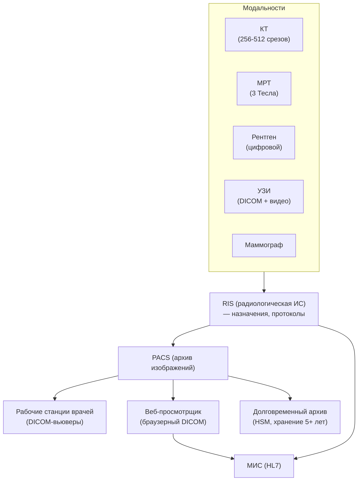
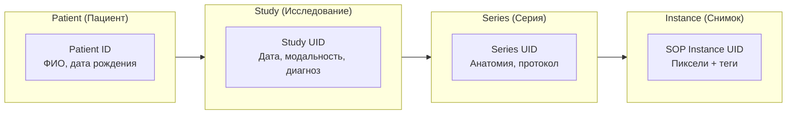
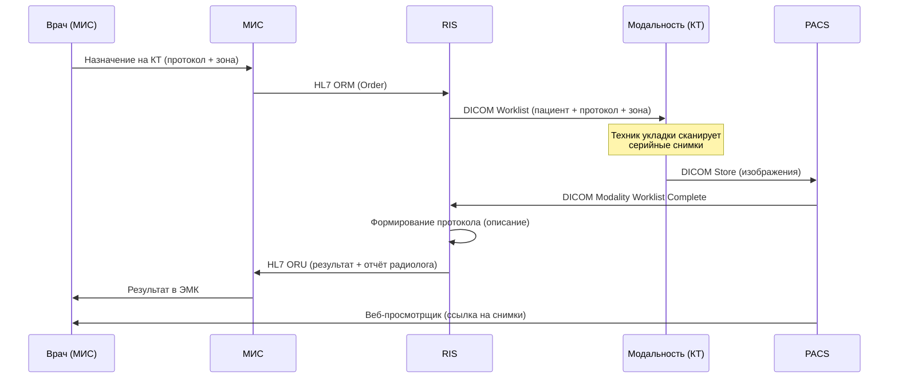

:::info[TL;DR]
PACS (Picture Archiving and Communication System) — система для хранения и просмотра медицинских изображений (рентген, КТ, МРТ, маммография). DICOM — стандарт для передачи и хранения изображений. Типовое хранилище областной больницы: 10-50 ТБ, 100 000+ снимков/день. Для аналитика: интеграция PACS с МИС (HL7), RIS (радиологическая ИС), модальностями (аппараты КТ/МРТ), хранение 5+ лет, DICOM-теги (метаданные снимка).
:::

## Для кого эта статья

- Senior SA, интегрирующий PACS с МИС
- Middle SA в радиологическом проекте
- Архитектор хранилища медицинских изображений

После прочтения вы:
- Поймёте архитектуру PACS: модальности → RIS → PACS → МИС
- Узнаете ключевые понятия DICOM (теги, study, series, modality)
- Сможете спроектировать интеграцию PACS с МИС и RIS

## Ключевые термины

| Термин | Описание |
|--------|----------|
| PACS | Система архивации и передачи изображений |
| DICOM | Стандарт для передачи, хранения и обработки изображений |
| RIS | Радиологическая ИС — управление назначениями и протоколами |
| Modality | Тип аппарата: КТ, МРТ, УЗИ, рентген, маммограф |
| Study | Одно исследование (пациент + процедура) |
| Series | Серия снимков: одна анатомическая зона, один протокол |
| Instance | Один DICOM-файл (снимок + метаданные) |
| DICOM Worklist | Передача задания на аппарат: какой пациент, что делать |
| DICOM Query/Retrieve | Поиск и получение снимков из PACS |
| JPEG 2000 / JPEG-LS | Форматы сжатия — lossless (диагностика) и lossy (просмотр) |

## Архитектура PACS

## DICOM — модель данных

## Поток данных: назначение → результат

## Сравнение модальностей

| Тип | Размер снимка | Серий | Исследование | Используется для |
|-----|---------------|-------|-------------|-----------------|
| **Рентген** | 5-10 MB | 1-2 | 5-20 MB | Лёгкие, кости, грудная клетка |
| **КТ** | 0.5-1 MB | 100-500 | 0.5-2 GB | Голова, грудная клетка, брюшная полость |
| **МРТ** | 0.3-0.8 MB | 50-200 | 0.3-2 GB | Мозг, позвоночник, суставы |
| **Маммография** | 30-100 MB | 1-4 | 100-400 MB | Скрининг рака груди |
| **УЗИ** | 1-5 MB (DICOM) | 10-50 | 50-500 MB | Брюшная полость, беременность |

## Требования к PACS

| Параметр | Пример | Почему это важно |
|----------|--------|-----------------|
| Хранение | 5+ лет (по закону), 10-50 ТБ | DICOM-файлы большие, нужен HSM |
| DICOM-совместимость | DICOM 3.0: Store, Query/Retrieve, Worklist | Без этого PACS не интегрируется с модальностями |
| Просмотр | Веб-просмотрщик + нативная рабочая станция | Врач смотрит и в больнице, и удалённо |
| Сжатие | Lossless (JPEG-LS) для архива, lossy для просмотра | Экономия места без потери диагностического качества |
| Производительность | 100 000+ снимков/день | Пропускная способность |
| Интеграция | HL7 v2 / FHIR (с МИС), DICOM (с модальностями) | Два разных протокола — два шлюза |

## Практический кейс: Миграция PACS legacy → новое решение

**Проблема:** Областная больница, 15 лет на legacy PACS (GE Centricity). Хранение: 30 ТБ снимков. Система не поддерживает веб-просмотр — только на рабочих станциях. Врачи не могут смотреть снимки из дома. Скорость загрузки: 30 сек на серию КТ.

**Анализ:**
- 3 млн исследований, 300 млн снимков
- Средний размер исследования КТ: 1.2 GB
- 15 рабочих станций — только в отделении
- Web-доступа нет
- Legacy не поддерживает DICOM Web (QIDO-RS, STOW-RS)

**Решение:**
1. Миграция на PACS на базе OsiriX + Orthanc
2. Все снимки переконвертированы в DICOM 3.0
3. Развёрнут веб-просмотрщик (OHIF Viewer) с DICOM REST API
4. Интеграция с МИС: HL7 FHIR + ссылки на веб-просмотрщик из ЭМК
5. HSM: SSD (30 дней) → HDD (1 год) → LTO-лента (5+ лет)

**Результат:**
- Скорость загрузки: 30 сек → 2 сек (с SSD-кэшом)
- Веб-доступ: врачи смотрят снимки из дома
- Интеграция: один клик из ЭМК на снимки
- Стоимость хранения: снижена в 3 раза (лента вместо дисков)
- Стоимость проекта: 12 млн руб. Окупаемость: 2 года

## Проверь себя

1. **Что такое DICOM?**
   *Ответ:* Стандарт для передачи, хранения и обработки медицинских изображений и их метаданных (теги). DICOM — это не только формат файла, а полный протокол взаимодействия.

2. **Как PACS интегрируется с МИС?**
   *Ответ:* Через RIS: МИС → HL7 ORM (назначение) → RIS → DICOM Worklist → модальность → DICOM Store → PACS → HL7 ORU → МИС.

3. **Сколько весит типовое исследование КТ и МРТ?**
   *Ответ:* КТ: 0.5-2 GB (100-500 серий), МРТ: 0.3-2 GB. Хранилище областной больницы — 30+ ТБ.

4. **В чём разница между PACS и RIS?**
   *Ответ:* PACS — архив изображений. RIS — система управления радиологическим отделением (назначения, протоколы, описание). RIS знает, ЧТО сняли, PACS — ГДЕ лежит снимок.

5. **Почему для диагностики используется lossless-сжатие, а для просмотра — lossy?**
   *Ответ:* Lossless сохраняет все пиксели — для диагностики (изменение пикселя может скрыть патологию). Lossy (JPEG 2000) — для быстрого просмотра на веб-вьювере, экономит трафик.

## Ссылки для самостоятельного изучения

| Что | Описание | URL |
|-----|----------|-----|
| DICOM 3.0 — официальный стандарт | NEMA — полная спецификация | dicom.nema.org |
| OHIF Viewer | Open-source веб-просмотрщик DICOM | ohif.org |
| Orthanc | Open-source PACS-сервер | orthanc-server.com |
| DICOM Web (QIDO-RS, STOW-RS) | REST API для DICOM | dicomweb.org |
| HL7 FHIR — ImagingStudy | Ресурс для радиологических исследований | hl7.org/fhir |

## Что дальше

- [Регуляторика в медицине](/docs/specialization/medtech-regulations) — требования к хранению, регистрация медизделий
- [DICOM — технология](/tech/dicom) — спецификация DICOM, теги, сервисы
