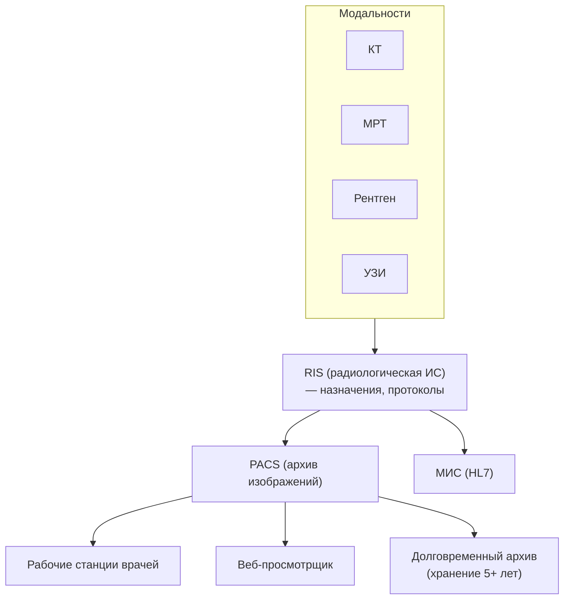
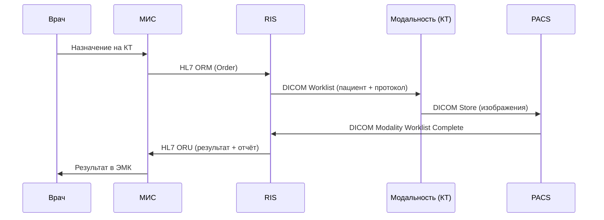

:::info[TL;DR]
PACS (Picture Archiving and Communication System) — система для хранения и просмотра медицинских изображений (рентген, КТ, МРТ). DICOM — стандарт для передачи и хранения изображений. Для аналитика: интеграция PACS с МИС (HL7), RIS (радиологическая ИС), модальностями (аппараты КТ/МРТ), хранение 5+ лет, DICOM-теги (метаданные снимка).
:::

## Архитектура PACS

## DICOM — ключевые понятия

| Понятие | Описание |
|---------|----------|
| **DICOM-теги** | Метаданные снимка (пациент, модальность, параметры) |
| **Modality** | КТ, МРТ, US, XR — тип аппарата |
| **Study** | Исследование (одна процедура) |
| **Series** | Серия снимков в одном исследовании |
| **Instance** | Один DICOM-файл |
| **Worklist** | Расписание: какие пациенты, что делать |

## Поток данных: назначение → результат

## Требования к PACS

| Параметр | Пример |
|----------|--------|
| Хранение | 5+ лет (по закону), 10+ ТБ |
| DICOM-совместимость | DICOM 3.0 (Store, Query/Retrieve, Worklist) |
| Просмотр | Веб-просмотрщик + DICOM-вьювер |
| Сжатие | Lossless (JPEG-LS), lossy (JPEG 2000) |
| Количество снимков | 100 000+ в день (областная больница) |
| Интеграция | HL7 v2 / FHIR (с МИС), DICOM (с модальностями) |

## Что дальше

- [Регуляторика в медицине](/docs/specialization/medtech-regulations)

## Проверь себя

1. **Что такое DICOM?**
   *Ответ:* Стандарт для передачи, хранения и обработки медицинских изображений и их метаданных (теги).

2. **Как PACS интегрируется с МИС?**
   *Ответ:* Через RIS: МИС → HL7 (назначение) → RIS → DICOM Worklist → модальность → PACS → HL7 ORU → МИС.
