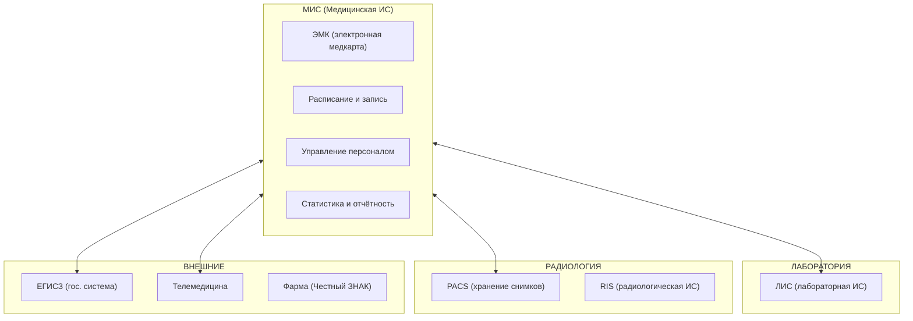

:::info[TL;DR]
MedTech-аналитик работает с медицинскими информационными системами: ЭМК (электронные медкарты), МИС, ЛИС, PACS, телемедицина, фарма-учёт. Специфика: жёсткая регуляция (323-ФЗ, 152-ФЗ, оборот лекарств), сложные интеграции (HL7 FHIR, DICOM), высокие требования к безопасности ПД и работа с жизненно важными данными пациентов.
:::

## Чем MedTech отличается от других отраслей

| Особенность | Описание |
|-------------|----------|
| **Жизнь и здоровье** | Системы влияют на качество лечения |
| **Регуляция** | 323-ФЗ, 152-ФЗ, приказы Минздрава |
| **Медицинские стандарты** | HL7 FHIR, DICOM, ICD-10, SNOMED |
| **ЭМК** | Юридическая значимость медкарты |
| **Интеграции** | МИС ↔ ЛИС ↔ PACS ↔ ЕГИСЗ |
| **ПД особой категории** | Данные о здоровье — максимальный уровень защиты |

## Основные системы MedTech

## Типовые проекты MedTech-аналитика

1. Внедрение МИС в больнице (замена бумажных карт)
2. Интеграция ЛИС с МИС (автоматизация лаборатории)
3. Подключение к ЕГИСЗ (передача данных в Минздрав)
4. Внедрение телемедицины (удалённые консультации)
5. Интеграция с маркировкой лекарств (Честный ЗНАК)
6. Миграция с legacy PACS на новое решение

## Карьерный путь

| Этап | Роль | Ключевые навыки |
|------|------|----------------|
| 1 | Junior SA в MedTech | ЭМК, документация |
| 2 | Middle SA | МИС, интеграции (HL7) |
| 3 | Senior SA | Архитектура, регуляторика, ЕГИСЗ |
| 4 | Lead / Architect | MedTech-решения, телемедицина |

## Что дальше

- [ЭМК — электронная медкарта](/docs/specialization/medtech-emk)
- [МИС — медицинские информационные системы](/docs/specialization/medtech-mis)

## Проверь себя

1. **Какие стандарты используются в MedTech?**
   *Ответ:* HL7 FHIR (обмен данными), DICOM (изображения), ICD-10 (диагнозы), SNOMED (терминология).

2. **Какие основные системы в типовой больнице?**
   *Ответ:* МИС (ядро), ЭМК, ЛИС (лаборатория), PACS (радиология), ЕГИСЗ (гос. отчётность).
