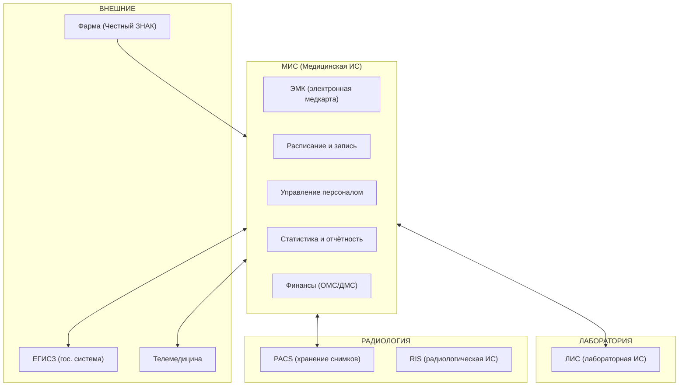
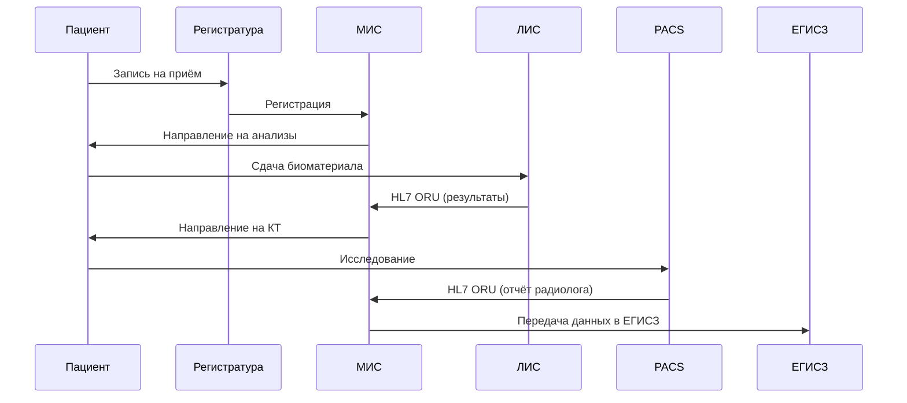

:::info[TL;DR]
MedTech-аналитик работает с медицинскими информационными системами: ЭМК (электронные медкарты), МИС, ЛИС, PACS, телемедицина, фарма-учёт. Специфика: жёсткая регуляция (323-ФЗ, 152-ФЗ, оборот лекарств), сложные интеграции (HL7 FHIR, DICOM), высокие требования к безопасности ПД и работа с жизненно важными данными пациентов. Рынок MedTech в РФ — 150+ млрд руб/год, более 10 000 медицинских организаций нуждаются в цифровизации.
:::

## Для кого эта статья

- Вы Middle SA и хотите перейти в MedTech
- Вы работаете в смежной отрасли (GovTech, FinTech) и рассматриваете медицину
- Вы уже в MedTech и хотите систематизировать знания

После прочтения вы:
- Поймёте отличие MedTech от других отраслей (регуляция, интеграции, ПД)
- Узнаете основные системы и стандарты (МИС, ЭМК, ЛИС, PACS, HL7, DICOM)
- Сможете спланировать карьерный путь в MedTech

## Ключевые термины

| Термин | Расшифровка |
|--------|-------------|
| МИС | Медицинская информационная система — ядро цифровизации больницы |
| ЭМК | Электронная медицинская карта — юридически значимая запись о пациенте |
| ЛИС | Лабораторная информационная система — управление анализами |
| PACS | Система хранения и архивации медицинских изображений |
| HL7 FHIR | Стандарт обмена медицинскими данными (REST, JSON) |
| DICOM | Стандарт для передачи и хранения медицинских изображений |
| ЕГИСЗ | Единая государственная информационная система в сфере здравоохранения |
| УЗ-1 | Уровень защищённости персональных данных (максимальный для данных о здоровье) |

## Чем MedTech отличается от других отраслей

| Особенность | Описание | Пример из жизни |
|-------------|----------|----------------|
| **Жизнь и здоровье** | Системы влияют на качество лечения | Ошибка в ЭМК может привести к неправильному назначению |
| **Регуляция** | 323-ФЗ, 152-ФЗ, приказы Минздрава | Каждая запись в ЭМК — юридически значимый документ |
| **Медицинские стандарты** | HL7 FHIR, DICOM, ICD-10, SNOMED | МИС обязана передавать данные в ЕГИСЗ по FHIR |
| **ЭМК** | Юридическая значимость медкарты | УКЭП врача на каждой записи — не просто практика, а закон |
| **Интеграции** | МИС ↔ ЛИС ↔ PACS ↔ ЕГИСЗ | Типовая больница имеет 10+ подсистем |
| **ПД особой категории** | Данные о здоровье — максимальный уровень защиты | УЗ-1, локализация в РФ, согласие пациента |

## Основные системы MedTech

## Реальные примеры MedTech-платформ

| Платформа | Масштаб | Специфика |
|-----------|---------|-----------|
| **1С:Медицина** | 2000+ медорганизаций в РФ | Лидер рынка МИС в России |
| **Medesk** | 500+ клиник, 10M+ записей/год | SaaS для частных клиник |
| **EMIAS (ЕМИАС)** | 1000+ поликлиник Москвы, 10M+ пациентов | Крупнейшая региональная ЕГИСЗ |
| **СберЗдоровье** | 8M+ пользователей | Телемедицина и запись к врачу |
| **БАРС Груп (Электронный регистр)** | 40+ регионов РФ | Гос. ЕГИСЗ-решения |

## Типовые проекты MedTech-аналитика

1. **Внедрение МИС в больнице** — замена бумажных карт на ЭМК. Бюджет: 10-100 млн руб. Длительность: 6-18 мес.
2. **Интеграция ЛИС с МИС** — автоматизация лаборатории. Лаборатория обрабатывает 5000+ проб/день, интеграция позволяет сократить ручной ввод на 80%.
3. **Подключение к ЕГИСЗ** — передача данных в Минздрав. Штраф за отсутствие: до 300 тыс. руб.
4. **Внедрение телемедицины** — удалённые консультации. С 2020 года объём телемедицинских консультаций в РФ вырос в 5 раз.
5. **Интеграция с Честным ЗНАКом** — маркировка лекарств. Затраты на интеграцию: 2-5 млн руб.
6. **Миграция PACS** — с legacy-решения на современное, типовой объём: 10-50 ТБ снимков.

## Архитектура типовой интеграции

## Карьерный путь

| Этап | Роль | Опыт | Зарплата (Москва) | Ключевые навыки |
|------|------|------|-------------------|----------------|
| 1 | Junior SA | 0-1 год | 80-120K | ЭМК, документация, анализ требований |
| 2 | Middle SA | 2-4 года | 180-250K | МИС, интеграции (HL7), управление требованиями |
| 3 | Senior SA | 5-7 лет | 280-400K | Архитектура, регуляторика, ЕГИСЗ, менторство |
| 4 | Lead / Architect | 8+ лет | 400-600K | MedTech-стратегия, орг. изменения |

## Практический кейс: Цифровизация районной больницы

**Проблема:** Районная больница на 500 коек, 1500 сотрудников. ЭМК в Excel, бумажные карты теряются, отчётность в Минздрав — вручную. Время поиска карты пациента: 30 мин. Ошибки назначений: 5% случаев.

**Анализ:** Корень — отсутствие единой МИС. Лаборатория использует отдельную программу без интеграции, результаты приходят по факсу. Радиология — плёночные снимки.

**Решение:** Выбрана «1С:Медицина» как ядро. Поэтапное внедрение:
1. Регистратура + ЭМК (3 мес.)
2. Интеграция ЛИС с МИС через HL7 FHIR (2 мес.)
3. PACS + DICOM-просмотрщик (3 мес.)
4. ЕГИСЗ — подключение к региональному сегменту (2 мес.)

**Результат:**
- Время доступа к карте: с 30 мин → 10 сек
- Ошибки назначений: с 5% → 0.3%
- Отчётность в Минздрав: с 5 дней → 1 час
- Стоимость проекта: 45 млн руб. Окупаемость: 2.5 года

## Проверь себя

1. **Какие стандарты используются в MedTech для обмена данными?**
   *Ответ:* HL7 FHIR (обмен медицинскими данными, REST/JSON), DICOM (изображения), ICD-10 (диагнозы), SNOMED (терминология).

2. **Какие основные системы есть в типовой больнице?**
   *Ответ:* МИС (ядро с ЭМК), ЛИС (лаборатория), PACS / RIS (радиология), интеграционная шина, ЕГИСЗ (гос. отчётность).

3. **Почему данные о здоровье — ПД особой категории, и что из этого следует?**
   *Ответ:* По 152-ФЗ данные о здоровье — всегда особая категория. Максимальный уровень защиты (УЗ-1), согласие пациента, локализация данных в РФ, аудит каждого доступа.

4. **Какой стандарт используется для передачи медицинских изображений?**
   *Ответ:* DICOM 3.0. Передаёт не только пиксели, но и метаданные (теги): данные пациента, параметры съёмки, заключение.

5. **Какие три закона регулируют MedTech в РФ?**
   *Ответ:* 323-ФЗ (охрана здоровья), 152-ФЗ (ПД), постановление № 1275 (ЕГИСЗ). Дополнительно: приказы Минздрава о телемедицине и ЭМК.

## Ссылки для самостоятельного изучения

| Что | Описание | URL |
|-----|----------|-----|
| 323-ФЗ «Об основах охраны здоровья» | Основной закон, регулирующий медицину в РФ | consultant.ru |
| Приказ Минздрава № 947н | Правила ведения ЭМК | minzdrav.gov.ru |
| HL7 FHIR R4 | Спецификация стандарта обмена | hl7.org/fhir |
| DICOM 3.0 | Стандарт медицинских изображений | dicom.nema.org |
| ЕГИСЗ | Методические материалы | egisz.rosminzdrav.ru |

## Что дальше

- [ЭМК — электронная медкарта](/docs/specialization/medtech-emk) — структура, жизненный цикл, права доступа
- [МИС — медицинские информационные системы](/docs/specialization/medtech-mis) — модули, процессы, интеграция с ЕГИСЗ
- [HL7 FHIR — стандарт обмена](/tech/hl7) — протокол и примеры запросов
