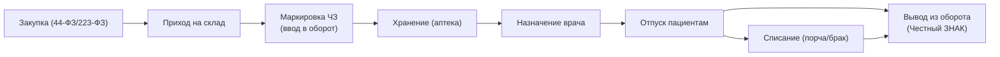
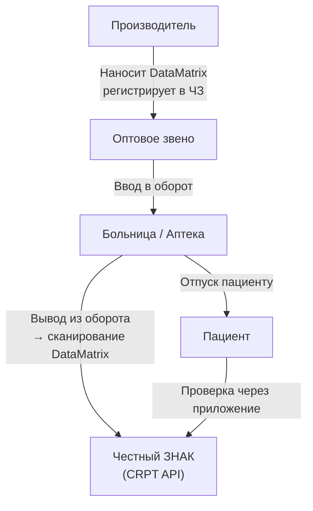

:::info[TL;DR]
Фармацевтический учёт — контроль движения лекарств в больнице: закупка, приход, хранение, отпуск пациентам. С 2020 года обязательна маркировка препаратов через систему «Честный ЗНАК» (ЦРПТ). Каждая упаковка — уникальный DataMatrix-код. К 2025 году маркировка охватывает 100% лекарств в РФ. Аналитик проектирует интеграцию аптечного склада с МИС и маркировку на уровне единицы товара.
:::

## Для кого эта статья

- Middle SA в фарме или больничной аптеке
- Аналитик, интегрирующий складской учёт с МИС
- SA, работающий с маркировкой Честный ЗНАК

После прочтения вы:
- Поймёте полный цикл движения лекарства: от закупки до списания
- Узнаете, как работает интеграция с Честным ЗНАКом (CRPT API)
- Сможете спроектировать модуль аптечного учёта в МИС

## Ключевые термины

| Термин | Описание |
|--------|----------|
| Честный ЗНАК (ЦРПТ) | Госсистема маркировки и прослеживания товаров |
| DataMatrix | Двумерный штрихкод ГОСТ Р 56095, уникальный для каждой упаковки |
| GTIN | Global Trade Item Number — код товара (14 цифр) |
| Ввод в оборот | Регистрация упаковки в системе ЧЗ при поступлении |
| Вывод из оборота | Списание упаковки при отпуске, порче или возврате |
| Сериализация | Присвоение уникального кода каждой единице товара |
| Batch / Lot | Партия — группа товаров с одинаковым сроком годности |

## Процесс движения лекарства

## Маркировка Честный ЗНАК

## Интеграция с МИС: сценарии

| Сценарий | Действие | Протокол | Таймаут |
|----------|----------|----------|---------|
| **Назначение** | Врач назначает препарат в ЭМК | Внутренний API МИС | — |
| **Проверка наличия** | МИС → Аптека: есть ли в наличии? | REST (JSON) | 3 сек |
| **Резервирование** | Аптека резервирует упаковку | REST | 5 сек |
| **Отпуск** | Аптека сканирует DataMatrix | Сканер + API | — |
| **Вывод из оборота** | Аптека → Честный ЗНАК API | REST (JSON, УКЭП) | 10 сек |
| **Списание** | Порча/брак → Честный ЗНАК | REST | 10 сек |

## Требования к системе учёта лекарств

| Параметр | Значение | Почему это важно |
|----------|----------|------------------|
| Маркировка | DataMatrix (ГОСТ Р 56095) | Обязательное требование ЧЗ |
| Интеграция | Честный ЗНАК API (CRPT) | Без интеграции — нельзя продавать/отпускать |
| Сериализация | Каждая упаковка — уникальный ID (GTIN + серийный номер) | Прослеживаемость от производителя до пациента |
| Сроки годности | Автоматический контроль (FEFO) | Запрет на отпуск просроченных препаратов |
| Списание | При порче, утере, возврате — обязательно в ЧЗ | Штраф за отсутствие вывода из оборота |
| Учёт | По batch/lot номерам | Отзыв партии при браке |

## Сравнение: учёт до и после маркировки

| Параметр | До ЧЗ (до 2020) | После ЧЗ (с 2024) |
|----------|----------------|-------------------|
| Идентификация | Наименование + дозировка | DataMatrix на каждой упаковке |
| Учёт движения | По партиям | Повитринный (каждая единица) |
| Списание | Акт на списание | Сканирование + CRPT API |
| Контроль | Внутренний | Гос. мониторинг в реальном времени |
| Штраф за ошибку | Нет | До 300 тыс. руб. |
| Возврат поставщику | Документарный | Сканирование + ЧЗ |

## Практический кейс: Внедрение маркировки в больнице

**Проблема:** Областная больница, аптека — 5000+ наименований. Отпуск лекарств — по бумажным накладным. С 2024 года маркировка обязательна — без внедрения ЧЗ больница не может закупать и отпускать лекарства.

**Анализ:**
- Аптека не подключена к интернету (локальная сеть)
- Сканеров DataMatrix нет
- МИС не поддерживает интеграцию с ЧЗ

**Решение:**
1. Подключение аптеки к защищённому каналу (ViPNet)
2. 10 сканеров DataMatrix (Zebra DS2208)
3. Модуль интеграции с CRPT API в МИС
4. Обучение 15 сотрудников аптеки

**Результат:**
- Время отпуска: 5 мин → 1 мин (со сканированием)
- Штрафы: сведены к нулю
- Расхождения по инвентаризации: 5% → 0.3%
- Стоимость проекта: 1.5 млн руб.

## Проверь себя

1. **Что такое Честный ЗНАК в фарме?**
   *Ответ:* Госсистема маркировки лекарств: каждая упаковка имеет уникальный DataMatrix-код, отслеживается от производителя до пациента.

2. **Какие этапы движения лекарства в больнице через ЧЗ?**
   *Ответ:* Закупка → Приход → Ввод в оборот (ЧЗ) → Хранение → Назначение → Отпуск → Вывод из оборота (ЧЗ).

3. **Что произойдёт, если больница не внедрила маркировку к 2024 году?**
   *Ответ:* Она не может закупать и отпускать лекарства — штраф до 300 тыс. руб. по КоАП РФ. Торговля без маркировки — уголовная ответственность (ст. 171.1 УК РФ).

4. **В чём разница между сериализацией и агрегацией?**
   *Ответ:* Сериализация — уникальный код на каждую упаковку. Агрегация — связь кодов в короб/паллету (в больницах обычно не требуется, нужна в оптовом звене).

5. **Как МИС узнаёт, что препарат можно отпустить?**
   *Ответ:* Проверка: срок годности не истёк, препарат выведен из оборота? (нет — можно), есть ли в наличии, есть ли назначение врача.

## Ссылки для самостоятельного изучения

| Что | Описание | URL |
|-----|----------|-----|
| Честный ЗНАК — API для аптек | CRPT API v2 — документация | markirovka.su |
| ГОСТ Р 56095 | Требования к DataMatrix для маркировки | gost.ru |
| 44-ФЗ о закупках | Регулирование госзакупок лекарств | consultant.ru |
| 223-ФЗ о закупках | Закупки госкомпаний (в т.ч. больниц) | consultant.ru |
| Постановление № 2052 | Правила маркировки лекарств | government.ru |

## Что дальше

- [Телемедицина](/docs/specialization/medtech-telemedicine) — электронные рецепты и интеграция с фармой
- [МИС — медицинские информационные системы](/docs/specialization/medtech-mis) — как модуль аптеки встраивается в МИС
