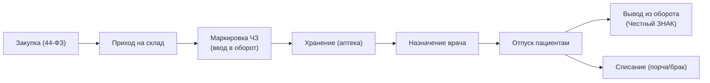
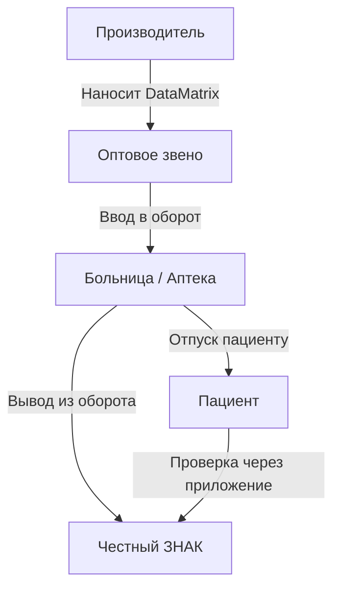

:::info[TL;DR]
Фармацевтический учёт — контроль движения лекарств в больнице: закупка, приход, хранение, отпуск пациентам. С 2020 года обязательна маркировка препаратов через систему «Честный ЗНАК» (ЦРПТ). Аналитик проектирует интеграцию аптечного склада с МИС и маркировку на уровне единицы товара.
:::

## Процесс движения лекарства

## Маркировка Честный ЗНАК

**Принцип:** каждая упаковка лекарства имеет уникальный код DataMatrix.

## Требования к системе учёта лекарств

| Параметр | Пример |
|----------|--------|
| Маркировка | DataMatrix (ГОСТ Р 56095) |
| Интеграция | Честный ЗНАК API (CRPT) |
| Сериализация | Каждая упаковка — уникальный ID |
| Сроки годности | Автоматический контроль |
| Списание | При порче, утере, возврате |
| Учёт | По batch/lot номерам |

## Интеграция с МИС

| Сценарий | Описание |
|----------|----------|
| **Назначение** | Врач назначает препарат в ЭМК |
| **Проверка** | МИС → Аптека: есть ли в наличии? |
| **Резервирование** | Аптека резервирует упаковку |
| **Отпуск** | Аптека сканирует DataMatrix |
| **Вывод из оборота** | Аптека → Честный ЗНАК |

## Что дальше

- [Телемедицина](/docs/specialization/medtech-telemedicine)

## Проверь себя

1. **Что такое Честный ЗНАК в фарме?**
   *Ответ:* Система маркировки лекарств — каждая упаковка имеет уникальный DataMatrix-код, отслеживается от производителя до пациента.

2. **Какие этапы движения лекарства в больнице?**
   *Ответ:* Закупка → Приход → Маркировка → Хранение → Назначение → Отпуск → Вывод из оборота.
