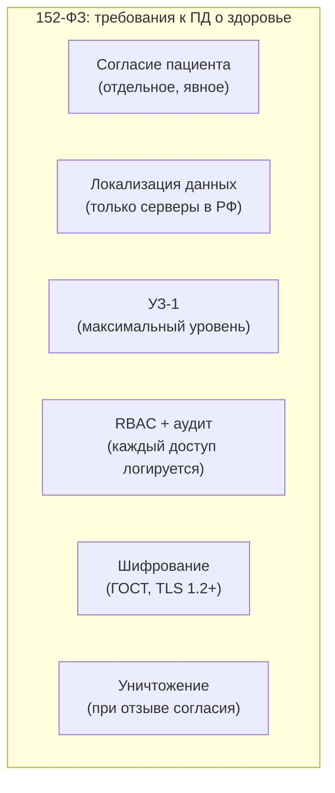
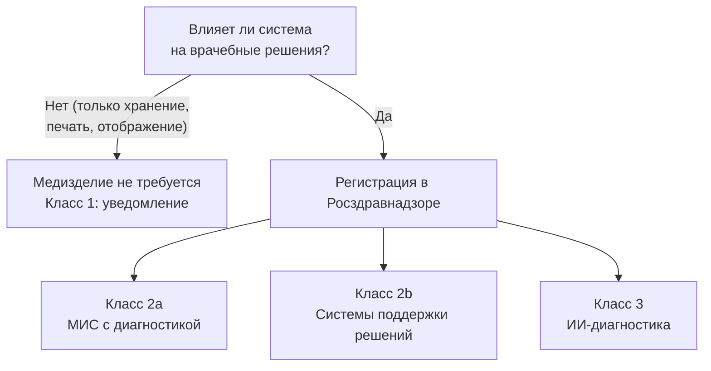

:::info[TL;DR]
Медицина — одна из самых регулируемых отраслей. Три столпа: 323-ФЗ (охрана здоровья, ЭМК, телемедицина), 152-ФЗ (ПД особой категории), постановление № 1275 (ЕГИСЗ). Все данные о здоровье — ПД особой категории (усиленная защита УЗ-1). Любая МИС должна соответствовать требованиям к обработке ПД и, если влияет на врачебные решения, регистрироваться как медизделие (классы риска 2a, 2b, 3). Штрафы за нарушения — до 300 тыс. руб. по КоАП, уголовная ответственность — за разглашение ПД (ст. 137 УК РФ).
:::

## Для кого эта статья

- Senior SA, проверяющий compliance медицинской системы
- Middle SA, проектирующий МИС с учётом регуляторных требований
- Enterprise-архитектор, планирующий регистрацию медизделия

После прочтения вы:
- Поймёте, какие НПА регулируют MedTech в РФ
- Узнаете требования к ПД особой категории (УЗ-1, локализация, согласие)
- Сможете определить, нужно ли регистрировать систему как медизделие

## Ключевые термины

| Термин | Описание |
|--------|----------|
| 323-ФЗ | «Об основах охраны здоровья» — базовый медицинский закон |
| 152-ФЗ | «О персональных данных» — защита ПД, особые категории (здоровье) |
| ЕГИСЗ | Единая гос. система здравоохранения — обязательная отчётность |
| Медизделие | Продукт, влияющий на врачебные решения — обязательная регистрация |
| УЗ-1 | Уровень защищённости ПД — максимальный для данных о здоровье |
| Росздравнадзор | Регулятор: лицензирование, контроль, штрафы |
| Приказ № 947н | Правила ведения ЭМК |
| Приказ № 797н | Порядок оказания телемедицинской помощи |

## Основные НПА

| НПА | Что регулирует | Кого касается | Штрафы |
|-----|---------------|--------------|--------|
| **323-ФЗ** | ЭМК, телемедицина, права пациента, медосмотры | Все медорганизации | До 300K руб. |
| **152-ФЗ** | Обработка ПД: согласие, локализация, УЗ, уничтожение | Все, кто обрабатывает данные | До 300K + уголовная (ст. 137) |
| **Приказ № 947н** | Правила ведения ЭМК | МИС, больницы | Предписание Росздравнадзора |
| **Приказ № 797н** | Телемедицина: что можно/нельзя | Телемедицинские платформы | Штраф + остановка |
| **Постановление № 1275** | Передача данных в ЕГИСЗ | Все гос. и частные ЛПУ | До 300K + блокировка |
| **Постановление № 2052** | Маркировка лекарств (Честный ЗНАК) | Аптеки, больницы | До 300K + изъятие товара |

## ПД особой категории: требования

| Требование | Описание | Нарушение |
|------------|----------|-----------|
| **Согласие** | Отдельное, явное, информированное согласие на обработку ПД о здоровье. Через Госуслуги или ЕСИА | Штраф 75-300K |
| **Локализация** | Все серверы обработки ПД — на территории РФ (ст. 18 152-ФЗ) | Штраф 100K + блокировка |
| **УЗ-1** | Максимальный уровень: антивирус, RBAC, шифрование, логирование | Предписание |
| **RBAC + аудит** | Каждый доступ к ПД — с ролью и аудитом. Хранение логов: 5-10 лет | Штраф 50-200K |
| **Шифрование** | Каналы: TLS 1.2+. Диски: ГОСТ-шифрование (КриптоПро) | Предписание |
| **Уничтожение** | При отзыве согласия или достижении цели обработки — безвозвратное удаление | Штраф | 

## Регистрация медизделия

| Класс риска | Риск | Пример | Требования |
|-------------|------|--------|-----------|
| **1** | Низкий | Архив ЭМК, просмотр снимков | Уведомление |
| **2a** | Средний | МИС с интерпретацией результатов | Документы + экспертиза |
| **2b** | Повышенный | CDSS — поддержка врачебных решений | Документы + КИ |
| **3** | Высокий | ИИ-алгоритмы диагностики (CAD) | Документы + КИ |

Регистрация занимает 6-18 месяцев (в зависимости от класса). Стоимость: от 200 тыс. до 2 млн руб. Без регистрации эксплуатация МИС, влияющей на диагноз, незаконна.

## Требования к МИС по compliance

| Параметр | Требование | Как проверить |
|----------|-----------|---------------|
| Класс ПД | Особая категория (здоровье) | Аудит данных |
| Согласие | Электронное, через Госуслуги или ЕСИА | Проверить интерфейс |
| Аудит | Все действия с ЭМК, хранение 10 лет | Логи в ClickHouse |
| УКЭП | Врач подписывает записи | КриптоПро + Рутокен |
| Медизделие | Регистрация (2a/2b) если влияет на диагноз | Свидетельство Росздравнадзора |
| ЕГИСЗ | Передача по HL7 FHIR | Проверить FHIR-транзакции |
| Шифрование | TLS 1.2+, ГОСТ | nmap, сканер уязвимостей |

## Практический кейс: Аттестация МИС

**Проблема:** Частная клиника разработала МИС для ведения ЭМК. Система ставит предварительные диагнозы на основе симптомов. Клиника не прошла аттестацию ФСТЭК — наложен штраф 200 тыс. руб.

**Анализ:**
- МИС обрабатывает ПД о здоровье — должна быть УЗ-1
- Система влияет на диагноз — требуется регистрация медизделия 2b
- Нет согласия пациента в электронном виде
- Нет аудита доступа к ЭМК
- Данные хранятся в двух дата-центрах, один — за пределами РФ (нарушение локализации)

**Решение:**
1. УЗ-1: внедрён ViPNet, КриптоПро, RBAC, аудит (ELK)
2. Регистрация медизделия класса 2b: 8 месяцев, 1.2 млн руб.
3. Согласие: электронная форма через Госуслуги
4. Миграция второго ДЦ в РФ
5. Подключение к ЕГИСЗ (FHIR)

**Результат:**
- Штраф выплачен, аттестация пройдена
- Регистрация медизделия: свидетельство получено
- ЕГИСЗ: данные передаются корректно
- Стоимость внедрения: 5 млн руб. (без штрафа — было бы 4.2 млн)

## Проверь себя

1. **Какие законы регулируют медицину в IT?**
   *Ответ:* 323-ФЗ (охрана здоровья), 152-ФЗ (ПД), постановление № 1275 (ЕГИСЗ), приказы Минздрава (№ 947н, № 797н), постановление № 2052 (ЧЗ).

2. **Когда МИС считается медизделием?**
   *Ответ:* Если она влияет на принятие врачебных решений (диагностика, лечение, поддержка). Класс риска — от 2a до 3.

3. **Какие требования 152-ФЗ к ПД о здоровье?**
   *Ответ:* Согласие, локализация (РФ), УЗ-1, RBAC + аудит, шифрование ГОСТ, уничтожение при отзыве.

4. **Какие санкции за нарушение локализации ПД?**
   *Ответ:* Штраф до 100 тыс. руб. по КоАП. Блокировка сайта/системы на территории РФ по решению Роскомнадзора.

5. **Почему для простого просмотровщика снимков не нужна регистрация медизделия, а для CDSS — да?**
   *Ответ:* Просмотрщик не влияет на диагноз — врач видит пиксели и интерпретирует сам. CDSS (система поддержки) подсказывает или ставит диагноз — это влияет на решение врача, требуется регистрация.

## Ссылки для самостоятельного изучения

| Что | Описание | URL |
|-----|----------|-----|
| 323-ФЗ | Полный текст закона | consultant.ru |
| 152-ФЗ | О персональных данных | consultant.ru |
| Постановление № 1275 | О ЕГИСЗ | government.ru |
| Приказ № 947н | Правила ведения ЭМК | minzdrav.gov.ru |
| Приказ № 797н | Телемедицина | minzdrav.gov.ru |
| Росздравнадзор — регистрация медизделий | Порядок и перечень | roszdravnadzor.gov.ru |

## Что дальше

Вернитесь к началу: [MedTech — путь аналитика](/docs/specialization/medtech-path), или перейдите к технологиям:
- [ЕМИАС — Единая МИС Москвы](/tech/emias) — пример крупнейшей МИС
- [HL7 FHIR — стандарт обмена](/tech/hl7) — как устроена интеграция
- [DICOM — медицинские изображения](/tech/dicom) — стандарт радиологии
