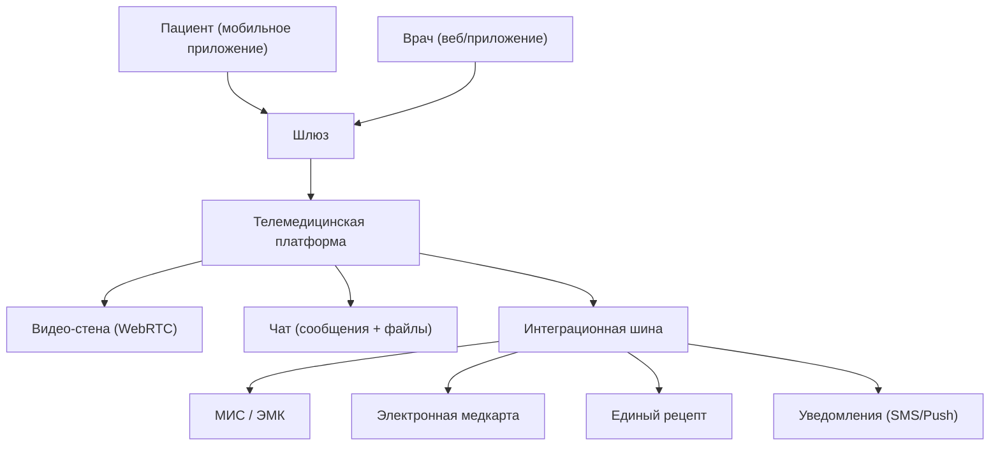
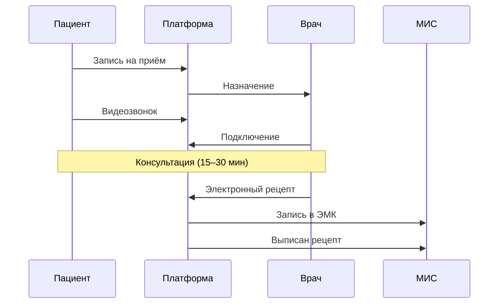

:::info[TL;DR]
Телемедицина — удалённое взаимодействие врача и пациента через видео/чат. С 2017 года разрешена в РФ (323-ФЗ). Включает: онлайн-приём, выписка электронных рецептов, дистанционный мониторинг, телемедицинские консилиумы. Аналитик проектирует сценарии приёма, интеграцию с МИС и ЭМК, требования к видео и безопасности.
:::

## Виды телемедицины

| Тип | Описание | Пример |
|-----|----------|--------|
| **Врач → Пациент** | Онлайн-консультация | SberHealth, Яндекс.Здоровье |
| **Врач → Врач** | Телемедицинский консилиум | Сложные случаи |
| **Мониторинг** | Удалённый контроль показателей | Давление, глюкоза |
| **Второе мнение** | Экспертная оценка снимков PACS | Радиология |

## Архитектура телемедицинской платформы

## Процесс телемедицинского приёма

## Требования к телемедицине

| Параметр | Пример |
|----------|--------|
| Видео | WebRTC, HD 720p |
| Аудио | Opus, эхо-подавление |
| Шифрование | TLS 1.3, сквозное (E2EE) по требованию |
| ЭМК | Запись консультации в ЭМК юридически значимо |
| Рецепт | Электронный рецепт с УКЭП |
| SLA | 99.9%, задержка видео < 200 ms |

## Что дальше

- [PACS / DICOM](/docs/specialization/medtech-pacs)

## Проверь себя

1. **Какие виды телемедицины существуют?**
   *Ответ:* Врач → Пациент (консультация), Врач → Врач (консилиум), мониторинг, второе мнение.

2. **Как телемедицина интегрируется с МИС?**
   *Ответ:* Через интеграционную шину: запись приёма в ЭМК, выписка электронного рецепта.
