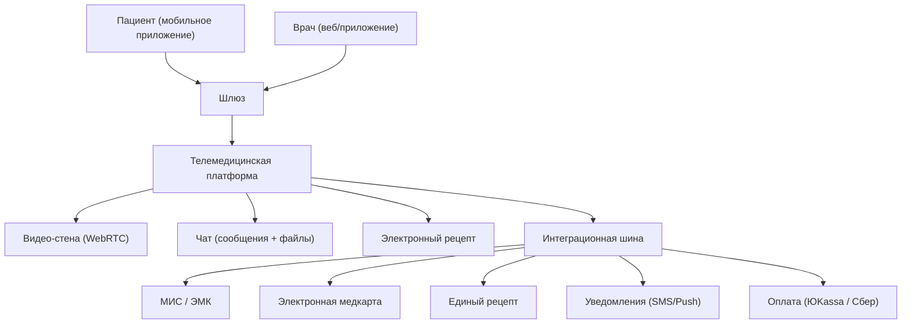
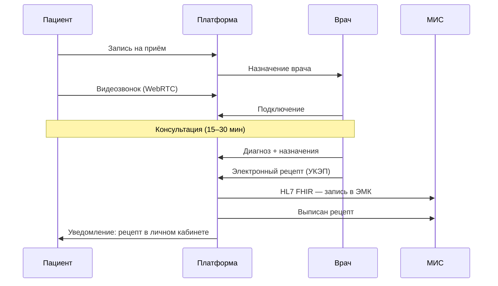

:::info[TL;DR]
Телемедицина — удалённое взаимодействие врача и пациента через видео/чат. С 2017 года разрешена в РФ (323-ФЗ, приказ № 797н). С 2020 года объём телемедицинских консультаций в РФ вырос в 5 раз. Включает: онлайн-приём, выписка электронных рецептов, дистанционный мониторинг, телемедицинские консилиумы. Крупнейшие платформы: ONDOC, СберЗдоровье (8M+ пользователей), Яндекс.Здоровье, Doctor.Ru. Аналитик проектирует сценарии приёма, интеграцию с МИС и ЭМК, требования к видео и безопасности.
:::

## Для кого эта статья

- Middle SA в телемедицинском проекте
- Аналитик, интегрирующий телемедицину с МИС
- SA, работающий с WebRTC и защищёнными каналами

После прочтения вы:
- Поймёте 4 вида телемедицины (врач-пациент, врач-врач, мониторинг, второе мнение)
- Узнаете архитектуру типовой телемедицинской платформы
- Сможете спроектировать сценарий консультации с интеграцией в ЭМК

## Ключевые термины

| Термин | Описание |
|--------|----------|
| Телемедицина | Удалённая медицинская помощь через ИКТ |
| WebRTC | Протокол видео/аудио-связи в браузере (P2P) |
| Приказ № 797н | Порядок оказания телемедицинской помощи в РФ |
| Электронный рецепт | Рецепт с УКЭП врача, юридически значимый |
| Дистанционный мониторинг | Автоматическая передача показателей (давление, глюкоза) |
| Телемедицинский консилиум | Удалённая консультация между врачами |
| HL7 FHIR | Стандарт передачи данных консультации в МИС |

## Виды телемедицины

| Тип | Участники | Описание | Пример |
|-----|-----------|----------|--------|
| **Врач → Пациент** | Видеозвонок | Онлайн-консультация | СберЗдоровье, Яндекс.Здоровье |
| **Врач → Врач** | Два врача | Консилиум по сложному случаю | Городской консилиум |
| **Мониторинг** | Устройство → Система | Передача показателей (давление, сахар) | СДМП, диабет-мониторинг |
| **Второе мнение** | Врач + эксперт | Экспертная оценка снимков | PACS + телемедицина |

## Архитектура телемедицинской платформы

## Процесс телемедицинского приёма

## Требования к телемедицинской платформе

| Параметр | Норма | Почему это важно |
|----------|-------|------------------|
| Видео | WebRTC, HD 720p | Качество для осмотра (кожные покровы, горло) |
| Аудио | Opus, эхо-подавление | Разборчивость речи — медицинская необходимость |
| Шифрование | TLS 1.3, E2EE по требованию | ПД особой категории — УЗ-1 |
| ЭМК | Запись консультации в ЭМК с УКЭП | Юридическая значимость |
| Рецепт | Электронный рецепт с УКЭП | Без подписи — недействителен |
| SLA | 99.9%, задержка видео < 200 ms | Пациенты не терпят задержек |
| Аудиозапись | Хранение 5 лет | Для разбора жалоб |

## Сравнение платформ телемедицины

| Платформа | Пользователи | Куда интегрирована | Особенность |
|-----------|-------------|-------------------|------------|
| **СберЗдоровье** | 8M+ | Сбер, ЕМИАС, МИС | Крупнейшая B2C |
| **Яндекс.Здоровье** | 3M+ | Яндекс Go, МИС | Быстрая запись |
| **Doctor.Ru** | 2M+ | ЕМИАС, ЧЗ | B2B + B2C |
| **ONDOCTOR** | 1M+ | МИС, Госуслуги | B2B для частных клиник |
| **ТАЛЕРО** | B2B | МИС, ЕГИСЗ | Гос. сегмент |

## Практический кейс: Внедрение телемедицины в частной клинике

**Проблема:** Сеть частных клиник (8 филиалов). 40% пациентов опаздывают или не приходят на приём. Ежемесячные потери: 1.5 млн руб. из-за простоев врачей.

**Анализ:**
- 30% записей — консультации без осмотра (сбор анамнеза, коррекция терапии)
- Пациенты тратят в среднем 2 часа на визит (дорога 30-60 мин, ожидание 30 мин)
- Врачи готовы вести удалённые приёмы

**Решение:** Внедрение телемедицинской платформы ONDOCTOR:
1. Интеграция с МИС (HL7 FHIR) — запись консультации в ЭМК
2. Видеозвонки WebRTC — без установки ПО
3. Электронные рецепты с УКЭП
4. Запись только на консультации без осмотра (анамнез, коррекция)

**Результат:**
- Доля удалённых приёмов: 25% от общего объёма
- Неявки: 40% → 8% (не нужно ехать)
- Выручка: +15% за счёт загрузки врачей
- NPS телемедицины: 82 (выше очных визитов — 76)
- Стоимость внедрения: 2 млн руб. Окупаемость: 4 мес.

## Проверь себя

1. **Какие виды телемедицины существуют?**
   *Ответ:* Врач → Пациент (консультация), Врач → Врач (консилиум), дистанционный мониторинг, второе мнение.

2. **Как телемедицина интегрируется с МИС?**
   *Ответ:* Через HL7 FHIR: запись консультации в ЭМК с УКЭП врача, выписка электронного рецепта.

3. **Какие требования к видео для телемедицины?**
   *Ответ:* WebRTC, HD 720p, шифрование TLS 1.3, задержка < 200 мс, аудиозапись с хранением 5 лет.

4. **Почему не все приёмы можно перевести в телемедицину?**
   *Ответ:* По 323-ФЗ первичный приём — только очно (если нужен осмотр). Телемедицина — для повторных консультаций, коррекции терапии, мониторинга.

5. **Как юридически оформляется телемедицинский приём?**
   *Ответ:* Врач вносит запись в ЭМК, подписывает УКЭП. Рецепт — электронный с УКЭП. Аудиозапись хранится 5 лет. Пациент даёт согласие на телемедицину.

## Ссылки для самостоятельного изучения

| Что | Описание | URL |
|-----|----------|-----|
| 323-ФЗ ст. 36.2 | Телемедицина — правовые основы | consultant.ru |
| Приказ Минздрава № 797н | Порядок оказания телемедицинской помощи | minzdrav.gov.ru |
| WebRTC | Спецификация протокола | webrtc.org |
| HL7 FHIR (Telemedicine) | Профиль для телемедицины | hl7.org/fhir |
| Электронный рецепт — ФЭР | Платформа единого рецепта | ferminzdrav.ru |

## Что дальше

- [PACS / DICOM](/docs/specialization/medtech-pacs) — как врач-радиолог использует телемедицину (второе мнение)
- [Регуляторика в медицине](/docs/specialization/medtech-regulations) — 323-ФЗ и телемедицина: что можно, что нельзя
