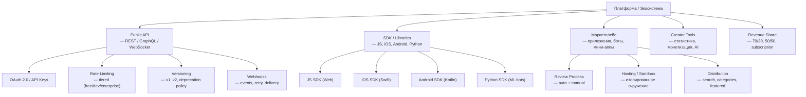
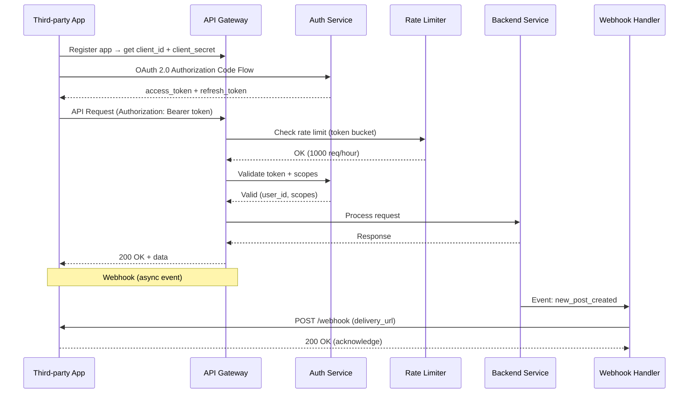

:::info[TL;DR]
Платформенные механики — Public API и SDK для внешних разработчиков, маркетплейс приложений (боты, мини-аппы, игры внутри платформы) и creator economy (инструменты для авторов). Примеры: Telegram Bot API (10M+ ботов), WeChat Mini Programs (5M+ приложений), Discord API (1M+ ботов), Facebook Graph API. Аналитик проектирует API-контракты, SDK, revenue share (70/30), политику публикации, rate limiting и метрики экосистемы (developer NPS, app quality, ecosystem revenue).
:::

## Для кого эта статья

Senior SA / Lead, работающий над платформенной стратегией. После прочтения вы:

- Поймёте компоненты экосистемы (API, SDK, маркетплейс, creator tools) и их взаимосвязь
- Узнаете архитектуру публичного API: auth (OAuth 2.0), rate limiting, versioning, webhooks
- Сможете проектировать политику публикации приложений и revenue share
- Поймёте метрики экосистемы: developer engagement, app quality, ecosystem flywheel

## 1. Компоненты экосистемы



## 2. Public API

### 2.1 Архитектура



### 2.2 API Design для соцсетей

| API | Method | Описание | Rate limit (free/dev) |
|-----|--------|----------|---------------------|
| `GET /users/{id}` | Profile | Чтение профиля | 1000/час |
| `GET /users/{id}/posts` | Timeline | Посты пользователя | 500/час |
| `POST /posts` | Create | Создать пост | 100/час |
| `GET /feed` | Feed | Лента пользователя | 200/час |
| `POST /media/upload` | Upload | Загрузить медиа | 1GB/день |
| `POST /graph/follow` | Follow | Подписаться | 100/час |
| `GET /graph/followers` | Followers | Список подписчиков | 200/час |
| `POST /payment/transfer` | Payment | Перевести донат | 50/час |
| `POST /webhook` | Register | Подписаться на события | 10 webhooks |

**Facebook Graph API:**

```
GET /v20.0/me?fields=id,name,posts.limit(10)
GET /v20.0/{page-id}/feed
POST /v20.0/{page-id}/photos

Rate limits (per user):
- User: 200 requests/hour
- App: 200 * number_of_users requests/hour
- Page: 200 requests/user/hour

Versioning: v20.0 (2025), version lifetime ~2 years
Deprecation: 90 days notice, migration guide
```

### 2.3 OAuth 2.0 Scopes

| Scope | Доступ | Пример |
|-------|--------|--------|
| `user:read` | Чтение профиля | Авторизация на сайте |
| `user:write` | Изменение профиля | Обновление аватарки |
| `post:read` | Чтение постов | Analytics dashboard |
| `post:write` | Создание постов | SMM-платформа |
| `feed:read` | Чтение ленты | Новостной агрегатор |
| `message:read` | Чтение сообщений | CRM-интеграция |
| `payment:write` | Инициировать платежи | Donation platform |
| `webhook` | Получение событий | Real-time боты |

## 3. SDK

### Структура типичного SDK

```
sdk/
├── src/
│   ├── client.ts           # HTTP client (axios, fetch)
│   ├── auth.ts             # OAuth 2.0 flow
│   ├── endpoints/          # API методы
│   │   ├── users.ts
│   │   ├── posts.ts
│   │   ├── feed.ts
│   │   └── graph.ts
│   ├── webhook.ts          # Webhook handler
│   ├── upload.ts           # Media upload (multipart)
│   └── types.ts            # TypeScript types
├── examples/               # Примеры использования
├── test/                   # Тесты
└── README.md               # Документация
```

### Пример: Telegram Bot API SDK

```python
# python-telegram-bot — самый популярный SDK для Telegram
from telegram import Bot
from telegram.ext import Application

bot = Bot(token="TOKEN")
async def start(update, context):
    await update.message.reply_text("Hello!")

app = Application.builder().token("TOKEN").build()
app.add_handler(CommandHandler("start", start))
app.run_polling()
```

**Метрики SDK:**

| Параметр | Telegram Bot API | Discord API | Facebook Graph API |
|----------|-----------------|-------------|-------------------|
| **SDK languages** | Python, JS, Java, C#, PHP, Go | Python (discord.py), JS (discord.js), Java, Go | PHP, JS, Python, iOS, Android |
| **GitHub stars** | 40K+ | 100K+ (discord.py) | 10K+ |
| **Bots/apps** | 10M+ | 1M+ | 5M+ |
| **Rate limit** | 30 msg/sec per bot | 50 req/sec | 200 req/user/hour |

## 4. Маркетплейс приложений

### 4.1 Типы приложений

| Тип | Описание | Пример платформы | Revenue model |
|-----|----------|------------------|---------------|
| **Bot** | Чат-бот, автоматизация | Telegram, Discord | Free / Premium features |
| **Mini App** | Встроенное приложение | WeChat, Telegram | In-app purchases |
| **Game** | HTML5-игра внутри платформы | WeChat, Facebook Gaming | Ads + IAP |
| **Creator Tool** | Аналитика, монтаж | YouTube, TikTok | Subscription |
| **Extension** | Дополнение функциональности | Facebook, Discord | Free / Donation |

### 4.2 Review Process

```
Developer submits app → Automated checks → Manual review → Published → Monitoring

Automated checks:
- Malware scan (ClamAV + sandbox)
- API usage pattern (anomaly detection)
- Permissions validation (scope minimal)
- Content policy check (NSFW, spam, copyright)
- Performance profile (CPU, memory, API calls)

Manual review:
- UI/UX consistency with platform
- Data privacy compliance (GDPR, COPPA)
- Revenue share compliance
- Developer identity verification

Monitoring (post-publication):
- Crash rate (> 1% = suspend)
- User reports (> 5% = review)
- API quota usage (anomaly)
- Monthly review for policy updates
```

### 4.3 Revenue Share

| Платформа | Standard | Game | Subscription | Описание |
|-----------|----------|------|-------------|----------|
| **Apple App Store** | 70/30 | 70/30 | 85/15 (year 2+) | Стандарт индустрии |
| **Google Play** | 85/15 (first $1M) | 70/30 | 85/15 | 15% для первых $1M |
| **WeChat Mini Programs** | 90/10 | 80/20 | 70/30 | 10% для большинства |
| **Telegram** | 70/30 | 70/30 | — | Toncoin payments |
| **Discord** | 90/10 | — | 90/10 | Nitro subscription |
| **YouTube** | — | — | 70/30 | Memberships |
| **OnlyFans** | 80/20 | — | 80/20 | Subscription |

## 5. Creator Tools

Инструменты для авторов контента — второй по важности компонент экосистемы:

| Tool | Функция | Пример | Monetization |
|------|---------|--------|-------------|
| **Analytics** | Статистика просмотров, подписчиков, revenue | YouTube Studio | Free |
| **Content creation** | Редактор, AI-генерация, фильтры | TikTok CapCut, Instagram Reels | Free + Premium |
| **Scheduling** | Планирование публикаций | Creator Studio | Free |
| **Monetization** | Payout dashboard, tax forms, invoice | YouTube AdSense | Free |
| **Audience** | Демография, активность подписчиков | Telegram Stats | Free |
| **Collab** | Поиск партнёров, brand deals | YouTube Brand Connect | Commission |

## 6. Практический кейс: WeChat Mini Programs

**Проблема:** WeChat (1.3B+ MAU) хочет стать операционной системой для сервисов — не просто мессенджер, а платформа, где можно заказать такси, оплатить счёт, поиграть.

**Решение:** Mini Programs — встроенные приложения (HTML5 + JS + WeChat SDK), которые запускаются внутри WeChat без установки.

```
Архитектура Mini Program:
1. Developer: HTML5 + CSS + JS + WeChat API
2. WeChat: JIT-compiles в native view
3. User: открывает внутри WeChat → не переключает приложения
4. Size limit: 10MB (увеличено с 5MB)
5. Payment: WeChat Pay (0.1-0.6% комиссии)
```

**Результат (2024):**
- 5M+ Mini Programs
- 450M+ DAU
- 20M+ developers
- Revenue: $50B+ GMV (2023)
- Top categories: e-commerce (30%), games (25%), food delivery (15%), transportation (10%)

**Ключевые факторы успеха WeChat Ecosystem:**
1. **Massive user base** — 1.3B MAU, каждый китаец использует WeChat
2. **Seamless payment** — WeChat Pay integrated, 0 friction
3. **Simple dev** — HTML5 + JS, любой веб-разработчик может
4. **No install** — открывается внутри WeChat, не занимает место на телефоне
5. **Revenue share** — 90/10 на большинство (очень привлекательно для разработчиков)

## Ссылки для самостоятельного изучения

| Ресурс | Описание | Ссылка |
|--------|----------|--------|
| Telegram Bot API | Полная документация Bot API | https://core.telegram.org/bots/api |
| Facebook Graph API | Документация Graph API Meta | https://developers.facebook.com/docs/graph-api |
| Discord Developer Portal | API и SDK Discord | https://discord.com/developers/docs |
| WeChat Mini Programs Guide | Руководство по разработке Mini Programs | https://developers.weixin.qq.com/miniprogram/en/ |
| OAuth 2.0 (RFC 6749) | Стандарт авторизации | https://oauth.net/2/ |
| Revenue Share Models Platform | Как работают revenue share в платформах | https://www.apple.com/app-store/ |
| Twitter/X API Documentation | API X/Twitter v2 | https://developer.twitter.com/en/docs |
| Google API Design Guide | Гайд по проектированию API от Google | https://cloud.google.com/apis/design |
| Platform Ecosystems (Tiwana) | Книга по платформенной экономике | https://www.amazon.com/Platform-Ecosystems-Aligning-Architecture-Governance/ |

## Проверь себя

1. **Какие компоненты входят в экосистему соцсети?**
   *Ответ:* Public API (REST/GraphQL), SDK (JS, iOS, Android, Python), Marketplace (боты, мини-аппы, игры), Creator Tools (аналитика, монетизация), Revenue Share (70/30, 90/10). Пример: WeChat — 5M+ Mini Programs, 450M+ DAU.

2. **Как работает OAuth 2.0 для публичного API соцсети?**
   *Ответ:* App регистрируется → получает client_id/secret → Authorization Code Flow → access_token + refresh_token → токен в каждом запросе (Bearer). Scopes определяют доступ (user:read, post:write). Rate limiting — tiered: free/dev/enterprise.

3. **Чем Mini Programs (WeChat) отличаются от обычных приложений?**
   *Ответ:* Mini Programs — HTML5 + JS внутри платформы, без установки, size limit 10MB, работают внутри WeChat. Плюсы: no install, seamless payment, простая разработка. Минусы: ограниченный функционал, зависимость от платформы.

4. **Как спроектировать review process для маркетплейса приложений?**
   *Ответ:* Automated checks (malware, API patterns, permissions, content policy, performance) → Manual review (UI/UX, data privacy, revenue share, identity) → Publish → Monitoring (crash rate > 1% = suspend, user reports > 5% = review).

5. **Почему 90/10 revenue share (WeChat) лучше для экосистемы, чем 70/30 (Apple)?**
   *Ответ:* 90/10 привлекает больше разработчиков (network effect — больше приложений → больше пользователей → больше revenue). WeChat может позволить 10%, потому что: (1) 1.3B MAU, (2) 0.1-0.6% комиссия на WeChat Pay покрывает инфраструктуру, (3) Mini Programs — часть супераппа (все сервисы в одном). Apple — 30% за экосистему и премиум-аудиторию.
