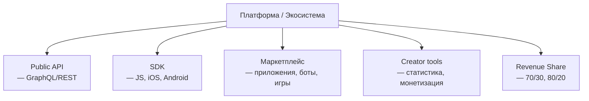

:::info[TL;DR]
Платформенные механики — API и SDK для внешних разработчиков, маркетплейс приложений (боты, мини-аппы, игры внутри платформы) и creator economy (инструменты для авторов). Аналитик проектирует API-контракты, SDK, revenue share, политику публикации и метрики экосистемы.
:::

## Компоненты платформы

## API публичной платформы

| API | Описание |
|-----|----------|
| `GET /users/{id}` | Профиль пользователя |
| `POST /posts` | Создать пост |
| `GET /feed` | Получить ленту |
| `POST /media/upload` | Загрузить медиа |
| `POST /graph/follow` | Подписаться |
| `POST /payment/transfer` | Перевести донат |

## Маркетплейс приложений

| Аспект | Описание |
|--------|----------|
| **Типы приложений** | Боты, мини-аппы, игры |
| **Public API** | GraphQL, REST |
| **Revenue share** | 70/30 (автор/платформа) |
| **Review process** | Автоматическая + ручная модерация |
| **Hosting** | Sandbox / изолированное окружение |

## Что дальше

Вернитесь к началу: [Соцсети — путь аналитика](/docs/specialization/socnet-path)

## Проверь себя

1. **Какие компоненты входят в экосистему платформы?**
   *Ответ:* Public API, SDK, маркетплейс, creator tools, revenue share.

2. **Как работает revenue share?**
   *Ответ:* 70% автору, 30% платформе (типично). Оплата через платёжную систему платформы.
