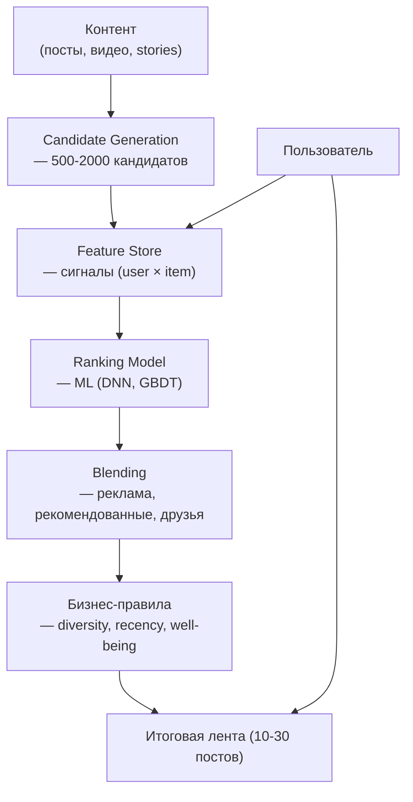
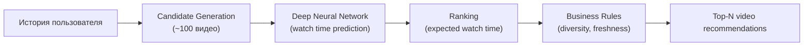

:::info[TL;DR]
Лента контента (feed) — основной интерфейс любой соцсети. Это не случайный список постов, а сложная ML-система ранжирования, которая решает: что показать пользователю, в каком порядке, сколько рекламы, как часто обновлять. Алгоритмическая лента (TikTok FYP, YouTube Recommendations) — ключевое конкурентное преимущество платформы. Аналитик проектирует типы контента, сигналы ранжирования, A/B тесты и метрики качества ленты (CTR, watch time, diversity).
:::

## Для кого эта статья

Senior SA, проектирующий контентную платформу. После прочтения вы:

- Поймёте архитектуру feed: candidate generation → ranking → blending → business rules
- Узнаете сигналы ранжирования и как их взвешивать для разных типов ленты
- Сможете проектировать A/B тесты для feed и метрики их эффективности
- Поймёте компромиссы: personalization vs diversity, recency vs relevance, engagement vs well-being

## 1. Архитектура feed



**Три этапа генерации ленты:**
1. **Candidate Generation** — отобрать 500-2000 релевантных постов из миллионов (быстрые методы: collaborative filtering, популярное, подписки)
2. **Ranking** — точная ML-модель оценивает каждый кандидат (CTR, watch time, engagement)
3. **Blending + Business Rules** — микс друзей/рекламы/рекомендаций, удаление дубликатов, diversity, well-being

## 2. Типы ленты

| Тип | Описание | Ранжирование | Пример |
|-----|----------|-------------|--------|
| **Friends Feed** | Только от подписок | Хронология + важные друзья | Facebook (original), Instagram (following) |
| **Algorithmic Feed** | Персонализированный микс | ML-модель (CTR, watch time, engagement) | TikTok FYP, Instagram Explore, YouTube |
| **Chronological Feed** | По времени публикации | Recency only | X/Twitter (опция), Telegram Channels |
| **Explore / Discovery** | Новый контент, cold start | Diversity, popularity, exploration | YouTube Explore, TikTok Discover |
| **Ads Feed** | Реклама в ленте | Auction (CPM × relevance) | Весь Facebook, Instagram |
| **Trending Feed** | Популярное сейчас | Velocity (скорость роста engagement) | X/Twitter Trending, YouTube Trending |

## 3. Сигналы ранжирования

Каждый сигнал — feature для ML-модели:

### User features

| Сигнал | Описание | Пример значения |
|--------|----------|----------------|
| **User embedding** | Векторное представление интересов | 128-dim float vector |
| **Past engagement** | История взаимодействий | likes: 45, comments: 12 |
| **Session context** | Текущая сессия | watched 3 videos, spent 8 min |
| **Time of day** | Когда пользователь активен | 22:00 even |
| **Device type** | Устройство | iOS 17, iPhone 15 |
| **Network speed** | Скорость интернета | 4G, 15 Mbps |
| **Country** | Регион | RU, US, IN |

### Item features

| Сигнал | Описание | Пример значения |
|--------|----------|----------------|
| **Item embedding** | Векторное представление контента | 128-dim float vector |
| **Content type** | Тип (video/photo/text) | `video` |
| **Author** | Кто опубликовал | author_embedding |
| **Recency** | Возраст поста | 2 hours ago |
| **Popularity** | Текущий engagement | 12K likes, 1.2K shares |
| **Watch time** | Среднее время просмотра | 45 seconds |
| **Completion rate** | % досмотревших до конца | 85% |
| **Language** | Язык контента | RU |

### Cross features (user × item)

| Сигнал | Описание |
|--------|----------|
| **Author affinity** | Как часто пользователь взаимодействует с автором |
| **Similar item engagement** | Вовлечённость в похожий контент |
| **Content type preference** | Предпочитаемый тип (video > photo > text) |
| **Topic affinity** | Интерес к теме |
| **Freshness preference** | Насколько пользователь ценит новый контент |

## 4. TikTok FYP — пример алгоритма

TikTok For You Page — самая известная recommendation-система. **Как устроена:**

**Candidate generation:**
- **Interests:** Похожие видео на основе прошлых взаимодействий
- **Friends:** Контент от друзей (TikTok не социальная сеть — друзья малозначимы)
- **Trending:** Популярное в регионе
- **Exploration:** Случайные видео (cold start для новых авторов)

**Ranking (two-tower DNN):**
```
User Tower: user_embedding + context → 128-dim
Item Tower: video_embedding + features → 128-dim
Score = dot_product(User_vector, Item_vector)
```

**Blending:**
```
Score = 0.6 × predicted_watch_time + 0.2 × predicted_like + 0.1 × predicted_share + 0.1 × predicted_comment
```

**Business rules:**
- Не больше 3 видео от одного автора подряд
- Не больше 70% от одного типа (video)
- 1 ad каждые 5-10 органических видео
- Well-being limit: не показывать triggers (disordered eating, violence)

## 5. Метрики качества feed

### Core metrics

| Метрика | Что измеряет | Норма | Описание |
|---------|-------------|-------|----------|
| **CTR** | Кликабельность | 5–20% | % постов, по которым тапнули |
| **Watch time** | Время просмотра | 15–60 мин/день | Главная метрика TikTok/YouTube |
| **Completion rate** | % досмотревших | 30–80% (зависит от длины) | Для short video: >60% хорошо |
| **Engagement rate** | Лайки/комменты/репосты | 1–5% от просмотров | Показывает «виральность» |
| **Session length** | Длина сессии | 10–30 мин | Среднее время за один визит |
| **Scrolling depth** | Глубина скролла | 20–50 постов | Сколько постов посмотрели |
| **Diversity** | Разнообразие контента | — | Не повторять одну тему |

### Business metrics

| Метрика | Что измеряет | Формула |
|---------|-------------|---------|
| **DAU/MAU** | Ежедневная активность | DAU / MAU (цель > 0.5) |
| **Retention D1/D7/D30** | Возврат пользователей | % вернувшихся |
| **Ad revenue per session** | Доход с сессии | Ad RPM × scrolls |
| **Time-to-find** | Время до первого интересного поста | < 5 секунд |
| **Churn by week** | Отток новых пользователей | % не вернувшихся на неделе 2 |

### Well-being metrics (регуляторные)

| Метрика | Описание | Пример |
|---------|----------|--------|
| **Excessive use** | % пользователей с > 3 часов/день | Цель: снизить |
| **Reported content** | % отмеченного как оскорбительное | Цель: < 0.5% |
| **Negative engagement** | Хейт-комментарии, bullying | ML-детекция |

## 6. A/B тесты в feed

Feed A/B тесты — самые сложные в соцсетях:

| Проблема | Решение |
|----------|---------|
| **Network effects** | Изменение feed влияет не только на тестовую группу, но и на авторов (их контент видят меньше → они уходят) | Switchback эксперименты (чередование времени), Clustered randomized experiments |
| **Long-term effects** | CTR может вырасти за счёт clickbait, но retention упадёт через 2 недели | Long-term holdout; минимум 2 недели на тест |
| **Cold start** | Новые пользователи ведут себя иначе | Отдельные эксперименты на новых users |
| **Seasonality** | Feed в пятницу вечером = другой | Длительность эксперимента > 7 дней |
| **Interference between tests** | Два feed A/B теста влияют друг на друга | Interleaving (чередование результатов моделей) |

**Пример A/B теста: изменение веса predicted watch time vs CTR**

```
Контроль:     0.6 watch_time + 0.4 CTR
Эксперимент:  0.7 watch_time + 0.3 CTR
Метрики:      Watch time (primary), CTR (secondary), Ad revenue (guardrail)
Длительность: 14 дней
Результат:    Watch time +12%, CTR -2%, Ad revenue +0.5% → OK, катим
```

## 7. Практический кейс: YouTube Recommendations

YouTube — одна из первых recommendation-систем в интернете (запуск 2008, первая DNN 2016).

**Как работают рекомендации YouTube (deep neural network, 2016):**



**Архитектура two-tower:**
```
User features: watched_video_ids, search_terms, demographics, device
Video features: video_id, topic, upload_time, language, popularity
```

**Метрики YouTube:**
- **Watch time (primary):** 1B+ часов/день
- **Session start:** % сессий, начавшихся с рекомендаций
- **Exploration rate:** % видео от новых авторов
- **Dry spells:** как быстро пользователь находит интересное видео

**Ключевое открытие YouTube:** predicted watch time (ожидаемое время просмотра) работает лучше, чем predicted CTR — пользователи могут кликать на кликбейт, но не смотреть. Watch time — «true north» метрика.

## Ссылки для самостоятельного изучения

| Ресурс | Описание | Ссылка |
|--------|----------|--------|
| YouTube Deep Neural Networks for YouTube Recommendations | Классическая статья (2016) | https://research.google/pubs/deep-neural-networks-for-youtube-recommendations/ |
| TikTok Engineering Blog | Архитектура FYP | https://www.tiktok.com/engineering |
| Twitter/X Recommendation Algorithm | Open-source код рекомендаций | https://github.com/twitter/the-algorithm |
| Instagram Explore Recommender (IGCV) | Как работает Explore | https://instagram-engineering.com/ |
| Facebook Feed Ranking | Как Facebook ранжирует посты | https://engineering.fb.com/core-data/feed-ranking/ |
| Netflix Tech Blog — Recommendations | Рекомендательная система Netflix | https://netflixtechblog.com/ |
| Spotify Recommendation — Discover Weekly | Как работает Discover Weekly | https://research.atspotify.com/ |
| Pinterest Engineering — PinSage (Graph Recs) | Рекомендации через графовую нейросеть | https://engineering.pinterest.com/ |
| RecSys Conference | Главная конференция по рекомендательным системам | https://recsys.acm.org/ |
| Awesome Recommender Systems | Сборник материалов по RecSys | https://github.com/grahamjenson/list-of-recommender-systems |

## Проверь себя

1. **Как устроена архитектура feed?**
   *Ответ:* Candidate Generation (500-2000 кандидатов) → Feature Store → Ranking Model (ML) → Blending (ads, friends, recs) → Business Rules (diversity) → Feed (10-30 постов).

2. **Какие сигналы ранжирования важны для feed?**
   *Ответ:* User features (embedding, history, context), Item features (embedding, type, popularity, recency), Cross features (author affinity, topic similarity).

3. **Чем TikTok FYP отличается от YouTube Recommendations?**
   *Ответ:* TikTok — only short video, FYP — single feed, two-tower DNN. YouTube — mixed (long + short), candidate generation из поиска и подписок, ranking на expected watch time.

4. **Какие метрики используются для оценки качества feed?**
   *Ответ:* Core: CTR, watch time, completion rate, session length, scrolling depth, diversity. Business: DAU/MAU, retention, ad revenue. Well-being: excessive use, reported content.

5. **Почему A/B тесты в feed сложнее, чем в Enterprise?**
   *Ответ:* Network effects (новый feed влияет на весь ecosystem), long-term effects (CTR может расти за счёт clickbait, retention падать), seasonality (feed разный в разное время), interference между экспериментами.
