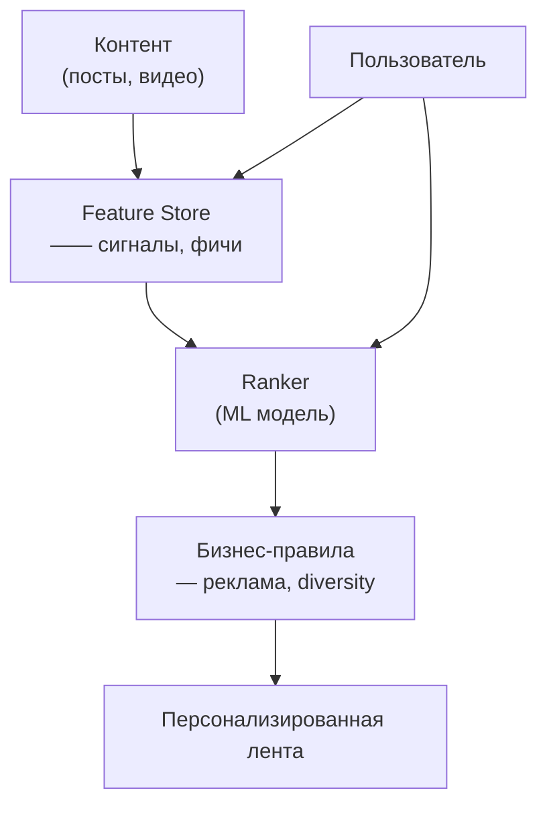

:::info[TL;DR]
Лента контента (feed) — основной интерфейс соцсети: посты, видео, истории, реклама, сгенерированные для пользователя. Ранжирование (ranking) определяет порядок постов. Рекомендации подбирают контент вне подписок. Аналитик проектирует типы контента, сигналы ранжирования, A/B тесты и метрики качества ленты.
:::

## Архитектура feed

## Типы ленты

| Тип | Описание | Пример |
|-----|----------|--------|
| **Friends feed** | Только от подписок | Facebook (истоки) |
| **Algorithmic feed** | Ранжированный | TikTok, Instagram |
| **Chronological feed** | По времени | Twitter/X (опция) |
| **Explore / Recommendations** | Новый контент | YouTube, TikTok |

## Сигналы ранжирования

| Сигнал | Описание |
|--------|----------|
| **Recency** | Время публикации |
| **Author affinity** | Взаимодействие с автором |
| **Content type** | Видео, фото, текст |
| **Engagement** | Лайки, комментарии, репосты |
| **Watch time** | Время просмотра видео |
| **CTR** | Кликабельность |

## Что дальше

- [Монетизация соцсетей](/docs/specialization/socnet-monetization)

## Проверь себя

1. **Как устроена архитектура feed?**
   *Ответ:* Контент → Feature Store → Ranker (ML) → Бизнес-правила → Лента.

2. **Какие сигналы ранжирования важны?**
   *Ответ:* Recency, author affinity, content type, engagement, watch time, CTR.
