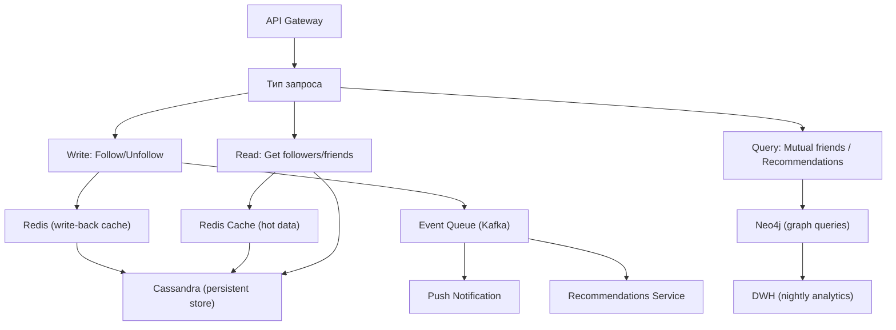
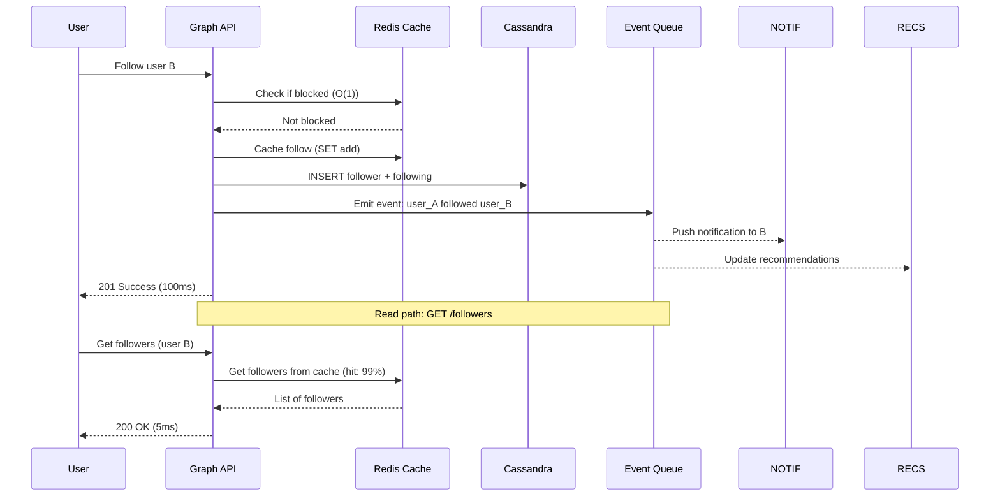

:::info[TL;DR]
Социальный граф — структура связей между пользователями (подписки, друзья, фолловеры, блоки, мьюты). Хранится в графовых БД (Neo4j, DGraph) или key-value (Redis, Cassandra). Ключевые операции: подписаться/отписаться, получить ленту друзей, найти общих друзей, рекомендации. Масштаб: Facebook хранит 250B+ edges, LinkedIn — 80B, обрабатывают 10M+ запросов/сек. Аналитик проектирует типы связей, алгоритмы рекомендаций друзей (friend-of-friend, ML-embeddings) и метрики графа (density, clustering coefficient, PageRank).
:::

## Для кого эта статья

Middle/Senior SA, работающий над социальными связями. После прочтения вы:

- Классифицируете типы связей (friend/follow/block/mute/subscribe) и их семантику
- Поймёте архитектуру хранения графа на разных масштабах (SQL → Redis → Cassandra → Neo4j)
- Сможете проектировать алгоритмы рекомендаций друзей и метрики качества графа
- Узнаете real-time операции (follow/unfollow, feed generation) на масштабе 1B+ пользователей

## 1. Типы связей и их семантика

| Тип | Направление | Влияние на ленту | Влияние на граф | Пример |
|-----|-------------|-----------------|-----------------|--------|
| **Friend** | Взаимная (A↔B) | Посты друзей в ленте | Двунаправленное ребро | Facebook, LinkedIn |
| **Follow** | Однонаправленная (A→B) | Посты B в ленте A | Направленное ребро | Instagram, Twitter/X |
| **Subscribe** | Пользователь→Канал | Сообщения канала | Membership edge | Telegram, YouTube |
| **Block** | A запрещает B | B не видит A, A не видит B | Directed + filter | Все платформы |
| **Mute** | A скрывает B | B не в ленте A | Filter-only (не ребро) | Twitter, Instagram |
| **Close Friend** | A помечает B | Приоритет в ленте | Weighted edge | Instagram, Snapchat |
| **Family** | Группа родственников | Особые настройки приватности | Group membership | Facebook, Google |

### Семантические различия

```
Friend (Facebook): взаимное согласие. Если A друг B, то B друг A.
Follow (Twitter/X): одностороннее. A может читать B, но B не обязан читать A.
Подписка (Telegram): пользователь подписан на канал. Канал не подписан на пользователя.
Block: полное прекращение коммуникации. A блокирует B — B не может найти A, писать A, видеть посты A.
Mute: только фильтр ленты. B не знает, что A замутил B.
```

**Пример масштаба:**
- Facebook: 3B+ пользователей, 250B+ friend edges, 10M+ новых дружеских связей/день
- Instagram: 2B+ пользователей, follows 70% (follow однонаправленный), friends 30% (взаимный)
- LinkedIn: 1B+ пользователей, 80B+ connections, 300M+ новых connection/неделю

## 2. Архитектура хранения графа



### Масштабирование: от стартапа к гиганту

| Этап | Технология | Масштаб | Плюсы | Минусы |
|------|-----------|---------|-------|--------|
| **MVP** | SQL (user_id, follower_id) | < 100M edges | Просто, ACID | Медленные запросы на больших графах |
| **Growth** | Redis Sorted Sets | < 1B edges | Быстро (< 1ms), TTL | RAM cost, нет сложных запросов |
| **Scale** | Cassandra (wide-column) | < 100B edges | Time-ordered, linear scaling | Нет graph queries |
| **Enterprise** | Neo4j / DGraph | Любой | Graph queries (BFS, PageRank) | Сложнее ops, cost |

### Cassandra schema для social graph

```
-- Followers (получатели → кто подписан)
CREATE TABLE social_graph.followers (
    user_id text,              -- целевой пользователь
    follower_id text,          -- кто подписан
    followed_at timestamp,     -- когда подписался
    is_mutual boolean,         -- взаимная подписка?
    PRIMARY KEY (user_id, follower_id)
) WITH CLUSTERING ORDER BY (follower_id ASC);

-- Following (кто → на кого подписан)
CREATE TABLE social_graph.following (
    user_id text,              -- пользователь
    following_id text,          -- на кого подписан
    followed_at timestamp,
    PRIMARY KEY (user_id, following_id)
) WITH CLUSTERING ORDER BY (following_id ASC);
```

**Проблема:** Для получения «кого подписаны друзья пользователя» (feed рекомендаций) нужно:
1. Получить подписки пользователя (N запросов)
2. Для каждой подписки получить её подписки (M запросов)
3. Итого: O(N × M). На масштабе 100M — невозможно через Cassandra.

**Решение:** Neo4j (graph query — 1 запрос):
```
MATCH (user:User {id: '123'})-[FOLLOWS]->(friend)-[FOLLOWS]->(rec)
WHERE NOT (user)-[FOLLOWS]->(rec) AND user.id <> rec.id
RETURN rec, COUNT(*) as mutual_count
ORDER BY mutual_count DESC LIMIT 50
```

## 3. Операции графа



### Write path: follow/unfollow

| Операция | Средняя latency | Узкое место |
|----------|----------------|-------------|
| **Follow** | 50-150ms | Cassandra write (2 nodes) |
| **Unfollow** | 50-100ms | Cassandra delete |
| **Block** | 100-200ms | Cassandra write + cache invalidation |
| **Mute** | 10-50ms | Redis only (mutes не в Cassandra) |
| **Bulk import** (миграция) | 10K writes/sec/node | Cassandra batch |

### Read path: feed friends

**Проблема:** Для ленты нужно получить посты от подписок = read fanout.

| Подход | Latency | Cost | Описание |
|--------|---------|------|----------|
| **Pull** (Twitter) | 100-500ms | Средний | При заходе: собрать подписки → запросить их посты |
| **Push** (Instagram) | 10-50ms | Высокий | При публикации: записать пост в ленту подписчиков |
| **Hybrid** (Facebook) | 50-200ms | Средний | Активные подписки → push, остальные → pull |

## 4. Рекомендации друзей

### Алгоритмы

| Алгоритм | Описание | Пример |
|----------|----------|--------|
| **Friend-of-Friend (FoF)** | Друзья друзей, которых нет в подписках | LinkedIn «People You May Know» |
| **Collaborative Filtering** | Пользователи с похожими подписками | Facebook Friend Suggestions |
| **Contact Sync** | По номерам телефона из адресной книги | WhatsApp, Telegram |
| **Graph Embedding** | Node2Vec, GraphSAGE — ML на графе | Pinterest PinSage |
| **PageRank / Eigenvector** | Важность пользователя в графе | Twitter Suggested Follows |
| **Clustering** | Пользователи в одной группе/событии | Facebook Events → друзья |

### LinkedIn «People You May Know»

LinkedIn — самый известный алгоритм рекомендаций друзей (connections):

```
1. FoF: общие друзья (2nd degree) → weight = count of mutual connections
2. Similarity: одинаковые industry, company, school, skills
3. Recency: кто недавно смотрел профиль / кто недавно зарегистрировался
4. Engagement: кто взаимодействовал с вашими постами
5. ML ranker: XGBoost на features (mutual_count, industry_score, location_distance)

Score = w1 × mutual_count + w2 × industry_match + w3 × recency + w4 × engagement_signals
```

**Метрики рекомендаций:**

| Метрика | LinkedIn | Facebook | Instagram |
|---------|----------|----------|-----------|
| **Accept rate** | 15-25% | 20-30% | 10-15% |
| **CTR on recommendation** | 5-10% | 8-15% | 3-7% |
| **Conversion** (дружба) | 20-40% | 30-50% | 15-25% |
| **Cold start performance** (новые пользователи) | 5% accept | 10% accept | 8% accept |

## 5. Метрики социального графа

### Core метрики

| Метрика | Описание | Норма для соцсети |
|---------|----------|-------------------|
| **Graph density** | % возможных связей, которые реализованы | Facebook: 10⁻⁷ (очень разреженный) |
| **Average degree** | Среднее число подписок/друзей | Facebook: 250, Twitter: 100, LinkedIn: 400 |
| **Clustering coefficient** | Насколько «друзья друзей» — друзья | 0.1-0.3 (соцсети) |
| **Diameter** | Максимальный путь между пользователями | Facebook: 3.5, LinkedIn: 4.5 |
| **Giant component size** | % пользователей в связном компоненте | > 99% |
| **Reciprocity** | % взаимных подписок | Facebook: 60%, Twitter: 20% |
| **Affinity** | Среднее число взаимодействий между connected | Instagram: 3/день, Facebook: 1/день |

### Business метрики

| Метрика | Что измеряет | Как влияет |
|---------|-------------|------------|
| **New connections/day** | Рост графа | Виральность, retention |
| **Churn of connections** | Отток связей | Unfollow rate — показатель качества |
| **Feed reach** | % постов, которые доходят до подписчиков | Organic reach (Facebook: 5%) |
| **Invite acceptance** | % принятых приглашений | Эффективность FoF |
| **Social retention** | Retention пользователей с N друзьями | 10 друзей = 80% retention (Facebook) |

**Правило 10 друзей (Facebook):** Если пользователь завёл 10 друзей за первую неделю — retention через месяц — 80%+. Если 0 друзей — retention < 10%. Социальный граф — критический фактор удержания.

## 6. Практический кейс: Facebook Graph — 250B+ edges

**Проблема:** Facebook хранит 250B+ дружеских связей (edges), обрабатывает 10M+ запросов/сек к графу. Каждая операция (follow, unfollow, блок) должна быть consistent и доступна.

**Архитектура Facebook Social Graph (2015-2024):**

| Компонент | Технология | Роль |
|-----------|-----------|------|
| **Graph Store** | TAO (Facebook custom) | Хранение edges и objects |
| **Cache** | Memcached (thousands of nodes) | Hot data: 95% cache hit |
| **Async writes** | Scribe (Kafka-like) | Event log для async обработки |
| **Read path** | TAO → Cache → MySQL | 99% reads из cache |
| **Write path** | TAO → MySQL + async → Search/Recs | Write через TAO API |

**Фишка TAO:** Ассоциативная модель — объекты (users) и ассоциации (friends, likes, comments). Каждая ассоциация — directed edge. Поддержка count, time-order, pagination.

**Как работают рекомендации друзей Facebook (2019 ML update):**

```
1. FoF baseline → ~50% качества
2. Graph Embedding (Node2Vec) → +15% accept rate
3. ML model (GBDT + DNN) → +20% accept rate
  Features:
  - FoF mutual count (1-2-3 friends)
  - Timeline: кто недавно добавил друзей
  - Similarity: network, school, location, age, language
  - Engagement: лайки/комменты с этим человеком
  - Negative signals: блок, игнор рекомендаций
  - Cold start: phone contacts, email imports
4. Meta-ранжирование: diversity (не все из одной группы), freshness (не показывать 2 раза)
```

**Результат:** 50B+ friend recommendations/day, 200M+ new connections/day.

## Ссылки для самостоятельного изучения

| Ресурс | Описание | Ссылка |
|--------|----------|--------|
| Facebook TAO (Graph Storage) | Как Facebook хранит social graph | https://engineering.fb.com/data-infrastructure/tao/ |
| Neo4j Graph Databases | Введение в графовые БД | https://neo4j.com/docs/getting-started/ |
| LinkedIn — PYMK Algorithm | Как работает People You May Know | https://engineering.linkedin.com/blog/2017/02/people-you-may-know |
| Pinterest PinSage (Graph Embeddings) | Графовые рекомендации от Pinterest | https://medium.com/pinterest-engineering/pinsage-a-graph-convolutional-network-for-recommendations-5e6f8c3e9f4d |
| Node2Vec (Stanford) | Алгоритм графовых эмбеддингов | https://snap.stanford.edu/node2vec/ |
| GraphX (Apache Spark) | Графовые вычисления на Spark | https://spark.apache.org/graphx/ |
| Twitter Graph at Scale | Как Twitter работает с графом | https://blog.twitter.com/engineering/en_us/topics/insights/2017/ |
| DGraph Labs | Open-source графовая БД | https://dgraph.io/ |

## Проверь себя

1. **Какие типы связей в соцсетях и чем friend отличается от follow?**
   *Ответ:* Friend — взаимная (A↔B), Follow — однонаправленная (A→B). Facebook использует friend (нужно согласие обеих сторон), Twitter/X — follow (можно подписаться без согласия). Block — полное прекращение, Mute — только фильтр ленты.

2. **Как хранить социальный граф на разных масштабах?**
   *Ответ:* SQL (MVP, < 100M edges), Redis (growth, < 1B, быстрые операций), Cassandra (scale, < 100B, time-ordered), Neo4j (enterprise, сложные graph queries). Facebook использует TAO (собственная ассоциативная БД на Memcached + MySQL).

3. **Как работает рекомендация друзей (FoF)?**
   *Ответ:* Friend-of-Friend — найти пользователей, с которыми мои друзьья уже связаны (2nd degree). LinkedIn учитывает mutual connections + industry/school/location. Facebook добавляет ML (GBDT + DNN) на features: mutual count, timeline, similarity, engagement, negative signals.

4. **Почему нельзя хранить все связи в SQL на масштабе Facebook?**
   *Ответ:* Facebook: 250B+ edges в одной таблице = full table scan невозможен. Joins (найти друзей друзей) — миллиарды строк. SQL не scale для graph queries (friend-of-friend, BFS). Нужен custom graph store (TAO) или NoSQL с шардированием.

5. **Какие метрики важны для оценки здоровья social graph?**
   *Ответ:* Core: graph density (разреженный), average degree (250 для Facebook), clustering coefficient (0.1-0.3), diameter (3.5), reciprocity (60% для friend-based). Business: new connections/day, feed reach (5% органический), social retention (10 друзей за неделю = 80% retention).
