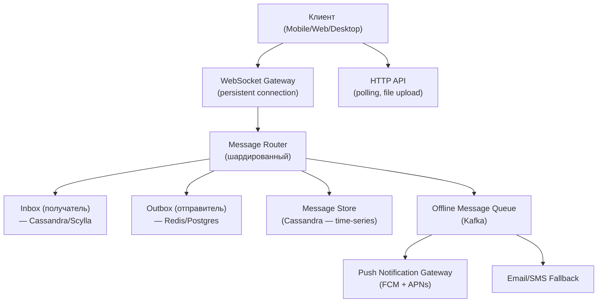

:::info[TL;DR]
Мессенджер — real-time система обмена сообщениями, одна из самых сложных инфраструктурных задач в IT. Ключевые компоненты: транспорт (WebSocket, MQTT, HTTP Polling), хранение (key-value + SQL для истории), маршрутизация (Inbox/Outbox модель), E2EE (Signal Protocol), доставка (offline queue + push-уведомления), групповые чаты и интеграции (bots, payments). Аналитик проектирует типы сообщений, статусную модель, схему хранения, E2EE-архитектуру и систему доставки для миллиардов сообщений в день.
:::

## Для кого эта статья

Senior SA, проектирующий real-time коммуникации. После прочтения вы:

- Поймёте архитектуру мессенджера: транспорт, хранение, маршрутизация, доставка
- Узнаете разницу между Inbox/Outbox моделями и fanout на миллиарды
- Сможете спроектировать E2EE для чата (Signal Protocol, MTProto)
- Поймёте метрики доставки: latency, delivery rate, loss rate

## 1. Архитектура мессенджера



**Основные потоки:**

1. **Online delivery:** WebSocket → Router → Inbox (если online) → Push (если offline)
2. **Offline:** Server stores → Push notification → Client opens → History sync
3. **History sync:** Client запрашивает историю → Message Store → Paginated response

## 2. Типы сообщений

| Тип | Пример | Размер | Хранение | Доставка |
|-----|--------|--------|----------|----------|
| **Text** | «Привет!» | ~1KB | Cassandra | Real-time |
| **Image** | Фото 1080p | 200-500KB | S3 + thumbnails | Content URL |
| **Video** | Видео 720p | 5-50MB | S3 + CDN + HLS | Streaming |
| **Voice** | Аудиосообщение | 100-500KB | S3 + OGG | Streaming |
| **Sticker / GIF** | Анимация | 50-200KB | CDN (pre-cached) | Real-time |
| **File** | PDF, ZIP | до 2GB | S3 presigned URL | Download |
| **System** | «Печатает…», «Прочитано» | ~100B | No store (in-memory) | Real-time |
| **Service** | Bot message, payment | ~1KB | Cassandra | Real-time |

## 3. Модель доставки: Inbox/Outbox

**Ключевая проблема:** в чате на 1000 участников каждое сообщение должно быть доставлено 1000 раз. Это fanout.

### Модель 1: Pull (Inbox per user)

```
Каждый пользователь имеет Inbox (sorted set в Cassandra).
Когда приходит сообщение для чата — сервер кладёт копию в Inbox каждого участника.
Пользователь pull'ит свой Inbox при старте.

+ Простая реализация
+ Быстрое чтение
- Хранение N копий (1 сообщение = N записей)
- Много записей для mega-групп (100K+)
```

**Пример:** Telegram — каждое сообщение в мегагруппе (100K+ участников) = 100K записей в БД. Это дорого, но Telegram платит за инфраструктуру.

### Модель 2: Push (Outbox + lazy fanout)

```
Сообщение хранится 1 раз в Message Store. 
Когда пользователь заходит — сервер проверяет последние сообщения в чатах, где он участник.
Outbox (Redis) — очередь «какие сообщения для каких пользователей ещё не доставлены».

+ Экономия storage (1 сообщение = 1 запись)
+ Лучше для больших групп
- Pull'ить историю может быть медленно
- Сложнее реализация
```

**Пример:** Facebook Messenger — fanout отложенный. Сообщение кладётся 1 раз, при загрузке приложения сервер агрегирует.

### Сравнение

| Параметр | Inbox per user | Lazy fanout |
|----------|---------------|-------------|
| **Storage** | O(N участников) | O(1) на сообщение |
| **Read latency** | Низкая | Средняя (нужно агрегировать) |
| **Write cost** | Высокий (N записей) | Низкий (1 запись) |
| **Best for** | Маленькие чаты &lt; 1000 | Большие чаты &gt; 1000 |
| **Пример** | Telegram (мегагруппы = Inbox) | Messenger, Discord |

## 4. E2EE (End-to-End Encryption)

E2EE — обязательное требование для современных мессенджеров. Без E2EE сообщения могут быть перехвачены на сервере (или предоставлены по запросу регулятора).

### Signal Protocol

Используется в: Signal, WhatsApp, Messenger (Secret Conversations).

```
У каждого пользователя есть ключевая пара (Identity Key — долгая, Signed Pre-Key — средняя)
и множество Ephemeral (одноразовых) ключей.

Алиса хочет написать Бобу:
1. Запросить ключи Боба (с сервера)
2. Вычислить общий секрет: X3DH (Extended Triple Diffie-Hellman)
3. Double Ratchet — смена ключей после каждого сообщения
4. Шифровать каждое сообщение новым ключом
```

**Что это значит для аналитика:**
- Сервер **не может** читать сообщения — только ключи и метаданные
- Поиск по истории сообщений **невозможен** (E2EE)
- Push-уведомления — **без контента** (только «У вас новое сообщение»)
- Group E2EE — сложнее: нужен Sender Key (Signal) или pairwise (WhatsApp)
- **Потеря ключей = потеря истории** (при смене устройства)

### MTProto (Telegram)

Telegram использует собственный протокол MTProto. **Не E2EE по умолчанию:** только для Secret Chats.

```
Обычные чаты: Server-client encryption (сервер может читать)
Secret Chats: End-to-end (MTProto 2.0, Diffie-Hellman, позволяет выбрать — и это спорный момент)

Особенности Telegram:
- Cloud sync: все сообщения на сервере, доступны с любого устройства
- Secret Chat: только на одном устройстве, нет пересылки
- Хранение ключей на сервере (Telegram может расшифровать — или нет, не доказано)
- **MTProto не открыт для аудита** (разработчики утверждают, что безопасен)
```

**Выбор протокола — trade-off:**
- Если **E2EE обязателен** (Signal, WhatsApp) — нет поиска по истории, нет пересылки сообщений между устройствами
- Если **Cloud Sync нужен** (Telegram) — нет полной конфиденциальности
- **Оптимально:** Telegram-style (обычные чаты с серверным шифрованием + опция Secret Chat)

## 5. Push-уведомления

Мессенджер — единственный тип приложения, где push критичен: если сообщение не пришло, пользователь уходит.

### Типы push

| Тип push | Задержка | Пример |
|----------|----------|--------|
| **Data push** | &lt; 1 сек | FCM data message → приложение просыпается |
| **Notification push** | &lt; 5 сек | Показ уведомления + payload (тайтл, текст) |
| **Rich push** | &lt; 10 сек | Уведомление с картинкой, кнопками |
| **Fallback SMS** | 1-10 мин | Если push не доставлен — SMS |

### Delivery chain

```
Сообщение → Message Server → Push Gateway → FCM/APNs → User Device → Notification
                    ↓                                                         ↓
               Если offline →  Queue                                       Wait for tap → open app
```

### Метрики доставки

| Метрика | Норма | Измерение |
|---------|-------|-----------|
| **Delivery latency (P50)** | &lt; 500ms | Time from send to delivery receipt |
| **Delivery latency (P99)** | &lt; 5s | Time from send to delivery receipt |
| **Delivery rate** | > 99.9% | % сообщений, доставленных за 1 минуту |
| **Delivery receipt rate** | > 95% | % сообщений, для которых получен receipt |
| **Push delivery rate** | > 99% (iOS) / > 99.5% (Android) | % push, доставленных до устройства |
| **Loss rate** | < 0.01% | % навсегда потерянных сообщений |

## 6. Групповые чаты

### Small group (&lt; 100 участников)

= fanout всем (Inbox model). Каждое сообщение → копия в Inbox каждого участника.

### Large group (100-1000 участников)

= Hybrid (Inbox для активных участников + lazy для остальных). Активные с онлайн-статусом — получают сразу. Остальные — pull при заходе.

### Megagroup / Supergroup (&gt; 1000, Telegram)

Telegram справляется с мегагруппами до 200K участников.

**Как это работает:**
- Сообщение хранится 1 раз в Message Store (не N копий)
- Каждый участник хранит `last_read_message_id` — offset
- При заходе: «покажи мне все сообщения с id > last_read_message_id»
- Требует: эффективное чтение истории (Cassandra time-series)
- **Минус:** для 200K участников не работают mentions (@all), server может задохнуться

## 7. Практический кейс: Telegram — архитектура мессенджера

| Компонент | Технология | Зачем |
|-----------|-----------|-------|
| **MTProto** | Собственный протокол поверх TCP/UDP | Шифрование, авторизация |
| **API Server** | Erlang/OTP (on C-node) | Изначально Erlang — идеально подходит для real-time |
| **Message Storage** | Cassandra + PostgreSQL | Cassandra — time-series сообщений, Postgres — метаданные |
| **Media Storage** | S3-compatible + CDN | Изображения, видео, файлы |
| **Push** | FCM + APNs | iOS и Android push |
| **Bots** | HTTP API (Bot API) | 10M+ ботов, работает как отдельный сервис |
| **Channels** | Single-direction fanout | Мегагруппы + подписчики (2M+ каналов) |

**Ключевые метрики Telegram (2024):**
- 900M+ MAU
- 15+ млрд сообщений/день
- 2M+ каналов
- 10M+ ботов
- 1M+ подписчиков в топовых каналах

## Ссылки для самостоятельного изучения

| Ресурс | Описание | Ссылка |
|--------|----------|--------|
| Signal Protocol Documentation | Полная спецификация E2EE | https://signal.org/docs/ |
| Telegram MTProto | Протокол Telegram | https://core.telegram.org/mtproto |
| WhatsApp Encryption Whitepaper | Как WhatsApp реализует E2EE | https://www.whatsapp.com/security/WhatsApp-Security-Whitepaper.pdf |
| Discord Engineering — How Discord Stores Messages | Хранение миллиардов сообщений | https://discord.com/blog/how-discord-stores-billions-of-messages |
| Matrix Protocol | Open-source децентрализованный протокол | https://matrix.org/docs/ |
| XMPP Standard | Классический протокол мгновенных сообщений | https://xmpp.org/ |
| Facebook Messenger — Inbox vs Fanout | Статья Engineering FB | https://engineering.fb.com/data-infrastructure/messages/ |
| Erlang/OTP для мгновенных сообщений | Почему WhatsApp выбрал Erlang | https://whatsapp.com/using/erlang/ |
| Hackenberg — Message Delivery | Подробный гайд по доставке сообщений | https://hackernoon.com/ |

## Проверь себя

1. **Как устроена архитектура мессенджера?**
   *Ответ:* WebSocket Gateway → Message Router → Inbox/Outbox → Message Store (Cassandra) → Offline Queue → Push (FCM/APNs). Online: WebSocket → Router → Inbox → Client. Offline: Queue → Push.

2. **Чем Inbox-модель отличается от Lazy Fanout?**
   *Ответ:* Inbox — копия сообщения каждому участнику (быстрое чтение, дорогое хранение). Lazy fanout — 1 сообщение в хранилище, агрегация при чтении (экономия storage, сложнее read).

3. **Как работает E2EE (Signal Protocol)?**
   *Ответ:* Identity Key + Signed Pre-Key + Ephemeral Keys → X3DH → Double Ratchet (смена ключей после каждого сообщения). Сервер не может читать сообщения, только пересылать ключи.

4. **Почему Telegram — не полностью E2EE?**
   *Ответ:* Обычные чаты — server-client encryption (Telegram может читать). Secret Chats — E2EE. Trade-off: Cloud sync (доступно с любого устройства) vs конфиденциальность. Для аналитика важно: в обычных чатах метаданные доступны.

5. **Какие метрики доставки важны для мессенджера?**
   *Ответ:* Delivery latency (P50 &lt; 500ms, P99 &lt; 5s), Delivery rate (> 99.9%), Delivery receipt rate (> 95%), Loss rate (< 0.01%), Push delivery rate.
