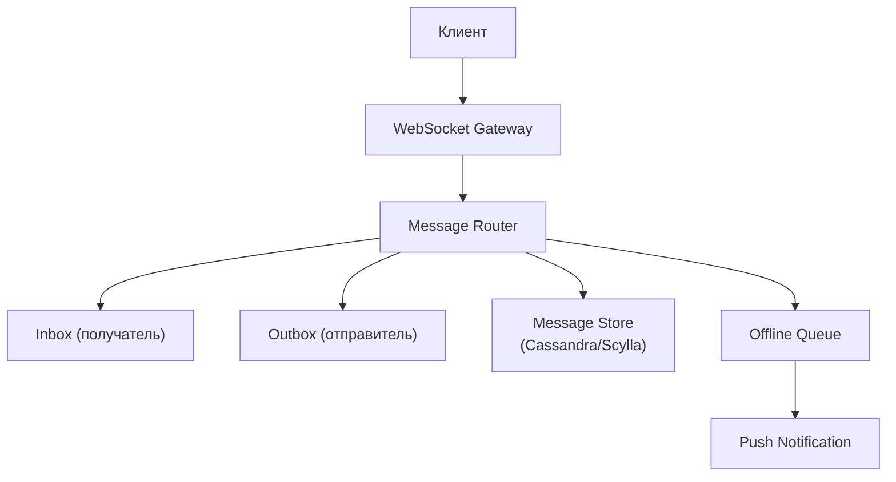
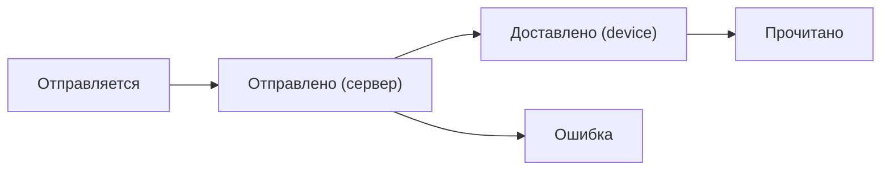

:::info[TL;DR]
Мессенджер — real-time система обмена сообщениями. Ключевые компоненты: транспорт (WebSocket, MQTT), хранение (key-value + SQL), доставка (Inbox/Outbox модель), push-уведомления. Аналитик проектирует типы сообщений, статусную модель, E2EE, групповые чаты и интеграции (bots, payments).
:::

## Архитектура мессенджера

## Типы сообщений

| Тип | Описание |
|-----|----------|
| **Text** | Текстовое сообщение |
| **Image / Video** | Медиавложения |
| **Voice** | Голосовые сообщения |
| **Sticker / GIF** | Анимированные реакции |
| **System** | «Пользователь печатает», «прочитано» |
| **Service** | Боты, переводы, payments |

## Статусы сообщения

## Что дальше

- [Социальный граф](/docs/specialization/socnet-graph)
- [Модерация контента](/docs/specialization/socnet-moderation)

## Проверь себя

1. **Как устроена архитектура мессенджера?**
   *Ответ:* WebSocket Gateway → Router → Inbox/Outbox → Message Store → Push.

2. **Какие статусы у сообщения?**
   *Ответ:* Отправляется → Отправлено → Доставлено → Прочитано / Ошибка.
