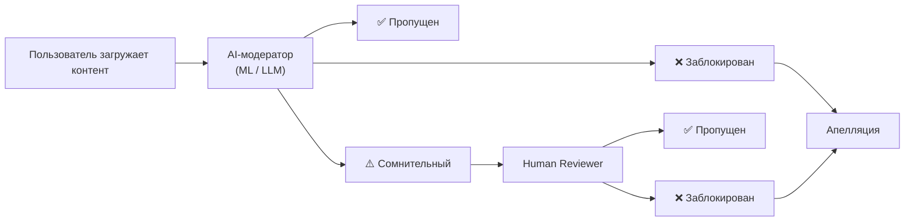

:::info[TL;DR]
Модерация — фильтрация запрещённого контента (ASR: adult, spam, racism; NSFW, экстремизм). Комбинация AI-модерации (ML, LLM) + human reviewers. Для аналитика: типы нарушений, правила модерации, системы жалоб, апелляции, метрики (precision/recall, time to action) и requirement для AI-модераторов.
:::

## Типы нарушений

| Категория | Пример |
|-----------|--------|
| **ASR** | Adult, Spam, Racism / Hate speech |
| **NSFW** | Обнажёнка, насилие |
| **Экстремизм** | Призывы, терроризм |
| **Фрод** | Фишинг, скам, поддельные аккаунты |
| **Copyright** | Пиратский контент |
| **Bullying** | Травля, хейтинг |

## Процесс модерации

## Метрики модерации

| Метрика | Описание |
|---------|----------|
| **Precision** | % верно заблокированных (минимум false positive) |
| **Recall** | % обнаруженных нарушений |
| **Time to action** | Среднее время блокировки |
| **Appeal rate** | % апелляций на блокировки |
| **False positive rate** | % ошибочных блокировок |

## Что дальше

- [Монетизация соцсетей](/docs/specialization/socnet-monetization)
- [Платформа контента](/docs/specialization/socnet-platform)

## Проверь себя

1. **Какие категории нарушений модерируются?**
   *Ответ:* ASR (adult/spam/racism), NSFW, экстремизм, фрод, copyright, bullying.

2. **Как работает AI-модерация?**
   *Ответ:* AI → пропуск/флаг/блокировка. Сомнительные уходят human reviewer. Апелляции пересматриваются.
