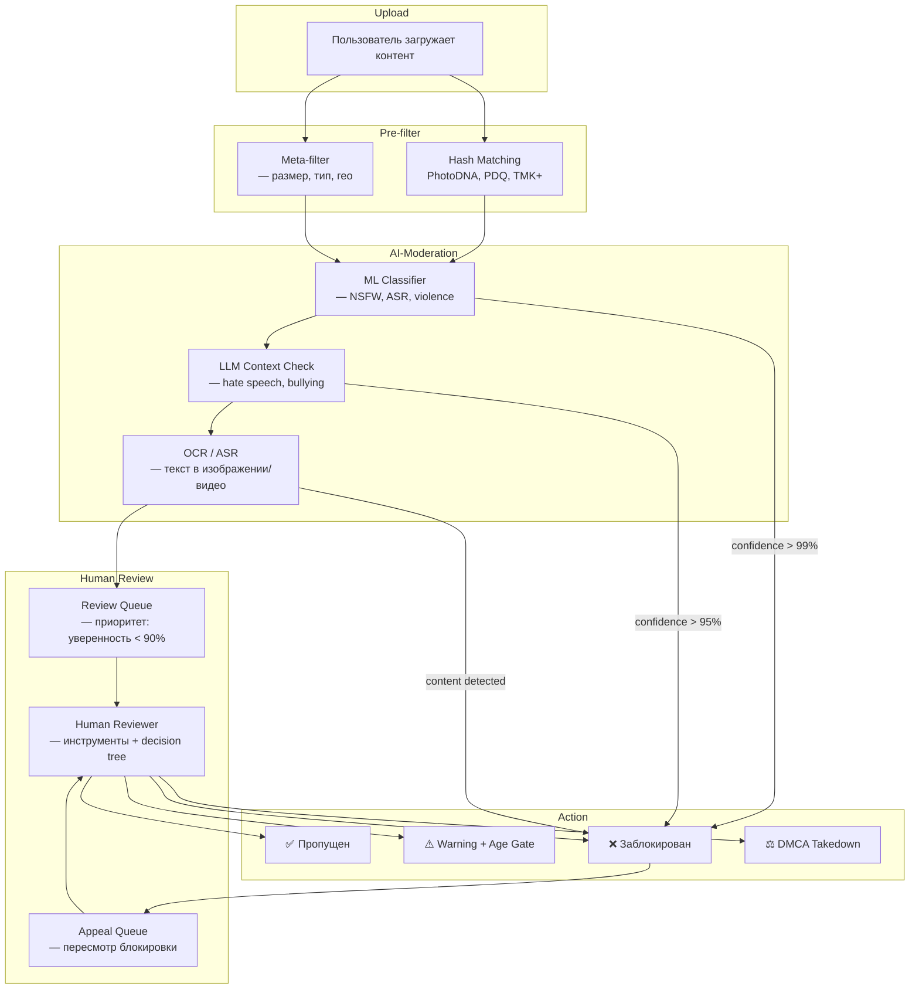
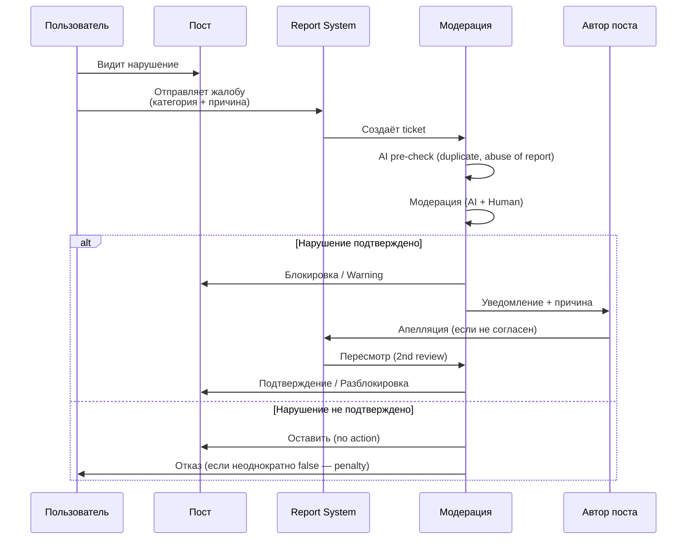

:::info[TL;DR]
Модерация контента — система фильтрации запрещённого контента (ASR: adult, spam, racism; NSFW, экстремизм, фрод, copyright). Комбинация AI-модерации (ML, LLM, hash-matching) + human reviewers в loop. Для аналитика: типы нарушений, правила модерации, системы жалоб, апелляции, метрики (precision/recall, time to action, appeal rate) и требования к AI-модераторам. Регуляторное давление (DSA, COPPA, РКН) делает модерацию первым классом риска.
:::

## Для кого эта статья

Senior SA, работающий над безопасностью платформы. После прочтения вы:

- Классифицируете типы нарушений и определите стратегию модерации для каждого
- Поймёте архитектуру AI-human moderation pipeline (pre-filter → ML → queue → review → appeal)
- Сможете проектировать правила модерации и метрики их эффективности
- Узнаете регуляторные требования (DSA, COPPA, Digital Safety) и их влияние на архитектуру

## 1. Рынок и масштаб модерации

| Платформа | Контента/день | AI-модерация | Human reviewers |
|-----------|-------------|--------------|-----------------|
| **YouTube** | 720K часов видео | Content ID (9M+ claims), AI Comment Filter | 20K+ reviewers |
| **Facebook/Meta** | 100M+ фото, 1B+ постов | AI для 99% NSFW/terrorism | 15K+ reviewers |
| **TikTok** | 34M+ видео | AI-moderation (ASR, NSFW) | 10K+ reviewers |
| **Twitter/X** | 500M+ твитов | AI для spam/hate speech | 5K+ reviewers |
| **Telegram** | 15B сообщений | AI для spam (оценка) | 1K+ reviewers |

**Тренды модерации 2024-2026:**

- LLM-based moderation (GPT-4, Claude) — понимание контекста лучше ML-классификаторов
- Proactive detection — поиск нарушений до жалобы
- Cross-platform — обмен данными о нарушителях между платформами (EU Digital Services Act)
- Real-time модерация live-стримов — сложность: модератор не может отмотать

## 2. Категории нарушений

### ASR (Adult, Spam, Racism) — базовая триада

```
Adult:    порнография, обнажёнка, сексуализированный контент (включая AI-generated)
Spam:     реклама, скам, фишинг, фейковые аккаунты, накрутка
Racism:   hate speech, дискриминация, разжигание, буллинг
```

**Пример:** Facebook блокирует 10M+ постов с hate speech в месяц. Precision AI-детекции — 95%+, recall — 90%.

### NSFW (Not Safe For Work)

| Подтип | Пример | Порог модерации |
|--------|--------|-----------------|
| **Nudity** | Обнажёнка, сексуальный контент | 100% блок (кроме education) |
| **Violence** | Драки, оружие, жестокость | Age gate + NSFW blur |
| **Gore** | Кровь, расчленение | 100% блок |
| **Self-harm** | Суицидальный контент | 100% блок + экстренная помощь |

### Производные категории

| Категория | Описание | Пример метрики |
|-----------|----------|----------------|
| **Экстремизм** | Терроризм, радикализация | Terror content removed/month |
| **Фрод/Скам** | Фишинг, fake giveaways | Scam reports resolved |
| **Copyright** | Пиратский контент, плагиат | DMCA takedowns |
| **Bullying** | Травля, доксинг | Harassment reports |
| **Disinformation** | Фейки, deepfakes | Fact-check flags |
| **Illegal goods** | Наркотики, оружие | Law enforcement referrals |

## 3. Архитектура системы модерации



### 3.1 Hash Matching

Первая линия обороны. Известный запрещённый контент сверяется по хешу:

| Технология | Для чего | Провайдер |
|------------|----------|-----------|
| **PhotoDNA** | Изображения (NSFW, CSAM) | Microsoft |
| **PDQ** | Изображения (Facebook) | Meta (open-source) |
| **TMK+** | Видео (YouTube Content ID) | Google |
| **SafeSearch** | NSFW-изображения | Google Cloud Vision |

**YouTube Content ID:** 9M+ claims в месяц, автоматическое распознавание copyright-контента. Хеши сравнения: audio fingerprint + video frame matching. Правообладатель выбирает: блок, монетизация или трекинг.

### 3.2 ML-модерация

```
Input: контент (текст, изображение, видео, аудио)
Output: (category, confidence_score, severity, action)

Пример ML-пайплайна для текста:
1. Tokenization → BERT/RoBERTa
2. Binary classifier × N категорий (NSFW, hate, spam, violence)
3. Confidence calibration
4. Post-processing: regex (URLs, phones), context analysis
```

**Метрики ML-модерации:**

| Метрика | Facebook | TikTok | YouTube |
|---------|----------|--------|---------|
| **Precision** | 97% | 95% | 96% |
| **Recall** | 90% | 88% | 92% |
| **Time to action (AI)** | < 1 sec | < 0.5 sec | < 2 sec |
| **Auto-removal rate** | 99% NSFW | 97% ASR | 98% violence |
| **Human review %** | ~1% | ~3% | ~2% |

## 4. Процесс жалобы и апелляции



### Метрики процесса жалоб

| Метрика | Описание | Норма |
|---------|----------|-------|
| **Time to first review** | Время до первого решения | < 24h |
| **Appeal rate** | % апелляций на блокировки | 5-15% |
| **Appeal success rate** | % успешных апелляций | 10-30% |
| **False positive rate** | % ошибочных блокировок | < 5% |
| **False negative rate** | % пропущенных нарушений | < 1% |
| **Bad report rate** | % ложных жалоб | 20-40% |
| **User satisfaction** | % удовлетворённых решением | > 80% |

**Проблема false positives:** YouTube в 2023 временно отключал AI-модерацию для партнёров из-за ложных блокировок легитимного контента (LGBTQ+, education). Баланс precision/recall — ключевой trade-off.

## 5. Регуляторные требования

| Регулятор | Требование | Влияние на архитектуру |
|-----------|-----------|----------------------|
| **EU Digital Services Act (DSA)** | Прозрачность модерации, отчётность раз в 6 мес | Логи всех решений, API для исследователей |
| **COPPA (USA)** | Защита детей < 13, parental consent | Content filter для детей, запрет на personalization |
| **РКН (Россия)** | Блокировка запрещённого контента по реестру | Realtime сверка с реестром, гео-блокировка |
| **Online Safety Bill (UK)** | Обязанность платформы защищать детей | Proactive detection, Safety by Design |
| **GDPR** | Право на забвение, объяснимость AI | Log of decisions, right to appeal |

## 6. Практический кейс: YouTube Content ID

**Проблема:** Пиратский контент на YouTube — пользователи загружают чужой контент (музыку, клипы, фильмы). Ручная проверка 720K часов видео/день невозможна.

**Решение:** Content ID — система автоматического распознавания контента:

1. Правообладатель загружает референс (музыка, видео, аудио)
2. Content ID создаёт цифровой отпечаток (audio fingerprint + video hash)
3. При загрузке нового видео — сравнение с базой
4. Если совпадение > 90% — правообладатель выбирает действие

**Действия правообладателя:**

| Действие | % использования | Результат |
|----------|----------------|-----------|
| **Блокировать** | 30% | Видео не публикуется |
| **Монетизировать** | 60% | Реклама идёт правообладателю |
| **Трекать** | 10% | Только статистика просмотров |

**Результат:** 9M+ claims/месяц, $3B+ выплачено правообладателям (за 10 лет). Precision — 99%+, false positives — < 1%.

**Проблема Content ID:** Fair use не распознаётся. Parody, review, education — ложные блокировки. Апелляции могут занимать недели.

## 7. AI vs Human: баланс

| Сценарий | AI | Human | Почему |
|----------|----|-------|--------|
| **NSFW изображение** | 99.9% | 0.1% | ML отлично детектит nudity |
| **Hate speech** | 90% | 10% | Контекст: «чёрный» может быть race или colour |
| **Disinformation** | 50% | 50% | Нужен факт-чекинг |
| **Copyright (fair use)** | 20% | 80% | Юридический контекст |
| **Self-harm** | 95% | 5% | Дополнительно: emergency services |

**LLM-based модерация (2025+):**

```
Промпт: Определи, нарушает ли следующий пост правила сообщества.
Учти: сарказм, цитирование, художественный контекст.

Пост: [текст]
Ответ: (нарушает/не нарушает/не уверен) + категория + confidence + пояснение
```

OpenAI Moderation API, Anthropic Constitutional AI — LLM лучше понимают контекст, чем BERT-классификаторы. Но latency выше (1-5 сек vs 100ms) и cost выше.

## Ссылки для самостоятельного изучения

| Ресурс | Описание | Ссылка |
|--------|----------|--------|
| YouTube Content ID | Как работает автоматическое распознавание | https://support.google.com/youtube/answer/2797370 |
| Facebook Community Standards Enforcement | Отчёт Meta по модерации | https://transparency.fb.com/data/community-standards-enforcement/ |
| EU Digital Services Act | Текст регламента ЕС | https://digital-strategy.ec.europa.eu/en/policies/digital-services-act |
| OpenAI Moderation API | AI-модерация через LLM | https://platform.openai.com/docs/guides/moderation |
| PhotoDNA (Microsoft) | Хеш-технология для изображений | https://www.microsoft.com/en-us/photodna |
| TikTok Transparency Report | Отчёт TikTok по модерации | https://www.tiktok.com/transparency/ |
| Twitter/X Moderation Policy | Правила модерации X | https://help.twitter.com/en/rules-and-policies |
| Hive Moderation | ML-модерация провайдер | https://thehive.ai/ |
| Google Jigsaw Perspective API | ML-детекция токсичности | https://perspectiveapi.com/ |
| DSA Compliance Guide | Руководство по DSA для платформ | https://dsa-compliance.com/ |

## Проверь себя

1. **Какие категории нарушений входят в ASR?**
   *Ответ:* Adult (NSFW, обнажёнка), Spam (реклама, скам, фейки), Racism (hate speech, дискриминация). ASR — базовая триада, модерируется AI-first.

2. **Как работает YouTube Content ID?**
   *Ответ:* Референс (аудио fingerprint + video hash) → загрузка видео → сравнение с базой → совпадение > 90% → блок/монетизация/трекинг. 9M+ claims/месяц. Precision — 99%+, но проблема fair use.

3. **Какие метрики важны для оценки AI-модерации?**
   *Ответ:* Precision (% верно блокированных), Recall (% обнаруженных), Time to action (< 1 sec для AI), Auto-removal rate, False positive rate (< 5%), Human review % (~1-3%).

4. **Почему LLM лучше BERT для модерации hate speech?**
   *Ответ:* LLM понимает контекст (сарказм, цитирование, художественный контекст), а BERT-классификаторы видят только паттерны слов. LLM может объяснить решение (chain-of-thought), что важно для апелляции и DSA-отчётности.

5. **Как EU Digital Services Act влияет на архитектуру модерации?**
   *Ответ:* DSA требует: (1) прозрачность — логи всех решений, отчётность раз в 6 мес; (2) право на апелляцию — human review по запросу; (3) API для исследователей — доступ к данным модерации; (4) risk assessment — анализ системных рисков платформы.
