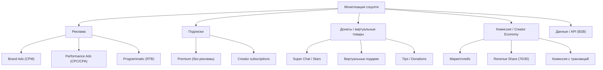
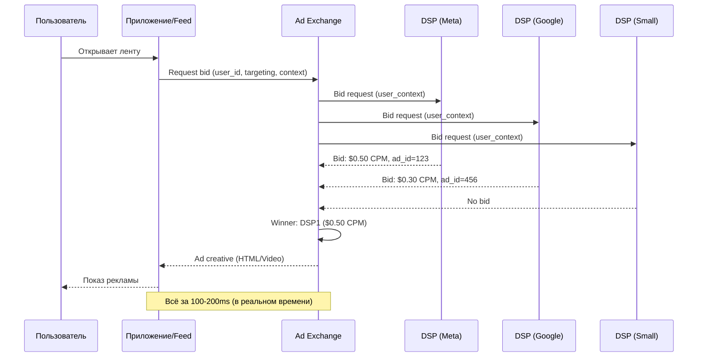

:::info[TL;DR]
Монетизация соцсетей: реклама (Ad Network — CPM/CPC/CPA, аукцион, programmatic buying), премиум-подписки (YouTube Premium, TikTok+, X Premium), донаты и Super Chat (YouTube, Twitch), комиссия с продаж (маркетплейс, creator economy). Рынок: $500B+ digital ads (2025), $100B+ creator economy. Аналитик проектирует аукцион рекламы, модели оплаты, creator payouts и метрики (ARPU, fill rate, eCPM, LTV/CAC).
:::

## Для кого эта статья

Senior SA или Lead, работающий над revenue-моделью. После прочтения вы:

- Классифицируете типы монетизации соцсетей и их экономику
- Поймёте архитектуру рекламного аукциона (real-time bidding, header bidding, ad exchange)
- Сможете проектировать revenue share и creator payouts
- Узнаете метрики монетизации: ARPU, eCPM, LTV, payback period

## 1. Рынок монетизации соцсетей

| Параметр | Facebook/Meta | YouTube | TikTok | X/Twitter | LinkedIn |
|----------|-------------|---------|--------|------------|----------|
| **Revenue (2024)** | $135B | $31B | $16B | $3B | $15B |
| **Revenue model** | Ads (98%) | Ads (80%) + Subs | Ads (85%) + Commerce | Ads (75%) + Subs | Ads + Subs + Recruiting |
| **ARPU (US)** | $50/мес | $8/мес | $6/мес | $0.50/мес | $5/мес |
| **Revenue per user** | $40/год (global) | $12/год | $10/год | $5/год | $15/год |
| **Creator payout** | Ad revenue share | 55% to creator | 50% to creator | Ad share + tips | N/A |

## 2. Типы монетизации



### 2.1 Реклама — основной драйвер

| Формат | Метрика оплаты | Рынок (2025) | Пример |
|--------|---------------|-------------|--------|
| **In-feed video** | CPM ($5-15) | $100B+ | TikTok, Instagram Reels |
| **Display banner** | CPM ($1-5) | $50B | Facebook sidebar |
| **Search ads** | CPC ($0.50-2) | $200B+ | — |
| **Video pre-roll** | CPM ($10-30) | $50B | YouTube, Twitch |
| **Sponsored content** | Flat fee ($500-50K) | $20B | Influencer marketing |
| **Programmatic** | RTB (реальный аукцион) | $200B+ | Ad Exchange (Google, Meta) |

### 2.2 Подписки

| Тип подписки | Цена | Фичи | Пример |
|-------------|------|------|--------|
| **Premium (no ads)** | $10-20/мес | Без рекламы, доп. функции | YouTube Premium, TikTok+ |
| **Creator subscription** | $3-10/мес | Эксклюзивный контент, бейдж | Twitch Sub, YouTube Memberships |
| **Verification** | $8-15/мес | Галочка, приоритет | X Premium, Meta Verified |
| **Business** | $100-1000/мес | API, analytics, team | LinkedIn Premium Business |

**Пример:** YouTube Premium — 100M+ подписчиков, $10B+ revenue/год. TikTok+ (2024) — $5/мес, без рекламы, не влияет на FYP-алгоритм.

### 2.3 Creator Economy

```
Platform → User creates content → Users engage → Platform monetizes → Revenue Share to Creator
```

| Платформа | Revenue Share | Доля автора | Доля платформы | Доп. комиссия |
|-----------|--------------|-------------|----------------|---------------|
| **YouTube** | Ad revenue | 55% | 45% | +30% на Memberships |
| **Twitch** | Subs + Ads | 50% (Subs) | 50% | +50% на Bits |
| **TikTok** | Creator Fund | 50-70% | 50-30% | + TikTok Shop commission |
| **OnlyFans** | Subscription | 80% | 20% | + tip commission |
| **Patreon** | Subscription | 90% (after fees) | 5-12% | Processing fee excluded |
| **Instagram** | Brand deals (indirect) | 100% (direct) | 0% (no rev share) | Meta takes 0% on Reels bonuses |

## 3. Рекламный аукцион (Real-Time Bidding)



### Типы аукционов

| Тип | Описание | Пример | Плюсы | Минусы |
|-----|----------|--------|-------|--------|
| **First-price** | Победитель платит свою ставку | Google (с 2019) | Прозрачно | DSP платят больше |
| **Second-price** | Победитель платит ставку 2-го места | Facebook (ранее) | DSP довольны | Непрозрачная цена |
| **Guaranteed** | Фиксированная цена, без аукциона | YouTube Reserve | Предсказуемый revenue | Меньше конкуренции |
| **Programmatic Guaranteed** | Автоматизированный guaranteed | Meta Business Manager | Эффективность | Только для крупных |

### Ad Ranking

```
Score = bid_price × relevance_score + quality_factor

relevance_score = CTR_prediction × conversion_probability × user_affinity
quality_factor = ad_quality (landing page, creative, historical CTR)

Побеждает: наивысший score (не обязательно наивысший bid)
```

**Пример:** DSP_A bid $0.50 CPM, relevance 0.8 → score = 0.40. DSP_B bid $0.30 CPM, relevance 0.9 → score = 0.27. Побеждает DSP_A.

## 4. Метрики монетизации

### Core revenue metrics

| Метрика | Формула | Норма | Описание |
|---------|---------|-------|----------|
| **ARPU** | Revenue / MAU | $3-50 (зависит от региона) | Средний доход на пользователя |
| **eCPM** | (Revenue / Impressions) × 1000 | $5-30 | Эффективная стоимость 1000 показов |
| **Fill rate** | Impressions with ads / Total impressions | 80-95% | % показов с рекламой |
| **CTR** | Clicks / Impressions | 0.5-3% | Кликабельность рекламы |
| **Conversion** | Conversions / Clicks | 2-10% | Целевое действие (покупка, регистрация) |
| **ROAS** | Revenue from ads / Cost of ads | 3-10× | Return on Ad Spend для рекламодателя |

### Business metrics

| Метрика | Описание | Пример |
|---------|----------|--------|
| **LTV (Lifetime Value)** | Доход от пользователя за всё время | Facebook: $100-200 (US) |
| **CAC (Customer Acquisition Cost)** | Стоимость привлечения | Facebook: $10-20 (US) |
| **Payback period** | Время, чтобы окупить CAC | 3-6 месяцев |
| **Churn revenue impact** | Потеря дохода при оттоке | $5M/мес на 1% churn |
| **Ad load** | % рекламы в ленте | 15-30% (TikTok: 1 ad per 5-10 posts) |
| **Ad revenue per session** | Доход с сессии | $0.05-0.50 |

### Сравнение платформ

| Метрика | Facebook | YouTube | TikTok | X/Twitter |
|---------|----------|---------|--------|-----------|
| **ARPU (global)** | $40/год | $12/год | $10/год | $5/год |
| **ARPU (US)** | $600/год | $100/год | $70/год | $6/год |
| **Ad load** | 20% | 15% (pre-roll + in-stream) | 15% | 10% |
| **eCPM** | $15 | $20 | $12 | $8 |
| **Creator payout** | 0% (organic) | 55% ad share | 50% | ~70% ads |
| **Subscription rev** | $0.5B | $10B+ | $0.1B+ | $0.5B+ |

## 5. Практический кейс: Creator Economy на YouTube

**Проблема:** YouTube должен платить авторам так, чтобы они оставались на платформе, но при этом платформа зарабатывала.

**Revenue model YouTube:**

```
Ad Revenue → 45% YouTube, 55% Creator
Memberships → 70% Creator, 30% YouTube
Super Chat → 70% Creator, 30% YouTube
Shelf (merch) → 100% Creator (партнёрская комиссия отдельно)
```

**Как считается payout creator'у:**

```
Gross Revenue = Ad Impressions × eCPM
Net Revenue = Gross Revenue × 0.55 (creator share)
Final Payout = Net Revenue × (1 - country_tax_rate)
```

**Пример для одного видео (1M views):**

| Параметр | Значение |
|----------|----------|
| Ad impressions | 500K (50% fill rate для video) |
| eCPM | $15 |
| Gross revenue | $7,500 |
| Creator share (55%) | $4,125 |
| Tax (US, 0%) | $4,125 |
| Payout creator'у | $4,125 |

**Проблемы YouTube Creator Economy:**
- **Demonetization:** Если контент не «ad-friendly», автор не получает revenue (controversial topics)
- **Adpocalypse:** Бренды уходят → eCPM падает → creators теряют доход
- **Algorithm changes:** Изменение ранжирования → просмотры падают → доход падает
- **Fraud:** Накрутка просмотров → отключение монетизации

**Решение:** YouTube Creator Fund ($100M+) для поддержки авторов + YouTube Shorts Fund ($100M для short video). 2024: YouTube добавил tipping (вне Super Chat) и affiliate commerce для creators.

## 6. Monetization Trade-offs

| Решение | Плюс | Минус | Пример |
|---------|------|-------|--------|
| **Больше рекламы (ad load)** | Выше ARPU | Хуже UX, выше churn | Facebook: ad load 20% |
| **Меньше рекламы** | Лучше retention | Ниже ARPU | TikTok: ad load 15% |
| **Premium подписка** | Прямой revenue | Только для ~5% users | YouTube Premium: 100M subs |
| **Creator revenue share** | Привлекает авторов | Меньше margin YouTube | 55/45 split |
| **In-stream ads vs in-feed** | Higher eCPM (in-stream) | Pre-roll раздражает | YouTube: in-stream dominates |

## Ссылки для самостоятельного изучения

| Ресурс | Описание | Ссылка |
|--------|----------|--------|
| Facebook Ads + Revenue | Структура рекламного бизнеса Meta | https://www.facebook.com/business/ads |
| Google Ads Documentation | Programmatic, RTB, Ad Exchange | https://developers.google.com/google-ads/api/docs |
| YouTube Creator Monetization | Как работает revenue share YouTube | https://support.google.com/youtube/answer/72857 |
| TikTok Creator Fund | Монетизация для создателей | https://www.tiktok.com/creators/creator-portal/ |
| Twitch Monetization | Subs, Bits, Ads на Twitch | https://help.twitch.tv/s/article/twitch-affiliate-program |
| X Premium (Twitter Blue) | Subscription model X/Twitter | https://help.twitter.com/en/using-x/x-premium |
| Programmatic Advertising (RTB) | Руководство по programmatic | https://www.iab.com/guidelines/programmatic/ |
| IAB CPM Benchmarks | Стандарты CPM по индустриям | https://www.iab.com/insights/ |
| Creator Economy (SignalFire) | Рынок creator economy 2024 | https://signalfire.com/creator-economy/ |
| LTV/CAC Calculation | Метрики SaaS (применимо к соцсетям) | https://www.baremetrics.com/blog/ltv-cac |

## Проверь себя

1. **Какие есть типы монетизации соцсетей?**
   *Ответ:* Реклама (CPM/CPC/CPA — основной драйвер, $500B+ рынок), подписки (Premium, creator subscription), донаты/Super Chat ($5B+), комиссия с продаж (creator economy, маркетплейс), данные/API (B2B).

2. **Как работает рекламный аукцион (RTB)?**
   *Ответ:* Пользователь открывает ленту → Приложение запрашивает bid у Ad Exchange → Exchange рассылает DSP → DSP бidят (CPM × relevance) → Google/Auction → Winner отдаёт creative → Показ. Всё за 100-200ms. Score = bid_price × relevance_score + quality_factor.

3. **Чем отличается first-price auction от second-price?**
   *Ответ:* First-price — победитель платит свою ставку (Google с 2019). Second-price — платит ставку 2-го места (Facebook ранее). First-price прозрачнее, но DSP платят больше. Second-price стимулирует честные ставки, но даёт меньше revenue платформе.

4. **Какие метрики монетизации важны для аналитика?**
   *Ответ:* Core: ARPU ($3-50), eCPM ($5-30), CTR (0.5-3%), Fill rate (80-95%), Conversion (2-10%). Business: LTV/CAC (payback 3-6 мес), Ad load (15-30%), Churn revenue impact, ROAS (3-10×).

5. **Почему YouTube платит 55% revenue creator'ам?**
   *Ответ:* Конкуренция: платформы борются за авторов контента. Если YouTube оставит больше себе — creators уйдут на Twitch (50% sub split) или OnlyFans (80%). 55% — баланс: достаточно для удержания, платформа зарабатывает 45% + Memberships/Super Chat. Проблемы: demonetization, adpocalypse, algorithm dependency.
