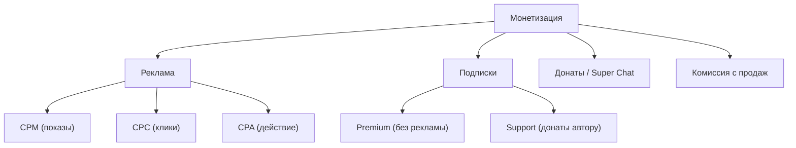
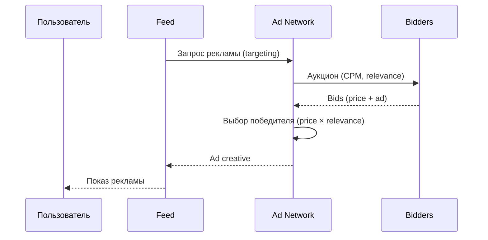

:::info[TL;DR]
Монетизация соцсетей: реклама (Ad Network — CPM/CPC/CPA), премиум-подписки (TikTok+, YouTube Premium), донаты и Super Chat, комиссия с продаж (маркетплейс, крипейторская экономика). Аналитик проектирует аукцион рекламы, модели оплаты, creator payouts и метрики (ARPU, fill rate, eCPM).
:::

## Типы монетизации

## Рекламный аукцион

## Метрики

| Метрика | Описание |
|---------|----------|
| **ARPU** | Средний доход на пользователя |
| **eCPM** | Эффективная стоимость 1000 показов |
| **Fill rate** | % показов с рекламой |
| **CTR** | Кликабельность рекламы |
| **Conversion** | Целевое действие после клика |
| **Subscription rate** | % пользователей с подпиской |

## Что дальше

- [Платформа контента](/docs/specialization/socnet-platform)

## Проверь себя

1. **Какие есть типы монетизации соцсетей?**
   *Ответ:* Реклама (CPM/CPC/CPA), подписки, донаты, комиссия с продаж.

2. **Как работает рекламный аукцион?**
   *Ответ:* Запрос → брокер получает ставки → победитель (price × relevance) → показ.
