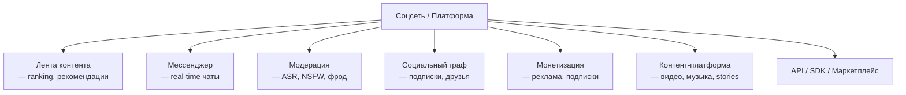

:::info[TL;DR]
Аналитик соцсетей и контентных платформ работает с лентой (feed), мессенджерами, модерацией, социальным графом, монетизацией (реклама/подписки), контентной платформой (видео, музыка, stories) и API/SDK для внешних разработчиков. Ключевые вызовы: масштаб (миллиарды пользователей), real-time, ASR/NSFW-модерация, рекомендации.
:::

## Основные домены

## Карьерный путь

| Этап | Роль | Ключевые навыки |
|------|------|----------------|
| 1 | Junior SA | Модерация, документация |
| 2 | Middle SA | Feed, рекомендации, интеграции |
| 3 | Senior SA | Архитектура, мессенджеры, платформа |
| 4 | Lead | Экосистема, монетизация, стратегия |

## Что дальше

- [Лента контента](/docs/specialization/socnet-feed)
- [Мессенджеры и real-time коммуникации](/docs/specialization/socnet-messenger)

## Проверь себя

1. **Какие основные домены в соцсетях?**
   *Ответ:* Лента, мессенджер, модерация, соцграф, монетизация, контент, API.

2. **Какие вызовы есть в соцсетях?**
   *Ответ:* Масштаб, real-time, модерация ASR/NSFW, рекомендации, миллиарды пользователей.
