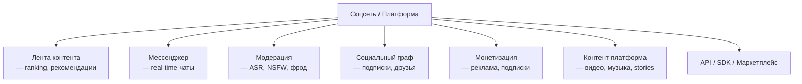

:::info[TL;DR]
Аналитик соцсетей и контентных платформ работает с лентой (feed), мессенджерами, модерацией, социальным графом, монетизацией (реклама/подписки), контентной платформой (видео, музыка, stories) и API/SDK для внешних разработчиков. Ключевые вызовы — масштаб (миллиарды пользователей), real-time, AI-модерация (ASR/NSFW), рекомендательные системы. Индустрия меняется каждые 2-3 года: TikTok перевернул feed, Clubhouse — аудио, Threads — микроблогинг.
:::

## Для кого эта статья

Middle-аналитик, который хочет перейти в соцсети или контентные платформы. После прочтения вы:

- Поймёте домены соцсетей и как они связаны
- Узнаете специфику платформ: требования к real-time, масштабу, модерации
- Сможете определить, какой домен вам ближе (feed, messenger, platform)
- Получите словарь терминов индустрии

## 1. Рынок соцсетей: цифры и факты

| Платформа | MAU | Основной формат | Revenue (год) |
|-----------|-----|----------------|---------------|
| **Facebook** | 3B+ | Лента, группы, marketplace | $135B (ads) |
| **YouTube** | 2.5B+ | Long/short video | $31B (ads) |
| **WhatsApp** | 2B+ | Messenger, voice calls | $0 (free) |
| **TikTok** | 1.5B+ | Short video | $16B (ads) |
| **Telegram** | 900M | Messenger, channels, bots | $0+ (freemium) |
| **Instagram** | 2B+ | Photo, video, stories | $50B+ (ads) |
| **X (Twitter)** | 550M | Microblogging | $3B+ (ads + subs) |
| **LinkedIn** | 1B+ | Professional network | $15B (ads + subs) |

**Тренды 2024-2026:**
- Short video — доминирующий формат (TikTok, Reels, Shorts)
- Creator economy — $100B+ рынок (OnlyFans, Patreon, YouTube Memberships)
- Decentralized / Federated — Mastodon, Bluesky, ActivityPub
- AI-generated content — Deepfakes, AI-модерация, персонализация
- Super-apps — WeChat, Telegram, Grab (всё в одном)

## 2. Домены соцсетей

### 2.1 Лента контента (Feed)
Самый сложный и конкурентный домен. Каждая платформа борется за время пользователя. Алгоритм ранжирования определяет, что видит пользователь. **Пример:** TikTok — For You Page (FYP) с two-tower DNN, 30 минут средней сессии.

### 2.2 Мессенджер
Real-time система, где важны: надёжность доставки, статусы сообщений, E2EE, групповые чаты. **Пример:** Telegram — MTProto, cloud sync, 2M+ каналов.

### 2.3 Модерация
Комбинация AI + human reviewers. Типы нарушений: ASR (Adult, Spam, Racism), NSFW, экстремизм, фрод, copyright. **Пример:** YouTube — Content ID (9M+ claims), AI-модерация Comment Section.

### 2.4 Социальный граф
Хранение и запросы связей: подписки, друзья, блоки, мьюты. **Масштаб:** Facebook хранит 250B+ edges, обрабатывает 10M+ запросов/сек.

### 2.5 Монетизация
Реклама (CPM/CPC/CPA — $50B+ рынок), подписки (YouTube Premium — 100M подписчиков), донаты (Super Chat — $5B+), creator economy.

### 2.6 Контент-платформа
Транскодинг, CDN, ABR, DRM. **Пример:** YouTube — 720K часов видео загружается ежедневно, тысячи edge-серверов CDN.

### 2.7 API / SDK
Платформа для внешних разработчиков. **Пример:** Telegram Bot API — 10M+ ботов, WeChat Mini Programs — 5M+ приложений.

## 3. Специфика соцсетей vs Enterprise

| Параметр | Enterprise | Соцсети |
|----------|-----------|---------|
| **Масштаб** | 100–10K пользователей | 1M–3B пользователей |
| **Latency** | Секунды | Миллисекунды (feed, messenger) |
| **Данные** | Транзакции, документы | Контент (видео, фото, текст) + графы |
| **Availability** | 99.9% (допустим downtime) | 99.99% (downtime = кризис) |
| **Режим работы** | Синхронный (рабочий день) | 24/7, пиковые нагрузки (вечер) |
| **Модерация** | Не требуется | Обязательна, юридически значима |
| **Персонализация** | Ролевая модель | AI-персонализация каждого пользователя |
| **Монетизация** | Лицензии, enterprise | Реклама, подписки, микротранзакции |

## 4. Карьерный путь аналитика в соцсетях

| Этап | Роль | Ключевые навыки | Что делаешь |
|------|------|----------------|-------------|
| 1 | Junior SA | Модерация, документация, SQL | Описываешь правила модерации, пишешь API-спеки для ботов |
| 2 | Middle SA | Feed, рекомендации, A/B тесты | Проектируешь ранжирование, анализируешь CTR/Watch time |
| 3 | Senior SA | Архитектура, мессенджеры, платформа | Проектируешь доставку сообщений, контент-пайплайн |
| 4 | Lead | Экосистема, монетизация, стратегия | Revenue model, API platform, 3rd-party dev tools |

## 5. Словарь терминов

| Термин | Значение | Пример |
|--------|----------|--------|
| **Feed** | Лента контента, персонализированная | For You Page (TikTok), Explore (Instagram) |
| **Ranker** | ML-модель, определяющая порядок постов | XGBoost, DNN в YouTube |
| **Engagement** | Вовлечённость: лайки, комментарии, репосты | CTR, watch time, share rate |
| **E2EE** | End-to-end encryption (Signal, WhatsApp) | Шифрование сообщений |
| **Creator economy** | Экономика авторов контента | YouTube Partner Program, Patreon |
| **Churn** | Отток пользователей | % удаливших приложение за месяц |
| **DAU / MAU** | Daily / Monthly Active Users | DAU/MAU = 0.5 (50% заходят ежедневно) |
| **ARPU** | Average Revenue Per User | $0.50 в месяц (Facebook) |
| **ASR** | Adult, Spam, Racism — категории нарушений | Автоматическая фильтрация |
| **CDN** | Content Delivery Network — доставка контента | Cloudflare, Akamai, CloudFront |
| **ABR** | Adaptive Bitrate — адаптивный битрейт | 480p → 720p → 1080p по качеству сети |
| **CTR** | Click-Through Rate — кликабельность | 1-5% для рекламы |

## 6. Типичные ошибки новичков

1. **Недооценивать масштаб.** «Просто добавить поле в таблицу» — в соцсети это может быть миграция 1B строк.
2. **Думать как Enterprise.** FDD, SRS на 100 страниц не нужны. Нужны компактные спецификации и A/B тесты.
3. **Игнорировать модерацию.** На любой платформе модерация — первый класс риска. Без неё — иск от регулятора.
4. **Не учитывать mobile.** 80%+ трафика соцсетей — мобильные устройства. API, загрузка, UI — mobile-first.
5. **Считать, что «пользователь будет ждать».** В соцсетях пользователь уходит, если лента грузится дольше 2 секунд.

## Ссылки для самостоятельного изучения

| Ресурс | Описание | Ссылка |
|--------|----------|--------|
| TikTok Engineering Blog | Как устроен FYP (For You Page) | https://www.tiktok.com/engineering |
| YouTube Engineering Blog | Рекомендации YouTube (статья 2016) | https://research.youtube/ |
| Facebook Engineering | Инфраструктура Facebook (feed, graph) | https://engineering.fb.com/ |
| Telegram MTProto | Протокол мессенджера Telegram | https://core.telegram.org/mtproto |
| Instagram Engineering | Cторкис, feed, инфраструктура | https://instagram-engineering.com/ |
| Twitter/X Recommendation Algorithm | Open-source алгоритм рекомендаций | https://github.com/twitter/the-algorithm |
| Signal Protocol | E2EE для мессенджеров | https://signal.org/docs/ |
| Discord Engineering | Real-time платформа | https://discord.com/category/engineering |
| LinkedIn Engineering | Масштабирование сети | https://engineering.linkedin.com/ |

## Проверь себя

1. **Какие основные домены в соцсетях?**
   *Ответ:* Feed, мессенджер, модерация, социальный граф, монетизация, контент-платформа, API/SDK.

2. **Чем соцсети принципиально отличаются от Enterprise?**
   *Ответ:* Масштаб (1M-3B), latency (миллисекунды), 24/7 availability, обязательная модерация, AI-персонализация, рекламная монетизация.

3. **Какой формат контента доминирует в 2024-2026?**
   *Ответ:* Short video (TikTok, Reels, Shorts). TikTok изменил формат: 15-60 секунд, вертикальное видео, full-screen, ML-driven feed.

4. **Какие метрики важны для оценки здоровья соцсети?**
   *Ответ:* DAU/MAU, retention (D1/D7/D30), average session time, engagement rate (likes/comments/shares per user), churn rate, ARPU.

5. **Почему модерация — первый класс риска в соцсетях?**
   *Ответ:* Регуляторы (ЕС Digital Services Act, РКН), ответственность за контент пользователей, blocked content в разных юрисдикциях, защита детей (COPPA), reputation risk.
