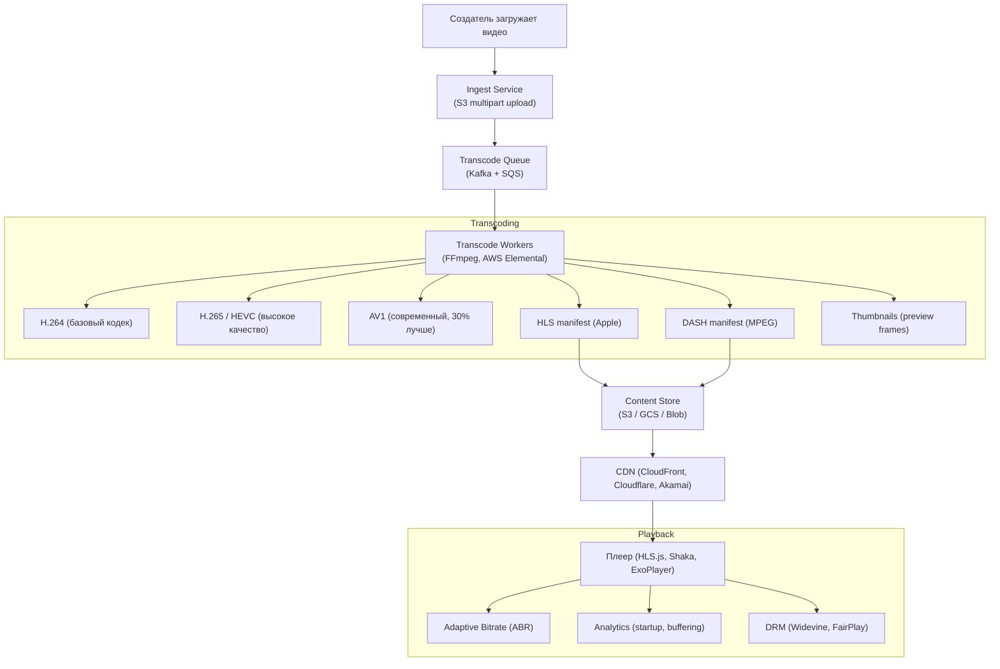
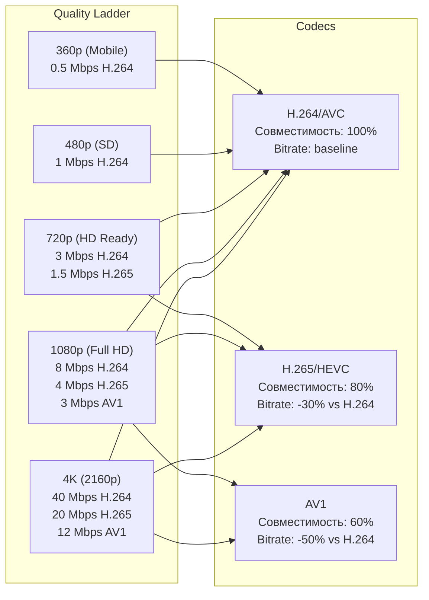

:::info[TL;DR]
Контент-платформа — видеохостинг (short/long), музыка, stories, live-стримы, подкасты. Ключевые компоненты: транскодинг/encoding (H.264, H.265, AV1), CDN (доставка: CloudFront, Cloudflare, Akamai), DRM (Widevine, FairPlay), загрузка, стриминг (HLS/DASH/LL-HLS), рекомендации. Аналитик проектирует форматы контента, workflow загрузки, ABR ladder, баланс качества/скорости и метрики (startup time, buffering rate, VMAF). YouTube: 720K часов/день, тысячи edge-серверов, собственная CDN (Google Global Cache).
:::

## Для кого эта статья

Senior SA, проектирующий контентную платформу. После прочтения вы:

- Поймёте архитектуру контент-платформы: загрузка → транскодинг → CDN → плеер
- Узнаете форматы (HLS, DASH, ABR) и их trade-off
- Сможете проектировать Quality Ladder (битрейты, разрешения) под устройство и регион
- Поймёте метрики качества (QoE): startup time, buffering, VMAF, CDN hit ratio

## 1. Архитектура контент-платформы



### 1.1 Загрузка контента

| Этап | Описание | Технология |
|------|----------|-----------|
| **Upload** | Многопоточная загрузка больших файлов | S3 multipart upload (5MB-5GB parts) |
| **Validation** | Проверка формата, вирусов, malware | FFprobe + ClamAV |
| **Thumbnail** | Генерация превью на каждой минуте | FFmpeg thumbnail extraction |
| **Transcoding init** | Добавление задачи в очередь | Kafka + SQS |
| **Notification** | Уведомление создателя о готовности | WebSocket + Push |

**Пример загрузки 1GB видео (YouTube):**
```
1. Client разбивает на 512KB chunks
2. Upload 5 parallel streams → S3
3. Video validation: FFprobe (codec, duration, resolution)
4. Malware check (ClamAV + custom ML)
5. Transcode queue (Kafka topic: video_transcode)
6. ~30 min for 4K → 1080p H.264 transcoding
```

### 1.2 Транскодинг (Encoding)



**Codec сравнение:**

| Кодек | Bitrate saving vs H.264 | Совместимость | Патентован | Пример использования |
|-------|------------------------|---------------|------------|---------------------|
| **H.264/AVC** | baseline | 100% (все плееры) | Да (MPEG-LA) | YouTube (основной) |
| **H.265/HEVC** | -30-40% | 80% (iOS 11+, Android 5+) | Да (два патентных пула) | Netflix (4K), Apple |
| **AV1** | -40-50% | 60% (браузеры 2022+, Android 10+) | Нет (Royalty-free) | YouTube, Netflix (начало) |
| **VP9** | -30-35% | 70% (браузеры, Android) | Нет (Royalty-free) | YouTube (второй кодек) |

**Практический совет:** Для соцсети (загрузка пользователей) оптимально:
- H.264 — baseline (гарантированная совместимость)
- H.265 — опция для iOS (популярно на Instagram/TikTok)
- AV1 — только для трендовых видео (вычислительно дорого)

## 2. Adaptive Bitrate (ABR) и Streaming протоколы

### 2.1 HLS vs DASH

| Параметр | HLS (Apple) | DASH (MPEG) |
|----------|-------------|-------------|
| **Разработчик** | Apple | MPEG |
| **Формат** | .m3u8 + .ts (HLS) или .fmp4 (HLS fMP4) | .mpd + .m4s |
| **Совместимость** | iOS + all (HLS.js для Web) | Android, Smart TV, Web (Shaka) |
| **Поддержка** | 100% iOS, 95% Android | 80% Android, 100% Smart TV |
| **LL-HLS** (Low Latency) | 2-5 sec | LL-DASH (Chunked) 2-5 sec |
| **DRM** | FairPlay | Widevine (Google) |
| **Тренд** | HLS dominant для соцсетей | DASH dominant для вещания |

**Вывод для соцсети:** Используй HLS для всех (hls.js на Web, native на iOS/Android). DASH — только если Target — Smart TV.

### 2.2 ABR Algorithm

ABR — алгоритм, который выбирает качество видео на основе скорости интернета:

```
class ABRAlgorithm:
    # Основные подходы
    
    def throughput_based():
        # Измеряет скорость загрузки сегмента
        # Выбирает highest bitrate, который помещается в bandwidth
        # Простой, но реагирует с задержкой
        
    def buffer_based():
        # Если буфер > 30 sec → повысить качество
        # Если буфер < 10 sec → понизить
        # Хорош для стабильного соединения
        
    def hybrid():
        # Комбинация throughput + buffer
        # BOLA (Buffer Occupancy based ABC)
        # Standard в ExoPlayer и Shaka
        
    def ml_based():
        # ML predicts bandwidth based on time-of-day, geo, ISP
        # Netflix: CMAF + ML ABR
        # Результат: +15% avg bitrate, -20% re-buffering
```

**Метрики ABR:**

| Метрика | Плохо | Средне | Хорошо | Отлично |
|---------|-------|--------|--------|---------|
| **Startup time** | > 10s | 5-10s | 2-5s | < 2s |
| **Buffering rate** | > 10% | 5-10% | 1-5% | < 1% |
| **Bitrate switch** | > 5 switches/min | 3-5 | 1-3 | < 1 |
| **Average bitrate** | < 480p | 480-720p | 720-1080p | 1080+ |
| **VMAF** (качество) | < 70 | 70-85 | 85-95 | > 95 |

## 3. Хранение и CDN

### Content Store Sizing

| Тип | Размер одного | Количество/день | Storage/день |
|-----|--------------|-----------------|--------------|
| **Short video (TikTok)** | 10MB (720p) | 34M | 340 TB |
| **Long video (YouTube)** | 500MB (1080p) | 720K hours ≈ 150M videos | 75 PB |
| **Photo (Instagram)** | 2MB | 100M | 200 TB |
| **Music (Spotify-like)** | 5MB (AAC 320kbps) | 100K tracks | 500 GB |

### CDN Architecture

```
User (Moscow) → Edge (Moscow, CDN) → Regional (Moscow, CDN) → Origin (S3, Frankfurt)

— Cache hit: 90%+ (популярное видео)
— Cache miss: запрос к origin
— TTL: 24h для популярного, 7d для старого
```

**CDN для видео — от стартапа к масштабу:**

| Этап | Решение | Cost | Performance |
|------|---------|------|-------------|
| **Startup** | Cloudflare + S3 | $200/мес | 100ms latency |
| **Growth** | CloudFront + Multi-region S3 | $5K/мес | 50ms latency |
| **Scale** | Multi-CDN (CloudFront + Fastly + Akamai) | $50K/мес | 20ms latency |
| **Enterprise** | Self-built CDN (Google Global Cache, Netflix Open Connect) | $10M+/мес | < 10ms latency |

**YouTube CDN:** Google Global Cache — 10K+ edge nodes (в каждом крупном ISP), инсталлированные прямо в сетях провайдеров. Netflix Open Connect — предустановка контента на ISP-nodes (2TB+ per server).

## 4. DRM и защита контента

| DRM | Платформа | Схема | CENC | Пример |
|-----|-----------|-------|------|--------|
| **Widevine** | Android, Chrome | Modular (Level 1-3) | Да | YouTube, Netflix |
| **FairPlay** | iOS, Safari | HLS key rotation | Нет (HLS) | Apple TV+ |
| **PlayReady** | Xbox, Windows | SL2000, SL3000 | Да | Microsoft, Netflix |
| **Clear Key** | Web (no DRM) | AES-128 | Да | Open source |

**Важно для аналитика:** DRM влияет на UX. Widevine Level 3 (software) — качество до 1080p. Level 1 (hardware) — 4K. Если платформа не поддерживает DRM → можно скачать контент.

## 5. Практический кейс: Netflix — Open Connect CDN

**Проблема:** Netflix — 260M+ подписчиков, 200M+ часов просмотра/день. Каждый стрим требует 3-15 Mbps. Если весь трафик через публичный интернет — не выдержит ни Netflix, ни ISP.

**Решение:** Netflix Open Connect — собственная CDN, установленная в сетях ISP.

```
Архитектура:
1. Netflix кодирует контент (4K HDR, H.265, Dolby Atmos)
2. Заливает в AWS (origin)
3. Open Connect Appliances (OCA) — сервера в ISP (1U, 2TB SSD, 10Gbps)
4. OCA предварительно кеширует популярный контент
5. User запрашивает видео → ISP->OCA (внутренняя сеть)
6. 95%+ cache hit — контент не идёт через публичный интернет
```

**Результат:**
- 95%+ CDN hit ratio (против 75-85% у обычных CDN)
- Latency: < 5ms (локальная сеть) вместо 50-100ms
- ISP happy: меньше транзитного трафика (экономия $M)
- Netflix happy: лучше качество, меньше buffering

**Метрики Netflix (QoE):**

| Метрика | Target | Результат |
|---------|--------|-----------|
| **Startup time** | < 2 sec | 1.2 sec |
| **Rebuffering rate** | < 0.5% | 0.3% |
| **Average bitrate** | > 5 Mbps | 6 Mbps |
| **VMAF** | > 90 | 93 |

## Ссылки для самостоятельного изучения

| Ресурс | Описание | Ссылка |
|--------|----------|--------|
| YouTube Engineering — Video Transcoding | Как YouTube транскодирует видео | https://engineering.fb.com/video-engineering/ |
| Apple HLS Authoring Spec | Спецификация HLS | https://developer.apple.com/documentation/http-live-streaming |
| MPEG-DASH Standard | Официальная спецификация DASH | https://www.iso.org/standard/79368.html |
| Netflix — Per-Title Encoding | Оптимизация кодирования Netflix | https://netflixtechblog.com/per-title-encode-optimization-7e99442b62a2 |
| FFmpeg Documentation | Транскодинг для аналитиков | https://ffmpeg.org/documentation.html |
| Cloudflare Stream vs CloudFront | Сравнение CDN для видео | https://www.cloudflare.com/developer-platform/stream/ |
| Google — VMAF (Video Quality Metric) | Объективная метрика качества | https://github.com/Netflix/vmaf |
| Widevine DRM | Документация DRM от Google | https://www.widevine.com/ |
| Netflix Open Connect | Как работает CDN Netflix | https://openconnect.netflix.com/ |
| HLS.js Documentation | Плеер HLS для Web | https://github.com/video-dev/hls.js/ |

## Проверь себя

1. **Как устроена архитектура контент-платформы?**
   *Ответ:* Upload → Validation → Transcode Queue → Transcode Workers (FFmpeg, H.264/H.265/AV1) → HLS/DASH manifests → Content Store (S3) → CDN (CloudFront) → Player (HLS.js, Shaka, native). ABR адаптирует качество под скорость соединения.

2. **Чем HLS отличается от DASH?**
   *Ответ:* HLS (Apple) — .m3u8 + .ts/.fmp4, 100% iOS, hls.js для Web, FairPlay DRM. DASH (MPEG) — .mpd + .m4s, Android/Web/Smart TV, Widevine DRM. Для соцсетей: HLS preferred (широкая совместимость).

3. **Как работает ABR (Adaptive Bitrate)?**
   *Ответ:* Алгоритм (throughput-based, buffer-based, hybrid, ML) выбирает качество сегмента. Измеряет скорость загрузки, состояние буфера. Если буфер > 30 sec — повысить качество, < 10 sec — понизить. Цель: минимум rebuffering при максимальном качестве.

4. **Почему Netflix построил собственную CDN (Open Connect)?**
   *Ответ:* Масштаб: 260M+ подписчиков, 200M+ часов/день. Публичный интернет не выдержит. Open Connect — сервера внутри ISP, 95%+ cache hit, < 5ms latency. ISP экономят на транзите, Netflix получает контроль над качеством.

5. **Какие метрики QoE важны для видеоплатформы?**
   *Ответ:* Startup time (< 2s), Buffering rate (< 1%), Bitrate switch frequency (< 1/min), Average bitrate (≥ 720p), VMAF (> 90). Business: CDN hit ratio (> 90%), Play-through rate (> 80%), ABR efficiency.
