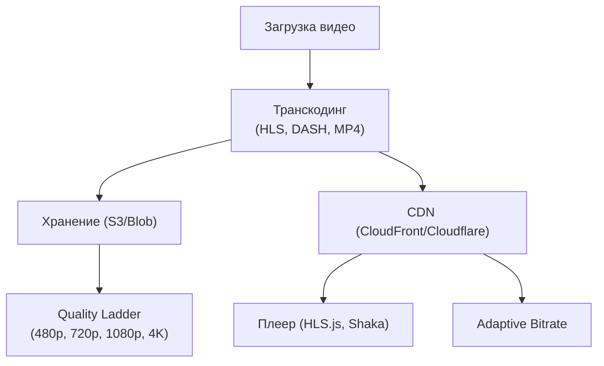

:::info[TL;DR]
Контент-платформа — видео (short/long), музыка, stories, подкасты. Ключевые компоненты: транскодинг/encoding, CDN (доставка), DRM, загрузка, стриминг (HLS/DASH), рекомендации. Аналитик проектирует форматы контента, workflow загрузки, баланс качества/скорости и метрики (startup time, buffering, play-through rate).
:::

## Архитектура видеоплатформы

## Типы контента

| Тип | Длительность | Формат | Монетизация |
|-----|-------------|--------|-------------|
| **Short video** | 15–60s | MP4, HLS | In-feed ads |
| **Long video** | 5–60 min | HLS/DASH | Pre-roll, mid-roll |
| **Music** | 2–5 min | AAC, MP3 | Подписка |
| **Stories** | 24h, 15s | MP4 | Stories ads |
| **Live** | Любая | HLS Low Latency | Super Chat |
| **Podcast** | 10–60 min | MP3, AAC | Реклама, подписка |

## Метрики контента

| Метрика | Описание |
|---------|----------|
| **Startup time** | Время до первого кадра |
| **Buffering rate** | % времени с буферизацией |
| **Play-through rate** | % досмотревших до конца |
| **ABR efficiency** | Качество при битрейте |
| **CDN hit ratio** | % кэш-хитов CDN |

## Что дальше

- [Платформенные механики (API, SDK, маркетплейс)](/docs/specialization/socnet-eco)

## Проверь себя

1. **Как устроена архитектура видеоплатформы?**
   *Ответ:* Загрузка → Транскодинг → S3 → CDN → Плеер (HLS/DASH, ABR).

2. **Какие типы контента есть на контент-платформе?**
   *Ответ:* Short video, long video, music, stories, live, podcast.
