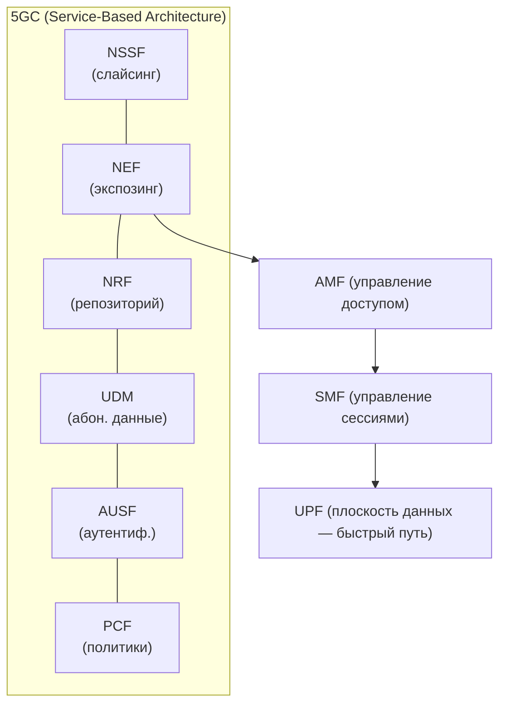
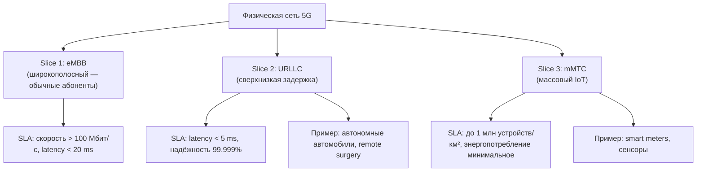
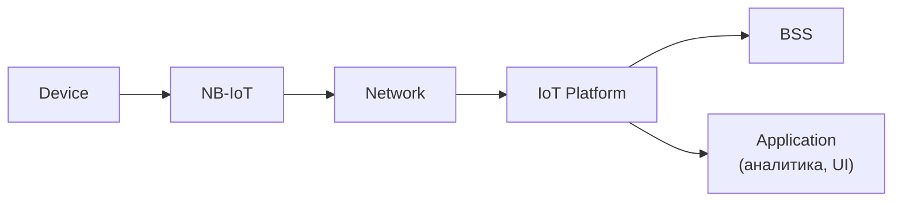
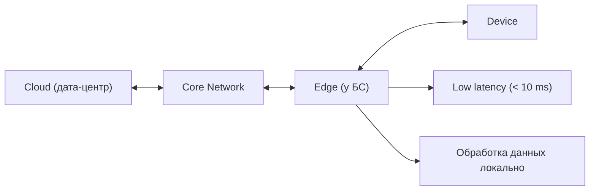

:::info[TL;DR]
5G — не просто «быстрее», а новая архитектура: network slicing, edge computing, low latency, mMTC (massive IoT). Для аналитика 5G означает новые бизнес-модели: B2B-сеть для заводов, IoT-тарифы для миллионов устройств, SLA на уровне сети.
:::

## Для кого эта статья

- SA, изучающие 5G и IoT-архитектуру
- Архитекторы BSS, готовящиеся к внедрению 5G
- Продуктовые менеджеры IoT-решений

## После прочтения вы узнаете

- Чем 5G отличается от 4G на уровне архитектуры
- Что такое Network Slicing и какие бизнес-модели он открывает
- Какие технологии IoT используются в Telecom
- Как Edge Computing меняет требования к BSS

## Что нового в 5G (vs 4G)

| Параметр | 4G | 5G |
|----------|-----|-----|
| Скорость | до 1 Гбит/с | до 20 Гбит/с |
| Задержка | 30–50 ms | 1–10 ms |
| Устройств на км² | 100K | 1M |
| Энергопотребление | Высокое | Низкое (NB-IoT) |
| Ядро сети | EPC | 5GC (Service-Based Architecture) |
| Сети | — | Network Slicing |

## Архитектура 5G

Ключевое отличие: 5G Core (5GC) построен как микросервисы (SBA — Service-Based Architecture).

## Network Slicing

**Идея:** на одной физической сети создаются несколько виртуальных «срезов» с разным SLA.

## IoT в Telecom

### Типы IoT-подключений

| Технология | Скорость | Дальность | Применение |
|-----------|----------|-----------|------------|
| **NB-IoT** | ~200 Кбит/с | 10+ км | Умные счётчики, парковки |
| **LTE-M** | ~1 Мбит/с | 5+ км | Трекинг, носимые устройства |
| **5G mMTC** | ~10 Мбит/с | 1+ км | Промышленные сенсоры |
| **Cat-1** | ~10 Мбит/с | 5+ км | POS-терминалы, телеметрия |

### IoT-архитектура

**IoT Platform — ключевой компонент:**
- **Device Management** — регистрация, OTA-обновления, состояние
- **Data Ingestion** — приём данных от миллионов устройств
- **Rules Engine** — обработка событий
- **Billing Integration** — тарификация по объёму данных / пакетам

## Edge Computing для Telecom

**Идея:** вычислительные мощности на границе сети (рядом с базовой станцией).

**Для аналитика:** Edge Computing означает требования к биллингу — как тарифицировать обработку на edge? Как учитывать потреблённые ресурсы?

## Требования к BSS для 5G и IoT

| Параметр | 5G/IoT |
|----------|--------|
| Тарификация | По slice, latency, throughput |
| IoT Billing | Per device (миллионы), data pool |
| Network Slicing | Product Catalog умеет slices |
| SLA | Юридические обязательства по скорости/задержке |
| Provisioning | Активация slice в реальном времени |
| API монетизация | TM Forum Open API для B2B |

## Пример: Network Slicing для промышленного завода

**Контекст.** Крупный производитель автомобилей («АвтоТех») построил «умный завод» с 5G-покрытием. Требования: три класса трафика на одной физической сети 5G:
1. **URLLC** — управление роботами-манипуляторами (latency < 5 ms, reliability 99.999%)
2. **eMBB** — видеоаналитика 4K с 200 камер (throughput > 500 Мбит/с на камеру)
3. **mMTC** — 50 000 сенсоров температуры/вибрации (единицы байт/день, батарея 10 лет)

**Задача.** Спроектировать 5G-сеть с тремя slices, интегрировать BSS для тарификации по SLA.

**Решение.**
- Network Slicing через 5GC: NSSF назначает slice-селектор по типу устройства
- URLLC-срез: выделенные ресурсы на UPF, MIMO-антенны, SLA в договоре
- eMBB-срез: best-effort с приоритетом для видео
- mMTC-срез: NB-IoT на отдельной несущей
- BSS: Product Catalog содержит три продукта (URLLC-Slice, eMBB-Slice, mMTC-Slice) с разными ценами и SLA

**Результат.**
- URLLC: latency 3.2 ms, 0 сбоев за 6 месяцев
- eMBB: 200 камер 4K передают видео в реальном времени
- mMTC: 50K сенсоров работают от батареек, замена раз в 8 лет
- Оператор зарабатывает: 2 млн ₽/мес за URLLC-slice + 500K ₽ за eMBB

## Что дальше

- [BSS/OSS архитектура](/docs/specialization/telecom-bss-oss) — ещё раз с точки зрения 5G
- [TM Forum Open API](/tech/tmforum) — стандарты для монетизации

## Проверь себя

1. **Что такое Network Slicing в 5G?**
   *Ответ:* Виртуальные срезы сети с разным SLA (eMBB — широкополосный, URLLC — низкая задержка, mMTC — массовый IoT).

2. **Какие технологии IoT используются в Telecom?**
   *Ответ:* NB-IoT (низкая скорость, дальняя связь), LTE-M (средняя), 5G mMTC (массовый).

3. **Как Edge Computing меняет требования к BSS?**
   *Ответ:* Нужно тарифицировать не только трафик, но и вычислительные ресурсы на edge, SLA по latency.

4. **Какие три типа трафика поддерживает Network Slicing в 5G?**
   *Ответ:* eMBB (широкополосный), URLLC (низкая задержка), mMTC (массовый IoT).

5. **Какая технология IoT подходит для умных счётчиков?**
   *Ответ:* NB-IoT — низкая скорость (~200 Кбит/с), дальняя связь (10+ км), минимальное энергопотребление.

## Ссылки

- [3GPP TS 23.501 — 5G System Architecture](https://www.3gpp.org/specifications)
- [5G SBA (Service-Based Architecture) — Ericsson](https://www.ericsson.com/en/5g)
- [GSMA — 5G Network Slicing](https://www.gsma.com)
- [NB-IoT — 3GPP Release 13](https://www.3gpp.org/specifications)
- [ETSI MEC — Multi-access Edge Computing](https://www.etsi.org/technologies/multi-access-edge-computing)
