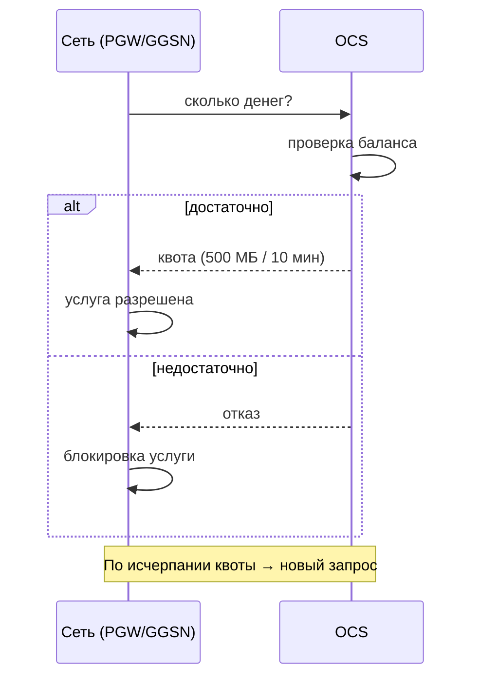
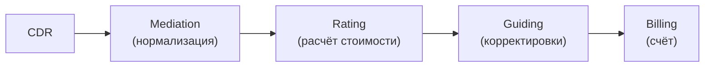
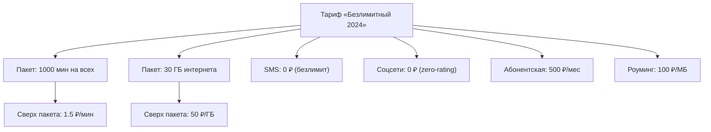
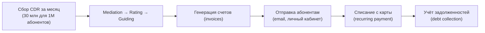

:::info[TL;DR]
Billing (выставление счетов) и Charging (тарификация в реальном времени) — ядро Telecom. Pre-paid: деньги списываются сразу. Post-paid: счёт в конце месяца. Аналитик специфицирует тарифные планы, CDR (Call Data Records), роуминг, OCS (Online Charging System) и интеграцию с CRM.
:::

## Для кого эта статья

- SA, работающие над Billing/Charging-модулями
- Архитекторы BSS-платформ операторов связи
- Разработчики OCS и Mediation-систем

## После прочтения вы узнаете

- Чем pre-paid отличается от post-paid на уровне архитектуры
- Как работает OCS (Online Charging System) в real-time
- Из каких этапов состоит обработка CDR
- Как проектировать тарифные планы в Telecom

## Pre-paid vs Post-paid

| Параметр | Pre-paid | Post-paid |
|----------|----------|-----------|
| Оплата | Вперёд | В конце месяца |
| Charging | Real-time (OCS) | Batch (Billing) |
| Риск | Нулевой (нет долга) | Есть (должник) |
| Сложность | Выше (real-time) | Ниже |
| Примеры | Yota, Tele2 | Билайн (контракт) |

## Online Charging System (OCS)

OCS — система, которая тарифицирует услугу ДО её оказания (pre-paid).



**Требования к OCS:**
- Время ответа: < 100 ms (иначе звонок оборвётся)
- Пропускная способность: 50 000 TPS (transactions per second)
- Доступность: 99.999%

## CDR — Call Data Records

Каждая операция (звонок, SMS, интернет-сессия) порождает CDR.

```
CDR содержит:
  - MSISDN (номер абонента)
  - IMSI / IMEI
  - Тип: voice / sms / data / roaming
  - Начало / окончание
  - Длительность (для voice)
  - Объём (для data, в байтах)
  - Сторона A / B (кто звонил, кому)
  - Cell ID (базовая станция)
  - Статус (success / failed)
```

**Batch-обработка CDR для post-paid:**



## Тарифные планы (Product Catalog)

Тариф — набор правил тарификации:



## Charging-сценарии

| Сценарий | Как работает |
|----------|-------------|
| **Звонок (voice)** | OCS: запрос квоты на N минут. По окончании — новый запрос |
| **Интернет (data)** | OCS: квота на N МБ. По окончании — новый запрос |
| **SMS** | OCS: списание фиксированной суммы за SMS |
| **Роуминг** | OCS → HPLMN → VPLMN: межоператорские расчёты (TAP-файлы) |
| **Zero-rating** | OCS не тарифицирует трафик на определённые ресурсы |
| **Family share** | Расход из общего баланса семьи |

## Billing (пост-оплата)

**Процесс:**



## Требования к Billing/Charging (спецификация)

| Параметр | Пример |
|----------|--------|
| Поддерживаемые типы | Pre-paid, post-paid, hybrid |
| Каналы тарификации | Voice, SMS, Data, Roaming, VAS |
| TPS (charging) | 50 000+ |
| Задержка OCS | < 100 ms |
| Время выставления счёта | < 4 часа на 10M абонентов |
| Retention CDR | 3 года |
| Роуминг | TAP-файлы (входящий/исходящий) |
| Zero-rating | По списку URL/IP |

## Пример: Миграция pre-paid абонентов на hybrid-биллинг

**Контекст.** Оператор «Мобайл» (5M pre-paid, 2M post-paid) терял 15% pre-paid абонентов в месяц из-за отсутствия hybrid-тарифов. Конкуренты (Yota, Tele2) предлагали пакеты с безлимитными соцсетями и переносом остатков, что было недоступно на старой OCS (Huawei OCS v8, 2014).

**Задача.** Мигрировать 5M pre-paid абонентов на новую OCS (Ericsson Charging System) с поддержкой hybrid (pre-paid + post-paid в одном тарифе) без потери действующих абонентов.

**Решение.**
- Новая OCS развёрнута параллельно, синхронизация балансов через Kafka
- Миграция по IMSI-range: 5 пулов по 1M абонентов, 50K/ночь
- Каждый пакет проходил: заморозка старой OCS → перенос баланса → активация в новой OCS → тестовый звонок
- Rollback-план: при падении успешности < 99% — откат пула за 2 часа

**Результат.**
- Успешность миграции: 99.97% (1 500 ошибок из 5M, все исправлены вручную)
- Downtime на абонента: < 3 минут
- Запуск hybrid-тарифа «Всё включено» через 2 недели после миграции
- Отток pre-paid: снизился с 15% до 4% за 3 месяца
- ARPU вырос на 18% за счёт cross-sell

## Что дальше

- [CRM и Order Management](/docs/specialization/telecom-crm-order)
- [Provisioning](/docs/specialization/telecom-provisioning)

## Проверь себя

1. **Чем pre-paid отличается от post-paid?**
   *Ответ:* Pre-paid — деньги вперёд, real-time charging (OCS). Post-paid — счёт в конце месяца, batch-тарификация.

2. **Как работает OCS?**
   *Ответ:* Сеть запрашивает квоту → OCS проверяет баланс → выдаёт квоту → по исчерпании — новый запрос. Время ответа < 100 ms.

3. **Что такое CDR и как он обрабатывается?**
   *Ответ:* Call Data Record — запись об операции. Процесс: Mediation → Rating → Guiding → Billing.

4. **Какая максимальная задержка OCS для pre-paid звонка?**
   *Ответ:* Менее 100 ms, иначе звонок может оборваться.

5. **Что такое Zero-rating в Telecom?**
   *Ответ:* Трафик на определённые ресурсы (соцсети, мессенджеры) не тарифицируется — OCS пропускает его без списания средств.

## Ссылки

- [3GPP TS 32.240 — Charging Architecture](https://www.3gpp.org/specifications)
- [TM Forum — Charging APIs](https://www.tmforum.org/oda/open-apis/)
- [IETF RFC 4006 — Diameter Credit-Control Application](https://datatracker.ietf.org/doc/html/rfc4006)
- [GSMA — TAP (Transferred Account Procedure) Standard](https://www.gsma.com)
