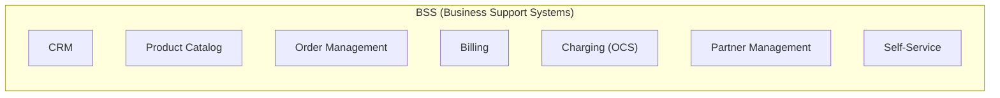
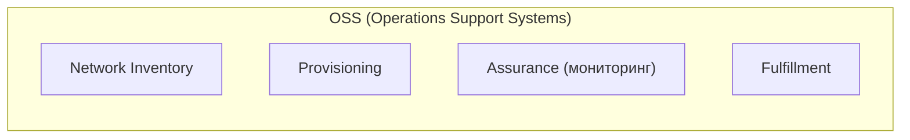
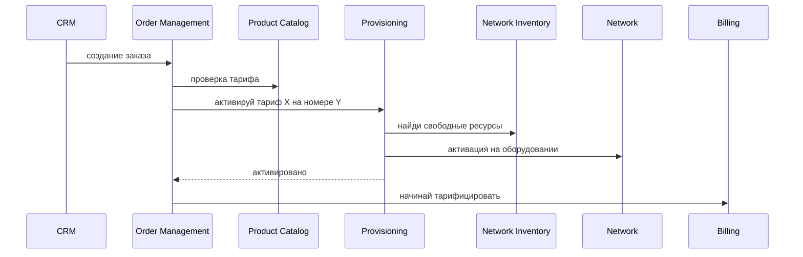

:::info[TL;DR]
Архитектура Telecom делится на BSS (Business Support Systems) и OSS (Operations Support Systems). BSS отвечает за абонентов, тарифы, биллинг, заказы. OSS — за оборудование сети, активацию услуг и мониторинг. Стандарты: TM Forum (eTOM, SID, TAM, Open API).
:::

## Для кого эта статья

- SA, начинающие работу в Telecom-проектах
- Разработчики и архитекторы, интегрирующие BSS/OSS
- Технические лиды, выбирающие платформу для оператора связи

## После прочтения вы узнаете

- Из каких компонентов состоит BSS и OSS
- Как взаимодействуют CRM, Order Management, Provisioning и Billing
- Какие стандарты TM Forum регулируют архитектуру
- Какие требования предъявляются к Telecom-системам

## BSS — Business Support Systems

BSS — всё, что связано с абонентом как с клиентом.

### Компоненты BSS

| Компонент | Назначение | Примеры систем |
|-----------|-----------|----------------|
| **CRM** | Управление абонентами, контакты, обращения | Salesforce, Oracle CRM, Amdocs |
| **Product Catalog** | Тарифы, услуги, опции, пакеты | Oracle BRM, Netcracker |
| **Order Management** | Заказы на подключение/изменение/отключение | Amdocs Order Management |
| **Billing** | Расчёт счетов post-paid | Oracle BRM, SAP CC |
| **Charging (OCS)** | Real-time тарификация pre-paid | Huawei OCS, Ericsson Charging |
| **Partner Management** | Дилеры, дистрибьюторы, MVNO | Oracle PRM |
| **Self-Service** | Личный кабинет, мобильное приложение | — |

## OSS — Operations Support Systems

OSS — всё, что связано с сетью и оборудованием.

### Компоненты OSS

| Компонент | Назначение |
|-----------|-----------|
| **Network Inventory** | Учёт оборудования: базовые станции, коммутаторы, каналы |
| **Provisioning** | Активация услуги в сети (включить интернет, активировать VoLTE) |
| **Assurance** | Мониторинг сети, алерты, SLA |
| **Fulfillment** | Сквозной процесс «заказ → активация в сети» |

## Взаимодействие BSS и OSS

## TM Forum стандарты

| Стандарт | Описание |
|----------|----------|
| **eTOM** | Business Process Framework — эталонные процессы Telecom |
| **SID** | Information Framework — модель данных |
| **TAM** | Application Framework — карта приложений |
| **Open API** | REST API для интеграции BSS/OSS (49+ API) |

**Для аналитика:** eTOM — ключевой стандарт для спецификации процессов. Если внедряете BSS — смотрите на соответствие eTOM.

## Требования к архитектуре BSS/OSS

| Параметр | Пример |
|----------|--------|
| Абонентская база | 10M+ |
| Задержка charging | < 100 ms (pre-paid) |
| Доступность | 99.999% (5 nines) |
| Интеграции | 50+ систем (BSS ↔ OSS ↔ внешние) |
| Legacy | TDM → IP, SS7 → Diameter |
| Стандарты | TM Forum Open API, 3GPP |

## Пример: Интеграция 47 legacy-систем в единую BSS

**Контекст.** Крупный федеральный оператор (10M+ абонентов) имел 47 разрозненных BSS/OSS-систем, накопленных за 15 лет M&A-сделок. Каждый MVNO-партнёр подключался через отдельную интеграцию. Вывод нового тарифа занимал 4-6 недель.

**Задача.** Построить единую BSS-платформу с TM Forum Open API, заместив 12 ключевых legacy-систем, без остановки услуг.

**Решение.**
- Внедрена ESB-шина (Oracle SOA) с адаптерами под каждый legacy-протокол
- 5 приоритетных API по TMF622 (Ordering), TMF629 (Customer), TMF620 (Catalog), TMF638 (Inventory), TMF639 (Resource)
- Разработан единый Product Catalog как источник правды для тарифов
- Поэтапная миграция: 3 legacy-системы в квартал, параллельная работа 18 месяцев

**Результат.**
- Время подключения MVNO: с 6 месяцев до 3 недель
- Вывод нового тарифа: с 4-6 недель до 2 дней
- Снижение operational cost на BSS: 40%
- Инциденты при интеграции: с 12/мес до 2/мес

## Что дальше

- [Billing и Charging](/docs/specialization/telecom-billing)
- [CRM и Order Management](/docs/specialization/telecom-crm-order)

## Проверь себя

1. **Чем BSS отличается от OSS?**
   *Ответ:* BSS — бизнес-системы (CRM, биллинг, заказы). OSS — сетевые системы (inventory, provisioning, assurance).

2. **Какие стандарты TM Forum нужно знать?**
   *Ответ:* eTOM (процессы), SID (данные), TAM (приложения), Open API (интеграции).

3. **Как BSS и OSS взаимодействуют при подключении услуги?**
   *Ответ:* CRM → Order Management → Provisioning → Network. Provisioning подтверждает активацию, Billing начинает тарификацию.

4. **Какой стандарт TM Forum описывает эталонные бизнес-процессы Telecom?**
   *Ответ:* eTOM (Business Process Framework).

5. **Какие 4 компонента входят в OSS?**
   *Ответ:* Network Inventory, Provisioning, Assurance (мониторинг), Fulfillment.

## Ссылки

- [TM Forum — Open API Map](https://www.tmforum.org/oda/open-apis/)
- [eTOM Business Process Framework (ITU-T M.3050)](https://www.itu.int/rec/T-REC-M.3050/)
- [3GPP TR 21.905 — Vocabulary for 3GPP Specifications](https://www.3gpp.org/specifications)
