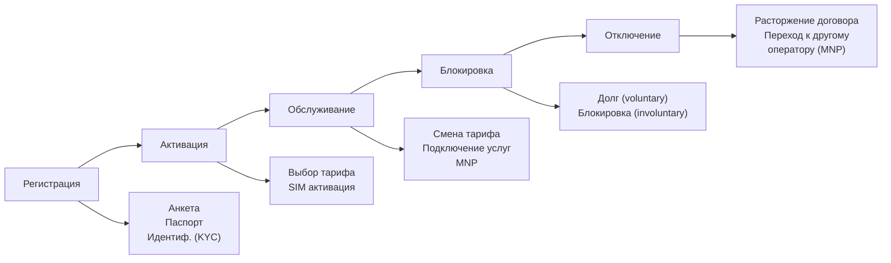
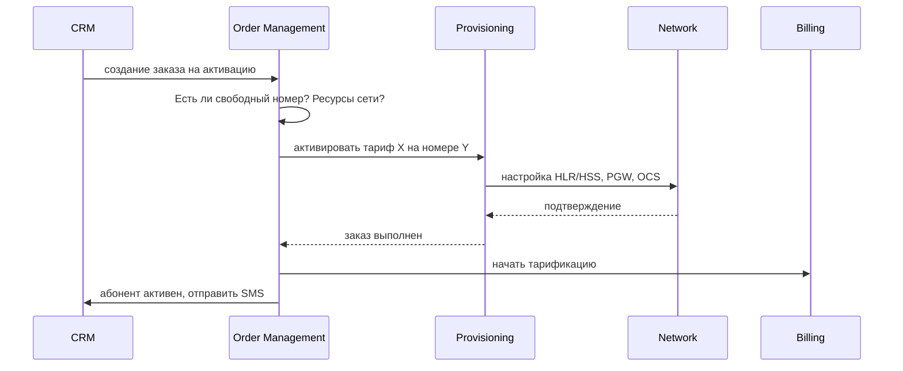

:::info[TL;DR]
CRM в Telecom — не просто контакты, а управление жизненным циклом абонента: регистрация, смена тарифа, блокировка, отключение, MNP (перенос номера). Order Management — заказы на услуги, которые идут в Provisioning и далее в сеть.
:::

## Для кого эта статья

- SA, проектирующие CRM и Order Management в Telecom
- Разработчики BSS-решений
- Продуктовые менеджеры Telecom-компаний

## После прочтения вы узнаете

- Какие этапы проходит абонент в CRM оператора связи
- Чем Order Management в Telecom отличается от e-commerce
- Как работает сквозной процесс Fulfillment (заказ → сеть)
- Какие требования предъявляются к CRM/OM

## Жизненный цикл абонента в CRM



### Ключевые процессы CRM

| Процесс | Описание |
|---------|----------|
| **Новый абонент** | Регистрация, KYC, выбор тарифа, выдача SIM |
| **MNP (перенос)** | Перенос номера от другого оператора (через ЦСП) |
| **Смена тарифа** | Изменение тарифного плана (немедленно/след. месяц) |
| **Блокировка** | Добровольная (потеря SIM) / принудительная (долг) |
| **Роуминг** | Включение/отключение роуминга |
| **Отключение** | Расторжение договора, MNP к другому оператору |

## Order Management в Telecom

Заказы в Telecom отличаются от e-commerce — они активируют услуги в сети.

```
Order
 ├── id
 ├── subscriber (MSISDN, IMSI)
 ├── type: activation / change_tariff / add_service / deactivation / mnp
 ├── items:
 │    ├── service: "Безлимитный интернет 30 ГБ"
 │    ├── tariff_id: T-2024-01
 │    └── parameters: {start_date, end_date, auto_renew}
 ├── status: NEW → VALIDATED → IN_PROGRESS → COMPLETED → FAILED
 └── external_ref: provisioning_id
```

### Типы заказов

| Тип заказа | Описание | SLA |
|------------|----------|-----|
| **Активация SIM** | Новый абонент | < 5 мин |
| **Смена тарифа** | Изменение тарифного плана | < 1 мин |
| **Подключение услуги** | Добавление опции (100 ГБ интернета) | < 1 мин |
| **Блокировка** | Блокировка по request | < 1 мин |
| **MNP** | Перенос номера | < 24 часа (по закону) |
| **Отключение** | Расторжение договора | < 24 часа |

## Fulfillment — сквозной процесс



## Требования к CRM/OM (спецификация)

| Параметр | Пример |
|----------|--------|
| Абонентов | 10M+ |
| Заказов в день | 100 000+ |
| Время выполнения | < 5 мин (активация) |
| Интеграции | Provisioning, Billing, OCS, Network |
| MNP | Через ЦСП (система переноса нумерации) |
| KYC | Проверка паспорта, ЕСИА |
| Compliance | 152-ФЗ, СОРМ, anti-fraud |

## Пример: Внедрение CRM и OM для MVNO с 500K абонентов

**Контекст.** Банковская группа запускала MVNO (виртуальный оператор) на сети MNO «Мегафон». Цель: 500K абонентов за первый год. Свои CRM, OM, Billing — интеграция с MNO через TM Forum API и Diameter.

**Задача.** Спроектировать и внедрить CRM + Order Management за 6 месяцев, с поддержкой MNP, KYC (паспорт через ЕСИА), zero-rating на банковское приложение и автоматической активацией SIM.

**Решение.**
- CRM: Salesforce Telecom Cloud (настроено 4 бизнес-процесса: регистрация, MNP, смена тарифа, блокировка)
- OM: кастомный Order Manager на Java с BPMN-движком (Camunda)
- Интеграция с MNO: TMF622 (Ordering) — активация SIM, TMF629 (Customer) — KYC
- MNP: интеграция с ЦСП (ГИС «Перенос номера») через SOAP, SLA 24 часа
- Zero-rating: OCS банка проверяет IP-адрес назначения через DPI

**Результат.**
- Запуск: 5.5 месяцев (на 2 недели раньше плана)
- 500K абонентов достигнуто на 10-й месяц
- KYC online: 92% абонентов прошли идентификацию без посещения салона
- MNP: среднее время переноса — 4 часа (при SLA 24 часа)
- NPS: 62 (выше среднего по Telecom — 45)

## Что дальше

- [Provisioning и активация услуг](/docs/specialization/telecom-provisioning)
- [Регуляторика в Telecom](/docs/specialization/telecom-regulations)

## Проверь себя

1. **Какие этапы проходит абонент в CRM?**
   *Ответ:* Регистрация → Активация → Обслуживание → Блокировка → Отключение (MNP).

2. **Чем Order Management в Telecom отличается от e-commerce OMS?**
   *Ответ:* Заказы в Telecom активируют услуги в сети (через Provisioning), а не просто меняют статус заказа.

3. **Что такое MNP и какой SLA?**
   *Ответ:* Mobile Number Portability — перенос номера к другому оператору. SLA: < 24 часа.

4. **Какие типы заказов бывают в Telecom?**
   *Ответ:* Активация SIM, смена тарифа, подключение услуги, блокировка, MNP, отключение.

5. **Какие системы конфигурирует Provisioning при активации абонента?**
   *Ответ:* HLR/HSS (голосовые услуги), PGW/GGSN (интернет), OCS (тарификация), SMSC (SMS).

## Ссылки

- [TM Forum TMF622 — Product Ordering API](https://www.tmforum.org/oda/open-apis/)
- [Salesforce Telecom Cloud](https://www.salesforce.com/eu/industries/communications/)
- [Camunda BPMN for Order Management](https://camunda.com/)
- [3GPP TS 23.228 — IP Multimedia Subsystem](https://www.3gpp.org/specifications)
