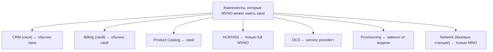
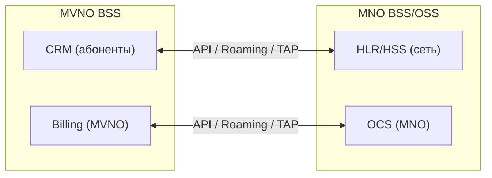

:::info[TL;DR]
MVNO (Mobile Virtual Network Operator) — оператор без своей сети. Арендует инфраструктуру у MNO (хост-оператора). Виртуальный оператор сам управляет тарифами, биллингом, маркетингом, но использует сеть и нумерацию MNO. Примеры: Yota (MVNO на Мегафон), Тинькофф Мобайл, Virgin Mobile.
:::

## Для кого эта статья

- SA, проектирующие MVNO-решения
- Продуктовые менеджеры виртуальных операторов
- Архитекторы BSS для MVNO-партнёрств

## После прочтения вы узнаете

- Какие бывают модели MVNO (Light / Service Provider / Full / Enhanced)
- Какие системы MVNO может иметь свои, а какие арендует у MNO
- Как интегрируется BSS MVNO с BSS MNO
- Какие бизнес-модели существуют у виртуальных операторов

## Модели MVNO

| Модель | Уровень самостоятельности | Пример |
|--------|--------------------------|--------|
| **Light MVNO** | Только маркетинг и SIM-карты | Виртуальные бренды |
| **Service Provider MVNO** | Свой биллинг, своя тарификация | Тинькофф Мобайл |
| **Full MVNO** | Свой HLR/HSS, свой IMSI range | Yota |
| **Enhanced MVNO** | Своё OCS, DPI, инфраструктура | — |

## MVNO-интеграция

## Техническая интеграция MVNO ↔ MNO

| Система MVNO | Система MNO | Протокол | Данные |
|-------------|-------------|----------|--------|
| CRM | HLR/HSS | MAP / Diameter / API | Создание абонента, услуги |
| Order | Provisioning MNO | REST / SOAP | Активация, блокировка |
| Billing | OCS | Diameter (Ro) | Тарификация, баланс |
| Billing | Billing MNO | TAP-файлы | Роуминг-расчёты |
| CRM | HLR | MAP | MNP, перенос номера |

## MVNO-бизнес модели

| Модель | Как зарабатывает | Пример |
|--------|-----------------|--------|
| **Брендовая** | Скидка копеечная, свой маркетинг | Virgin Mobile |
| **Банковская** | Кешбэк + пакет услуг | Тинькофф Мобайл |
| **Ритейловая** | SIM в каждой коробке | МТС (как бренд до 2018) |
| **IoT MVNO** | Машины, сенсоры, устройства | — |
| **Enterprise** | Для юрлиц, свои тарифы | — |

## Требования к MVNO-системе (спецификация)

| Параметр | Пример |
|----------|--------|
| Модель | Service Provider или Full MVNO |
| MNO | 1–2 партнёра (хост-оператора) |
| Протоколы | Diameter Ro, MAP, REST API MNO |
| IMSI | Свой диапазон (для full MVNO) |
| Нумерация | DEF-коды от Минцифры |
| Billing | Свой (тарифы, пакеты) |
| Техподдержка | Своя (фронтлайн, эскалация MNO) |

## Пример: Запуск банковского MVNO на 1M абонентов

**Контекст.** Топ-10 российский банк решил запустить MVNO для интеграции мобильной связи в банковское приложение. Цель: 1M абонентов за 2 года. Модель: Service Provider (свой биллинг, CRM, Product Catalog; сеть и HLR — MNO «ВымпелКом»).

**Задача.** За 8 месяцев спроектировать BSS, интегрироваться с MNO, запустить тариф «Банковский» с zero-rating на приложение банка, кешбэком за связь и автоматической привязкой к карте.

**Решение.**
- CRM: Salesforce Telecom Cloud с кастомизацией под банковский KYC (паспорт + ИНН через ЕСИА)
- Billing: собственный на микросервисах (Go), интегрирован с core-banking для автоплатежей
- Zero-rating: OCS проверяет DPI-теги от MNO, трафик на bank.com не тарифицируется
- MNP: интеграция с ЦСП через SOAP, автоматическое заведение абонента при переносе номера
- Омниканальная поддержка: чат-бот (80% запросов) + live-agent

**Результат.**
- 1M абонентов за 14 месяцев (на 10 мес раньше плана)
- ARPU: 620 ₽ (выше рынка на 25% за счёт банковских cross-sell)
- Churn rate: 2.8% (vs средние 8% по MVNO)
- Zero-rating: 35% всего data-трафика
- Кешбэк за связь: конверсия в кредитные карты — 22%

## Что дальше

- [5G, IoT и новые технологии](/docs/specialization/telecom-5g-iot)

## Проверь себя

1. **Какие бывают модели MVNO?**
   *Ответ:* Light MVNO (только маркетинг), Service Provider (свой биллинг), Full MVNO (своя HLR), Enhanced MVNO (своя OCS).

2. **Какие системы MVNO может иметь свои?**
   *Ответ:* CRM, Billing, Product Catalog (обычно). HLR/HSS, OCS, Network — только у full MVNO.

3. **Как интегрируются BSS MVNO и BSS MNO?**
   *Ответ:* Через API, Diameter (для тарификации), TAP-файлы (роуминг), MAP (HLR).

4. **Какая модель MVNO предполагает свой HLR/HSS?**
   *Ответ:* Full MVNO.

5. **Какой протокол используется для тарификации между MVNO и MNO?**
   *Ответ:* Diameter (Ro — Online Charging, Rf — Offline Charging).

## Ссылки

- [TM Forum — MVNO Reference Architecture](https://www.tmforum.org/oda/open-apis/)
- [GSMA — MVNO Guide](https://www.gsma.com)
- [3GPP TS 23.228 — IMS для MVNO](https://www.3gpp.org/specifications)
- [Минцифры — Порядок присоединения сетей MVNO](https://digital.gov.ru/)
