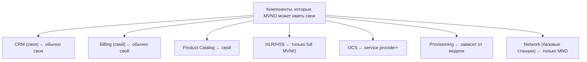
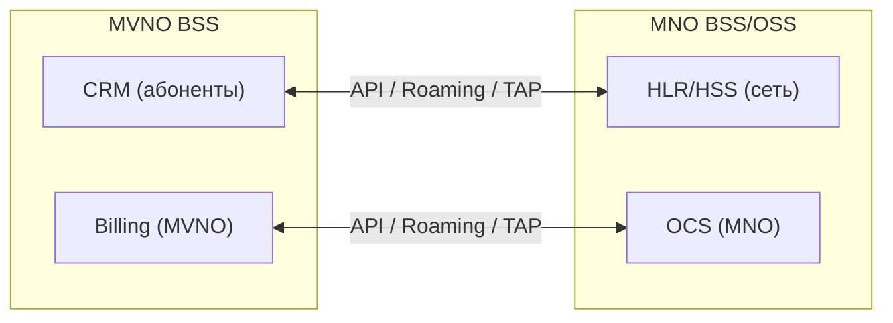

:::info[TL;DR]
MVNO (Mobile Virtual Network Operator) — оператор без своей сети. Арендует инфраструктуру у MNO (хост-оператора). Виртуальный оператор сам управляет тарифами, биллингом, маркетингом, но использует сеть и нумерацию MNO. Примеры: Yota (MVNO на Мегафон), Тинькофф Мобайл, Virgin Mobile.
:::

## Модели MVNO

| Модель | Уровень самостоятельности | Пример |
|--------|--------------------------|--------|
| **Light MVNO** | Только маркетинг и SIM-карты | Виртуальные бренды |
| **Service Provider MVNO** | Свой биллинг, своя тарификация | Тинькофф Мобайл |
| **Full MVNO** | Свой HLR/HSS, свой IMSI range | Yota |
| **Enhanced MVNO** | Своё OCS, DPI, инфраструктура | — |

## MVNO-интеграция

## Техническая интеграция MVNO ↔ MNO

| Система MVNO | Система MNO | Протокол | Данные |
|-------------|-------------|----------|--------|
| CRM | HLR/HSS | MAP / Diameter / API | Создание абонента, услуги |
| Order | Provisioning MNO | REST / SOAP | Активация, блокировка |
| Billing | OCS | Diameter (Ro) | Тарификация, баланс |
| Billing | Billing MNO | TAP-файлы | Роуминг-расчёты |
| CRM | HLR | MAP | MNP, перенос номера |

## MVNO-бизнес модели

| Модель | Как зарабатывает | Пример |
|--------|-----------------|--------|
| **Брендовая** | Скидка копеечная, свой маркетинг | Virgin Mobile |
| **Банковская** | Кешбэк + пакет услуг | Тинькофф Мобайл |
| **Ритейловая** | SIM в каждой коробке | МТС (как бренд до 2018) |
| **IoT MVNO** | Машины, сенсоры, устройства | — |
| **Enterprise** | Для юрлиц, свои тарифы | — |

## Требования к MVNO-системе (спецификация)

| Параметр | Пример |
|----------|--------|
| Модель | Service Provider или Full MVNO |
| MNO | 1–2 партнёра (хост-оператора) |
| Протоколы | Diameter Ro, MAP, REST API MNO |
| IMSI | Свой диапазон (для full MVNO) |
| Нумерация | DEF-коды от Минцифры |
| Billing | Свой (тарифы, пакеты) |
| Техподдержка | Своя (фронтлайн, эскалация MNO) |

## Что дальше

- [5G, IoT и новые технологии](/docs/specialization/telecom-5g-iot)

## Проверь себя

1. **Какие бывают модели MVNO?**
   *Ответ:* Light MVNO (только маркетинг), Service Provider (свой биллинг), Full MVNO (своя HLR), Enhanced MVNO (своя OCS).

2. **Какие системы MVNO может иметь свои?**
   *Ответ:* CRM, Billing, Product Catalog (обычно). HLR/HSS, OCS, Network — только у full MVNO.

3. **Как интегрируются BSS MVNO и BSS MNO?**
   *Ответ:* Через API, Diameter (для тарификации), TAP-файлы (роуминг), MAP (HLR).
