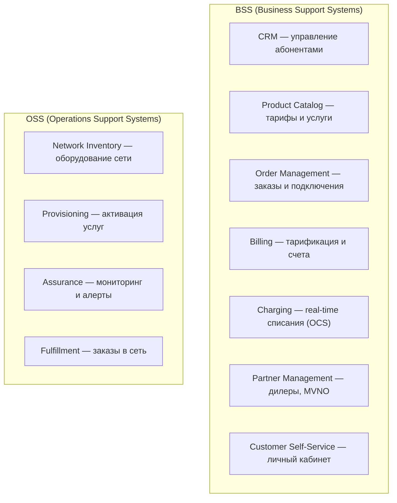

:::info[TL;DR]
Telecom-аналитик работает с BSS/OSS — системами для управления абонентами, тарификации, заказами и сетью. Специфика: миллионы абонентов, real-time charging, жёсткая регуляция (СОРМ, 152-ФЗ, лицензии) и длинный lifecycle (десятилетиями работающие legacy-системы).
:::

## Для кого эта статья

- Junior-аналитики, которые хотят войти в Telecom
- Middle SA, переходящие из других доменов (FinTech, e-commerce)
- Team Lead / Architects, оценивающие специфику Telecom-проектов

## После прочтения вы узнаете

- Чем Telecom отличается от e-commerce и FinTech
- Какие системы входят в BSS и OSS
- Какие протоколы и стандарты нужно знать
- Как выглядит карьерный путь Telecom-аналитика

## Чем Telecom отличается от других отраслей

Telecom (телекоммуникации) — связь, мобильные операторы, интернет-провайдеры.

| Особенность | Описание |
|-------------|----------|
| **Миллионы абонентов** | Системы рассчитаны на 10M+ |
| **Real-time charging** | Тарификация звонка в реальном времени |
| **BSS/OSS** | Разделение на бизнес-системы и сетевые системы |
| **Legacy** | Многие системы пишутся десятилетиями (TDM, SS7) |
| **Регуляция** | Лицензии, СОРМ, ПД, переносимость номера (MNP) |
| **Сложные биллинги** | Pre-paid, post-paid, hybrid, roaming |

## Основные подсистемы

## Типовые проекты Telecom-аналитика

1. Внедрение новой BSS-платформы (замена legacy)
2. Интеграция CRM + Order Management + Provisioning
3. Подключение MVNO-партнёра (виртуальный оператор)
4. Миграция биллинга с pre-paid на hybrid
5. Внедрение 5G — новые тарифы и услуги
6. СОРМ — интеграция с правоохранительными органами
7. MNP — переносимость номера
8. API-монетизация (TM Forum Open API)

## Что нужно знать

- **Архитектура:** BSS/OSS, микросервисы, event-driven
- **Протоколы:** Diameter, HTTP/2, SS7 (legacy)
- **Данные:** миллионы абонентов, CDR (Call Data Records)
- **Регуляция:** СОРМ, 152-ФЗ, лицензии Роскомнадзора
- **Стандарты:** TM Forum (Open API, eTOM, SID), 3GPP, ITU-T

## Карьерный путь

| Этап | Роль | Ключевые навыки |
|------|------|----------------|
| 1 | Junior SA в Telecom | CRM, Order Management |
| 2 | Middle SA | Billing, Provisioning |
| 3 | Senior SA | BSS/OSS архитектура, MVNO |
| 4 | Lead / Architect | Telecom-решения, 5G |

## Пример: BSS-реплейсинг для оператора «Связь»

**Контекст.** Региональный оператор связи с 2.5M абонентов эксплуатировал BSS-платформу на Oracle BRM 2008 года. Система не поддерживала hybrid-тарифы (pre-paid + post-paid), не было API для MVNO-партнёров, downtime биллинга достигал 4 часов в месяц.

**Задача.** За 18 месяцев заменить ядро BSS: CRM, Product Catalog, Order Management, Billing/Charging. Без остановки действующих абонентов.

**Решение.**
- Выбрана платформа Netcracker (TM Forum Open API compliant)
- Разбивка на 5 фаз: (1) Product Catalog → (2) CRM → (3) OM → (4) Billing → (5) OCS
- Миграция данных: параллельная запись в старую и новую BSS в течение 3 месяцев
- Для pre-paid абонентов — горячая миграция через OCS (по IMSI-range, 50K/ночь)

**Результат.**
- Downtime BSS: с 4 ч/мес до 0 (99.995%)
- Запуск 3 MVNO-партнёров через TM Forum API
- Время вывода нового тарифа: с 3 недель до 2 дней
- ROI: 18 месяцев (учтена экономия на лицензиях Oracle и downtime)

## Что дальше

- [BSS/OSS](/docs/specialization/telecom-bss-oss) — архитектура Telecom-систем
- [Billing и Charging](/docs/specialization/telecom-billing)

## Проверь себя

1. **Чем BSS отличается от OSS?**
   *Ответ:* BSS — бизнес-системы (CRM, биллинг, заказы). OSS — сетевые системы (inventory, provisioning, assurance).

2. **Какие особенности Telecom по сравнению с другими отраслями?**
   *Ответ:* Миллионы абонентов, real-time charging, жёсткая регуляция (СОРМ), десятилетиями работающие legacy-системы.

3. **Какие 4 стандарта TM Forum нужно знать аналитику?**
   *Ответ:* eTOM (процессы), SID (данные), TAM (приложения), Open API (интеграции).

4. **Сколько абонентов может обслуживать BSS оператора связи?**
   *Ответ:* 10M+ абонентов, пиковая нагрузка до 50 000 TPS на OCS.

5. **Какая максимальная задержка OCS при pre-paid звонке?**
   *Ответ:* Менее 100 ms, иначе звонок оборвётся.

## Ссылки

- [TM Forum Open API](https://www.tmforum.org/oda/open-apis/)
- [3GPP спецификации](https://www.3gpp.org/specifications)
- [Минцифры — лицензирование услуг связи](https://digital.gov.ru/ru/activity/directions/8/)
