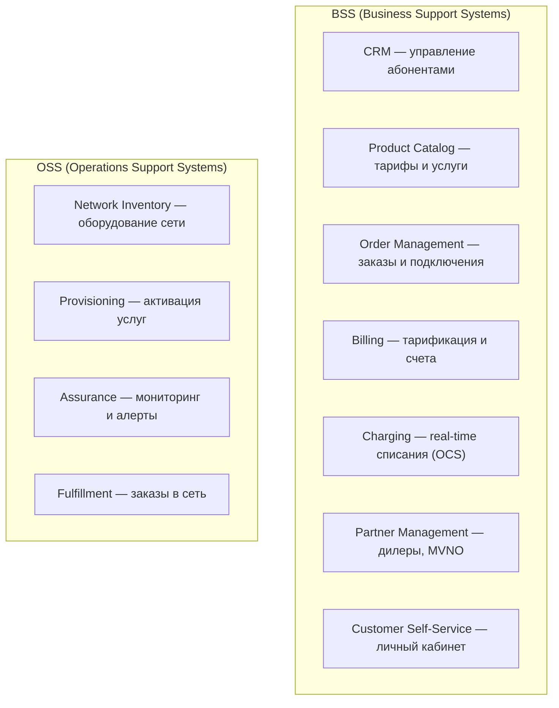

:::info[TL;DR]
Telecom-аналитик работает с BSS/OSS — системами для управления абонентами, тарификации, заказами и сетью. Специфика: миллионы абонентов, real-time charging, жёсткая регуляция (СОРМ, 152-ФЗ, лицензии) и длинный lifecycle (десятилетиями работающие legacy-системы).
:::

## Чем Telecom отличается от других отраслей

Telecom (телекоммуникации) — связь, мобильные операторы, интернет-провайдеры.

| Особенность | Описание |
|-------------|----------|
| **Миллионы абонентов** | Системы рассчитаны на 10M+ |
| **Real-time charging** | Тарификация звонка в реальном времени |
| **BSS/OSS** | Разделение на бизнес-системы и сетевые системы |
| **Legacy** | Многие системы пишутся десятилетиями (TDM, SS7) |
| **Регуляция** | Лицензии, СОРМ, ПД, переносимость номера (MNP) |
| **Сложные биллинги** | Pre-paid, post-paid, hybrid, roaming |

## Основные подсистемы

## Типовые проекты Telecom-аналитика

1. Внедрение новой BSS-платформы (замена legacy)
2. Интеграция CRM + Order Management + Provisioning
3. Подключение MVNO-партнёра (виртуальный оператор)
4. Миграция биллинга с pre-paid на hybrid
5. Внедрение 5G — новые тарифы и услуги
6. СОРМ — интеграция с правоохранительными органами
7. MNP — переносимость номера
8. API-монетизация (TM Forum Open API)

## Что нужно знать

- **Архитектура:** BSS/OSS, микросервисы, event-driven
- **Протоколы:** Diameter, HTTP/2, SS7 (legacy)
- **Данные:** миллионы абонентов, CDR (Call Data Records)
- **Регуляция:** СОРМ, 152-ФЗ, лицензии Роскомнадзора
- **Стандарты:** TM Forum (Open API, eTOM, SID), 3GPP, ITU-T

## Карьерный путь

| Этап | Роль | Ключевые навыки |
|------|------|----------------|
| 1 | Junior SA в Telecom | CRM, Order Management |
| 2 | Middle SA | Billing, Provisioning |
| 3 | Senior SA | BSS/OSS архитектура, MVNO |
| 4 | Lead / Architect | Telecom-решения, 5G |

## Что дальше

- [BSS/OSS](/docs/specialization/telecom-bss-oss) — архитектура Telecom-систем
- [Billing и Charging](/docs/specialization/telecom-billing)

## Проверь себя

1. **Чем BSS отличается от OSS?**
   *Ответ:* BSS — бизнес-системы (CRM, биллинг, заказы). OSS — сетевые системы (inventory, provisioning, assurance).

2. **Какие особенности Telecom по сравнению с другими отраслями?**
   *Ответ:* Миллионы абонентов, real-time charging, жёсткая регуляция (СОРМ), десятилетиями работающие legacy-системы.
