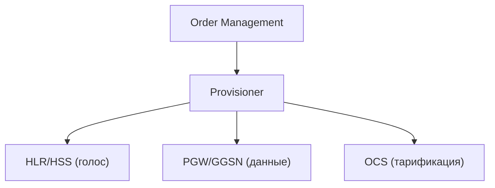
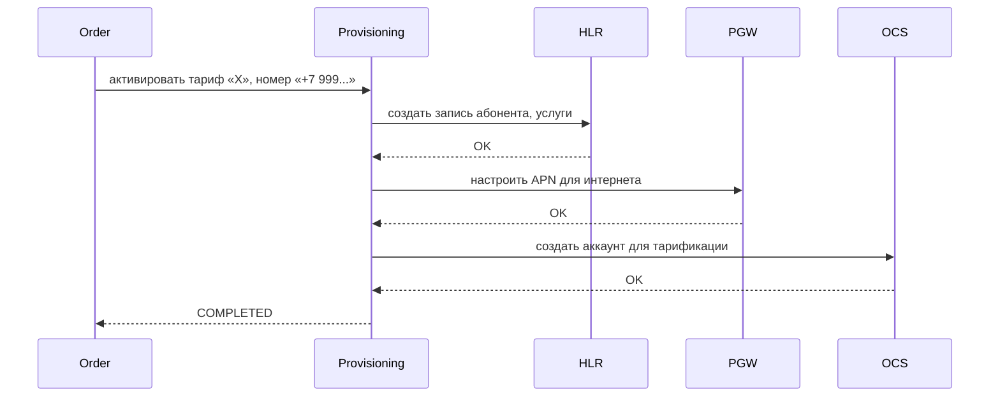
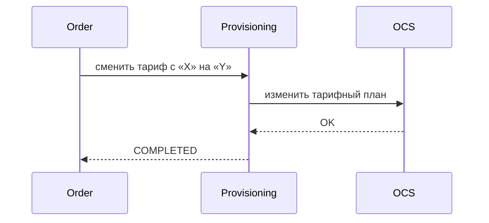
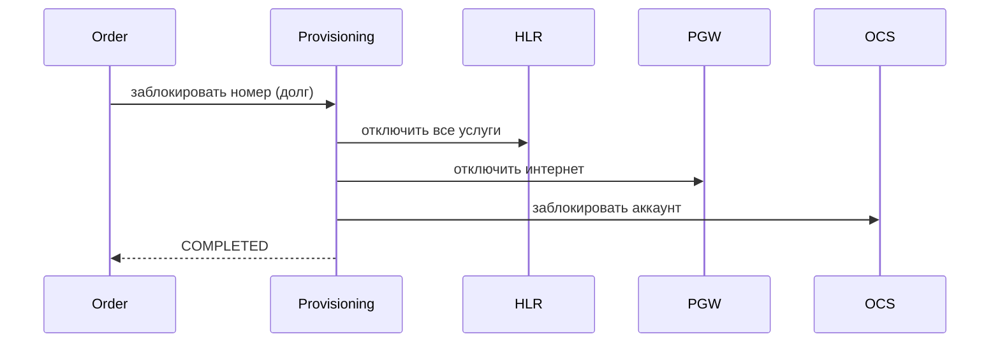
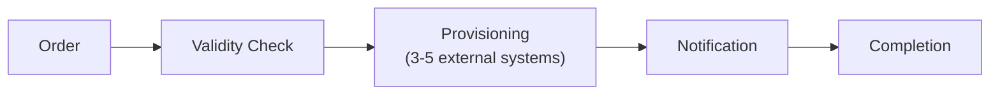

:::info[TL;DR]
Provisioning — мост между BSS и сетью. Получает заказ из Order Management и конфигурирует сетевое оборудование: HLR/HSS (голос), PGW/GGSN (данные), OCS (тарификация). Без Provisioning абонент не получит услугу.
:::

## Для кого эта статья

- SA, работающие над интеграцией BSS и OSS
- Разработчики Provisioning-систем
- Архитекторы, проектирующие активацию услуг

## После прочтения вы узнаете

- Что такое Provisioning и зачем он нужен
- Какие сетевые элементы конфигурирует Provisioning
- Как выглядят типовые сценарии активации, смены тарифа и блокировки
- Какие требования к SLA предъявляются к Provisioning

## Что такое Provisioning

Provisioning (активация) — процесс настройки сети для предоставления услуги абоненту.

## Что конфигурирует Provisioning

| Сетевой элемент | Что настраивает | Протокол |
|----------------|----------------|----------|
| **HLR/HSS** | Голосовые услуги, роуминг, переадресация | MAP/SS7, Diameter, LDAP |
| **PGW/GGSN** | Доступ в интернет, APN, QoS, IP-адрес | RADIUS, Diameter, GTP |
| **OCS** | Тарифный план, квоты, zero-rating | Diameter (Ro, Rf) |
| **SMSC** | SMS-услуги | SMPP, SS7 |
| **MMSC** | MMS | MM7 |
| **VoLTE AS** | VoLTE, IMS | SIP, Diameter (Sh) |

## Типовые сценарии Provisioning

### 1. Активация нового абонента

### 2. Смена тарифа

### 3. Блокировка

## Provisioning-сценарии вне Telecom

**Для аналитика:** лайфхак — понимание Provisioning в Telecom помогает проектировать любые системы, где нужно активировать услугу в подключённых системах (Device Management в IoT, KYC в FinTech, подключение к API-шлюзу).

## Требования к Provisioning (спецификация)

| Параметр | Пример |
|----------|--------|
| SLA на активацию | < 5 мин |
| SLA на смену тарифа | < 1 мин |
| SLA на блокировку | < 30 сек |
| Кол-во сетевых систем | 5+ (HLR, PGW, OCS, SMSC, MMSC) |
| Retry mechanism | 3 попытки с exponential backoff |
| Rollback | Откат всех изменений при ошибке |
| Мониторинг | Алерт при падении успешности ниже 99.5% |

## Пример: Автоматизация Provisioning для оператора с 12M абонентов

**Контекст.** Федеральный оператор (12M абонентов) использовал ручной Provisioning: заказ из CRM попадал в тикет-систему, инженер вручную конфигурировал HLR, PGW и OCS через CLI. Среднее время активации — 4 часа, ошибки человеческого фактора — 8% заказов.

**Задача.** Автоматизировать Provisioning: заказ → автоматическая активация за < 5 минут, zero-touch для 90% сценариев.

**Решение.**
- Внедрён Provisioning-движок с оркестрацией на Camunda BPMN
- 12 адаптеров: HLR (MAP/SS7), PGW (RADIUS/Diameter), OCS (Diameter Ro), SMSC (SMPP)
- Для каждого сценария — BPMN-диаграмма с шагами, retry-механизмом и rollback-компенсацией
- Мониторинг: успешность > 99.5%, алерт при отклонении

**Результат.**
- Среднее время активации: с 4 часов до 3.2 минут
- Ошибки: с 8% до 0.3%
- FTE-экономия: 12 инженеров высвобождены для других задач
- Rollback при сбое: автоматический, среднее время отката — 45 секунд

## Что дальше

- [Регуляторика в Telecom](/docs/specialization/telecom-regulations)
- [5G и IoT](/docs/specialization/telecom-5g-iot)

## Проверь себя

1. **Что делает Provisioning?**
   *Ответ:* Получает заказ из BSS и конфигурирует сетевое оборудование (HLR, PGW, OCS) для предоставления услуги.

2. **Какие системы конфигурирует Provisioning?**
   *Ответ:* HLR/HSS (голос), PGW/GGSN (интернет), OCS (тарификация), SMSC (SMS), VoLTE AS.

3. **Что такое Saga в контексте Provisioning?**
   *Ответ:* Цепочка вызовов: если один шаг упал — откатить предыдущие (rollback). Аналог Saga pattern.

4. **Какие протоколы использует Provisioning для настройки HLR?**
   *Ответ:* MAP/SS7, Diameter, LDAP.

5. **Какой SLA на активацию нового абонента?**
   *Ответ:* < 5 минут (в автоматизированном Provisioning).

## Ссылки

- [3GPP TS 23.002 — Network Architecture](https://www.3gpp.org/specifications)
- [TM Forum — Service Activation and Configuration](https://www.tmforum.org/oda/open-apis/)
- [Camunda BPMN для оркестрации Provisioning](https://camunda.com/)
- [Diameter Protocol — IETF RFC 6733](https://datatracker.ietf.org/doc/html/rfc6733)
