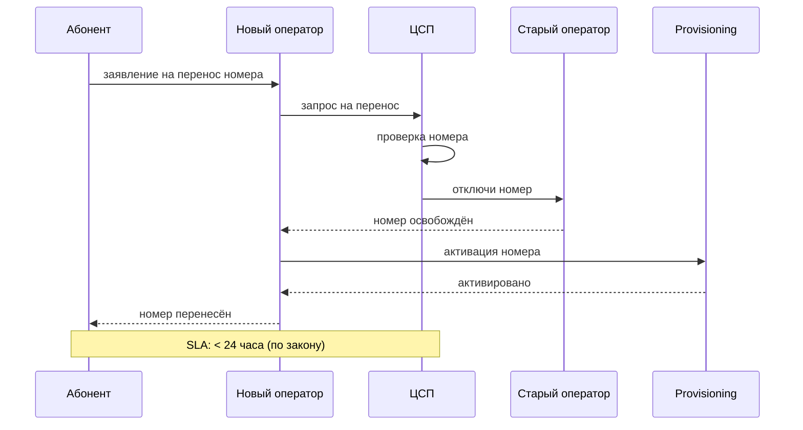

:::info[TL;DR]
Telecom — одна из самых регулируемых отраслей. Ключевые требования: СОРМ (доступ правоохранительных органов к трафику), 152-ФЗ (персональные данные), лицензирование услуг связи, MNP (переносимость номера), anti-fraud и блокировка запрещённых ресурсов (РКН).
:::

## Для кого эта статья

- SA, работающие над compliance-требованиями в Telecom
- Архитекторы BSS/OSS, учитывающие СОРМ и 152-ФЗ
- Юристы и compliance-менеджеры операторов связи

## После прочтения вы узнаете

- Какие регуляторы контролируют Telecom в РФ
- Что такое СОРМ и какие требования к архитектуре
- Как 152-ФЗ влияет на обработку ПД абонентов
- Что нужно для получения лицензии оператора связи

## Основные регуляторы

| Регулятор | Функция | Страна |
|-----------|---------|--------|
| **Минцифры** | Лицензирование, политика | РФ |
| **Роскомнадзор (РКН)** | Надзор, блокировки, ПД | РФ |
| **ФСБ** | СОРМ, криптография | РФ |
| **ФАС** | Антимонопольное регулирование | РФ |
| **ЕС** | GDPR, Digital Markets Act | EU |

## СОРМ — Система Оперативно-Розыскных Мероприятий

**Основное:** оператор обязан предоставить ФСБ доступ к трафику абонента (голос, SMS, интернет).

### Требования СОРМ

| Требование | Описание |
|------------|----------|
| Перехват трафика | Копия всего трафика абонента (по запросу) |
| Идентификация | Номер, IMSI, IMEI, время, базовая станция |
| Хранение записей | 6 месяцев (закон Яровой) |
| Хранение трафика | До 30 суток для интернета |
| Оборудование | СТА (СОРМ технические средства) на сети оператора |
| Удалённый доступ | ФСБ подключается к СТА удалённо |

## 152-ФЗ — Персональные данные

| Требование | Описание |
|------------|----------|
| Согласие | Абонент даёт согласие на обработку ПД |
| Цель обработки | Только для оказания услуг связи |
| Передача третьим | Только с согласия или по закону |
| Локализация | Данные россиян — на серверах в РФ |
| Уведомление РКН | Обработка ПД регистрируется в РКН |

## Лицензирование

**Услуги связи в РФ требуют лицензии Роскомнадзора:**

| Лицензия | Услуга |
|----------|--------|
| **Мобильная связь** | Услуги подвижной радиотелефонной связи |
| **Фиксированная связь** | Услуги местной/внутризоновой связи |
| **Интернет** | Телематические услуги (доступ в интернет) |
| **Передача данных** | За выделением сетей |
| **Междугородная** | Междугородная и международная связь |

**Обязательства по лицензии:**
- Предоставление СОРМ
- Нумерация (выделение номеров)
- Пропуск трафика через ТСО (точки обмена трафиком)
- Оплата в РФ (автоматическое продление)

## Anti-fraud и блокировки

Требования РКН по борьбе с мошенничеством (закон «О связи» ст. 46.1):

- **Блокировка вызовов с подменой номера** — вызовы, где CID не совпадает с реальным номером
- **Anti-fraud платформа** — проверка каждого вызова через систему
- **Блокировка запрещённых сайтов** — по реестру РКН (на уровне оператора)
- **Маркировка звонков** — информирование абонента о входящем вызове от юрлица

## MNP — Mobile Number Portability

**Переносимость номера** — абонент может уйти к другому оператору, сохранив номер.

## Требования к системе (спецификация)

| Параметр | Пример |
|----------|--------|
| СОРМ | Копия трафика + хранение 6 мес |
| 152-ФЗ | Локализация в РФ, согласие |
| Лицензии | 3+ лицензии (мобильная, интернет, передача данных) |
| Anti-fraud | Блокировка вызовов с подменой A-number |
| MNP | Интеграция с ЦСП, SLA 24 часа |
| РКН блокировки | Интеграция с Единым реестром |
| Отчётность | Ежемесячно в РКН и Минцифры |

## Пример: Внедрение СОРМ-3 для оператора с 5M абонентов

**Контекст.** Федеральный оператор (5M абонентов, 10 000 базовых станций) получил предписание РКН о несоответствии СОРМ требованиям «закона Яровой» (ФЗ-374). Старое оборудование СТА не обеспечивало хранение трафика 30 суток и пропускную способность для перехвата 100% сессий.

**Задача.** За 12 месяцев внедрить СОРМ-3: замена СТА, увеличение хранилища до 6 ПБ, интеграция с биллингом для идентификации абонентов.

**Решение.**
- СТА-3 от «РТК-СОРМ» (3 кластера, total 6 ПБ RAW + 3 ПБ метаданных)
- Копирование трафика: SPAN-порты на всех PE-роутерах (10 000 портов)
- DPI-анализ: классификация трафика (VoIP, SMS, HTTP, HTTPS, Telegram, WhatsApp)
- Интеграция с BSS: по MSISDN/IMSI — подтягивание ФИО, адреса, паспортных данных
- Anti-fraud: платформа «Антифрод» от РКН для проверки CID каждого вызова

**Результат.**
- Предписание РКН снято через 11 месяцев
- Перехват: 100% голосовых вызовов, 99.97% интернет-сессий
- Anti-fraud: заблокировано 12 000 вызовов с подменой номера в первый месяц
- Бюджет: 180 млн ₽ (CAPEX) + 24 млн ₽/год (OPEX)

## Что дальше

- [MVNO — виртуальные операторы](/docs/specialization/telecom-mvno)
- [5G и IoT](/docs/specialization/telecom-5g-iot)

## Проверь себя

1. **Что такое СОРМ и какие требования?**
   *Ответ:* Система Оперативно-Розыскных Мероприятий — доступ ФСБ к трафику. Хранение записей 6 месяцев, оборудования СТА на сети оператора.

2. **Какие требования 152-ФЗ для оператора связи?**
   *Ответ:* Согласие абонента на обработку ПД, локализация данных в РФ, уведомление РКН.

3. **Что такое MNP и какой SLA?**
   *Ответ:* Mobile Number Portability — перенос номера к другому оператору. Максимум 24 часа по закону.

4. **Сколько месяцев нужно хранить записи СОРМ по закону Яровой?**
   *Ответ:* 6 месяцев.

5. **Какие лицензии нужны для работы оператора мобильной связи?**
   *Ответ:* Мобильная связь, телематические услуги (интернет), передача данных.

## Ссылки

- [ФЗ «О связи» от 07.07.2003 № 126-ФЗ](http://www.consultant.ru/document/cons_doc_LAW_43224/)
- [152-ФЗ «О персональных данных»](http://www.consultant.ru/document/cons_doc_LAW_61801/)
- [Закон Яровой (ФЗ-374) — требования к СОРМ](http://www.consultant.ru/document/cons_doc_LAW_201079/)
- [РКН — Реестр операторов ПД](https://pd.rkn.gov.ru/)
- [Минцифры — Лицензирование услуг связи](https://digital.gov.ru/ru/activity/directions/8/)
