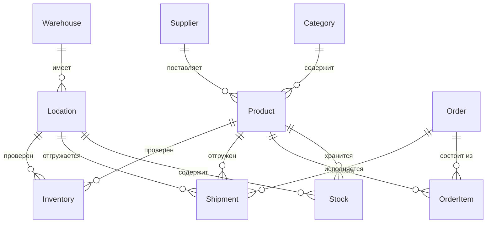

# Проектирование схемы БД

**Тип задачи:** Данные
**Уровень:** Strong Junior
**Оценка времени:** ~90 минут

## Контекст

Вы — системный аналитик в компании, разрабатывающей WMS (Warehouse Management System). Система должна управлять складскими запасами: приёмка товаров от поставщиков, хранение на складе, отгрузка клиентам и инвентаризация.

Бизнес-правила:
- Один товар может храниться в разных ячейках склада
- Одна ячейка может содержать несколько товаров
- При отгрузке товар списывается с конкретной ячейки
- Нужно хранить историю движения товаров (аудит)

## 1. Выделите сущности

| Сущность | Описание | Ключевые атрибуты |
|----------|----------|-------------------|
| Product | Товар | id, name, sku, unit, category_id |
| Category | Категория товара | id, name, parent_id |
| Supplier | Поставщик | id, name, contact, inn |
| Warehouse | Склад | id, name, address |
| Location | Ячейка склада | id, warehouse_id, zone, row, shelf |
| Stock | Остаток (товар в ячейке) | id, product_id, location_id, quantity |
| Order | Заказ клиента | id, customer, created_at, status |
| OrderItem | Строка заказа | id, order_id, product_id, quantity |
| Shipment | Отгрузка | id, order_id, location_id, product_id, quantity, date |
| Inventory | Инвентаризация | id, location_id, product_id, actual_qty, system_qty, date |

## 2. Определите связи

## 3. Нормализация

Проверьте:
- **1НФ:** все атрибуты атомарны (нет списков в одном поле)
- **2НФ:** нет частичной зависимости от составного ключа (Stock: quantity зависит от product_id + location_id) — это ок
- **3НФ:** category_name в Product? Нет, категория вынесена в отдельную таблицу

## 4. Чек-лист

- [ ] Все сущности имеют первичный ключ
- [ ] Внешние ключи настроены для всех связей
- [ ] Типы данных соответствуют смыслу (numeric для цен, date для дат)
- [ ] NOT NULL для обязательных полей
- [ ] UNIQUE constraints для уникальных полей (sku, inn)
- [ ] Достигнута 3НФ
- [ ] ER-диаграмма нарисована
- [ ] Индексы для полей, используемых в WHERE и JOIN

## Пример результата

После выполнения задачи у вас будет ER-диаграмма в draw.io или PlantUML и набор DDL-скриптов, которые создают 10+ таблиц с корректными constraints, внешними ключами и индексами. Схема должна быть в 3НФ и покрывать все бизнес-сценарии.
