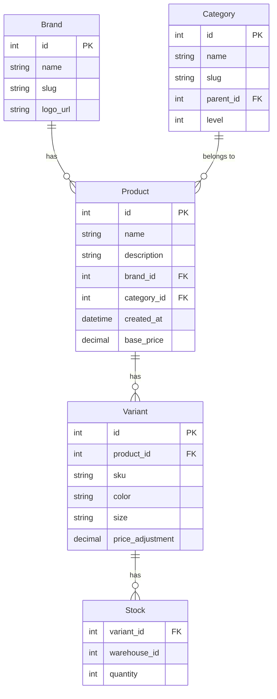
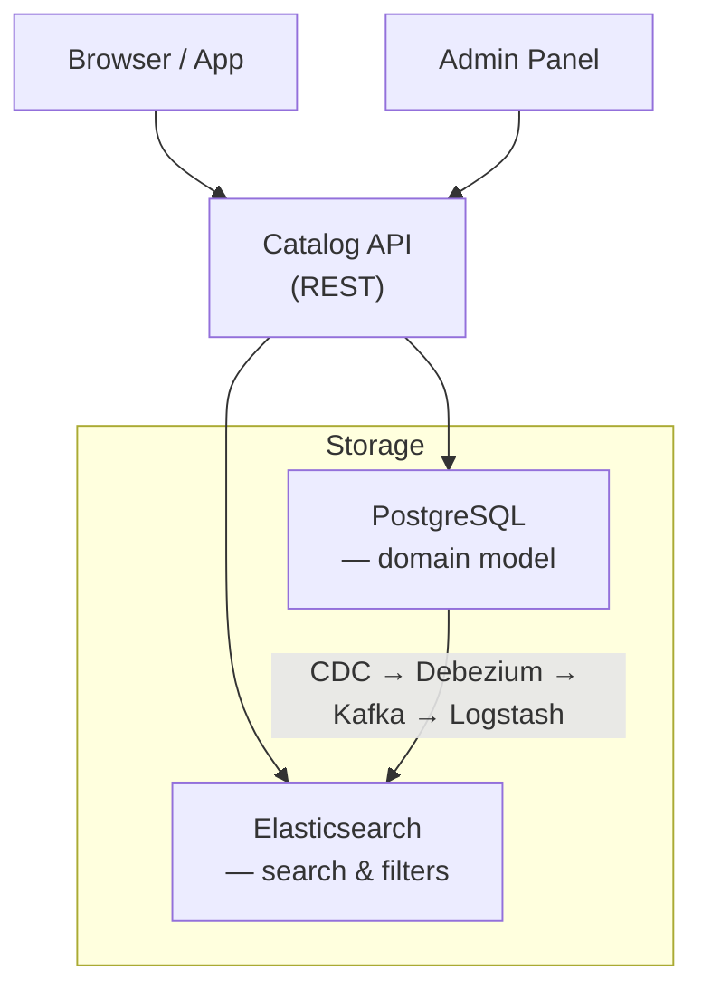

:::info[TL;DR]
Спроектируйте структуру каталога товаров для интернет-магазина. Условие: мультибрендовый магазин одежды, 20 000 SKU, категории иерархические (до 3 уровней), у товара — вариативные характеристики (цвет, размер). Обоснуйте выбор хранения (SQL / NoSQL / Search engine).
:::

## Предпосылки

Вы — системный аналитик в e-commerce компании «Модный Склад». Задача: спроектировать каталог товаров. Магазин продаёт одежду: бренды, категории, товары с вариациями (цвет, размер).

**Требования:**

- 20 000 SKU
- Иерархическая категория (до 3 уровней): `Одежда → Верхняя → Куртки`
- У товара: 1+ вариаций (цвет × размер)
- Каждая вариация — свой остаток (stock) и цена (может отличаться)
- Поиск по названию, бренду, категории
- Фильтры: по цене, цвету, размеру, бренду
- Админка: CRUD для товаров, категорий, брендов

## Задание

Необходимо:

1. **Domain-модель** — нарисовать Mermaid-диаграмму сущностей: Brand, Category, Product, Variant, Stock
2. **Выбор хранилища** — таблица "Плюсы/минусы" для трёх вариантов: SQL (PostgreSQL), MongoDB, Elasticsearch
3. **Архитектурная схема** — Mermaid C4-diagram: Client → BFF → Catalog API → DB / ES
4. **Текстовое обоснование** — почему вы выбрали именно такое решение

## Решение

### 1. Domain-модель

### 2. Выбор хранилища

| Критерий | PostgreSQL | MongoDB | Elasticsearch |
|----------|-----------|---------|-------------|
| **ACID** | ✅ | ❌ (eventual) | ❌ |
| **Иерархическая категория** | ✅ CTE recursive | ✅ nested | ❌ сложно |
| **Вариативные атрибуты** | ⚠️ EAV или JSONB | ✅ документы вложенные | ⚠️ nested |
| **Поиск full-text** | ⚠️ через GIN-индекс | ⚠️ через text index | ✅ отлично |
| **Faceted фильтры** | ⚠️ через GROUP BY | ⚠️ через aggregation | ✅ отлично |
| **CRUD-админка** | ✅ | ✅ | ❌ |

**Рекомендация:** PostgreSQL (Source of Truth) + Elasticsearch (Search). PostgreSQL хранит доменную модель (бренды, категории, товары, вариации, остатки). Elasticsearch — поисковый слой для каталога (full-text + faceted фильтры). Синхронизация — через CDC (Debezium → Kafka).

### 3. Архитектурная схема

### 4. Обоснование

- PostgreSQL — Source of Truth для всех CRUD-операций админки и корзины
- Elasticsearch — для пользовательского поиска (фильтры по цене, цвету, размеру — aggregations)
- CDC (Change Data Capture) — синхронизация без дополнительного кода
- Вариации (Variant) — отдельная таблица, не JSONB, чтобы можно было независимо управлять ценой и остатком

## Критерии приемки

- ✅ Domain-модель покрывает Brand, Category, Product, Variant, Stock
- ✅ Обоснован выбор хранилища (таблица сравнения)
- ✅ Архитектурная схема с Client → BFF → API → DB/ES
- ✅ Описана синхронизация между DB и ES
- ✅ Учтена админка (CRUD)
