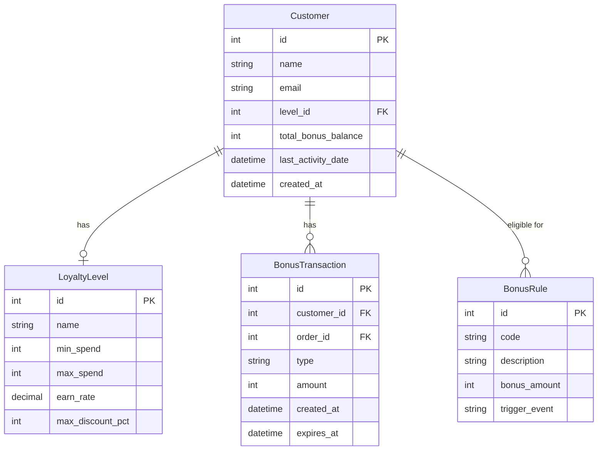
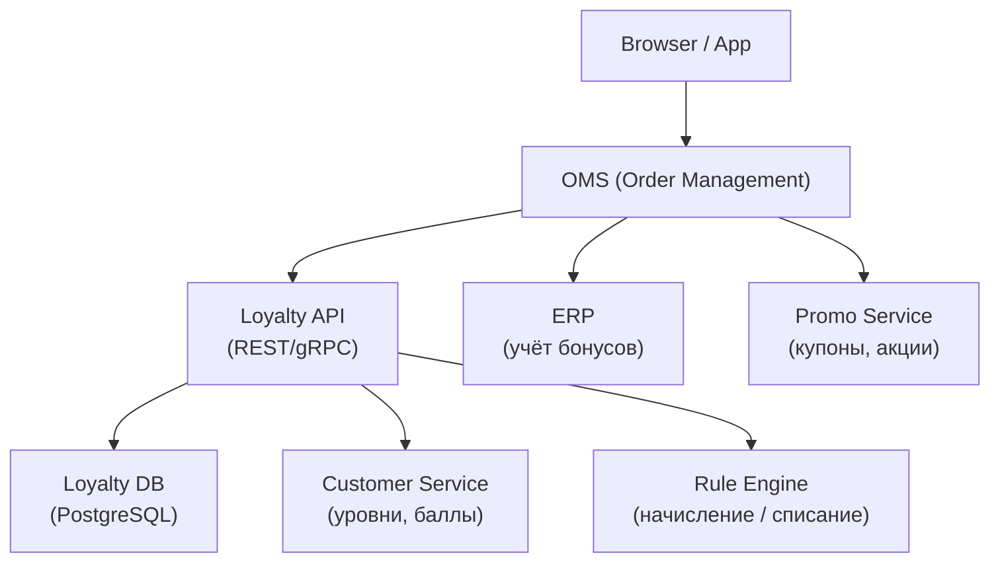
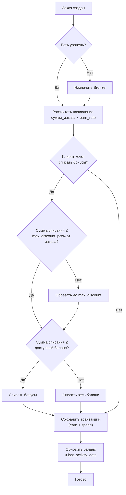

:::info[TL;DR]
Спроектируйте систему лояльности для e-commerce: правила начисления, списания, уровни программы, интеграции. Условие: мультибрендовый магазин одежды, 500 000 клиентов, 50 000 заказов/мес. Результат: domain-модель, архитектура, decision-tree для расчёта бонусов.
:::

## Предпосылки

Вы — системный аналитик в e-commerce компании «Модный Склад». Маркетинг запускает программу лояльности.

**Требования бизнеса:**

- **Уровни:** Bronze (0-9 999 ₽), Silver (10 000-49 999 ₽), Gold (50 000+ ₽)
- **Начисление:** 1% (Bronze) / 3% (Silver) / 5% (Gold) от суммы заказа
- **Списание:** до 30% от стоимости заказа можно оплатить бонусами
- **Бонус = 1 рубль**
- **Сгорание:** через 180 дней без активностей
- **Приветственный бонус:** +500 бонусов при регистрации
- **Бонус за отзыв:** +50 бонусов за отзыв с фото
- **Интеграции:** OMS (начисление/списание), ERP (учёт), Analytics

## Задание

Необходимо:

1. **Domain-модель** — Mermaid ER-диаграмма: Customer, LoyaltyLevel, BonusTransaction, BonusRule
2. **Архитектура** — Mermaid C4: Client → OMS → Loyalty API → Bonus DB
3. **Decision-tree** — Mermaid flowchart: при создании заказа — правила начисления/списания
4. **Таблица операций** — тип, условия, лимиты
5. **Текстовый сценарий** — клиент Silver оформляет заказ на 5 000 ₽, списывает макс бонусов

## Решение

### 1. Domain-модель

### 2. Архитектура

### 3. Decision-tree (расчёт бонусов при оформлении заказа)

### 4. Таблица операций

| Тип операции | Условие | Сумма | Лимиты | Срок жизни |
|-------------|---------|-------|--------|-----------|
| **Earn (заказ)** | DELIVERED | price × earn_rate | Нет | 180 дней |
| **Spend (списание)** | При оформлении | до max_discount_pct% от заказа | Остаток на балансе | — |
| **Welcome (приветственный)** | Регистрация | 500 | Один раз | 180 дней |
| **Review (отзыв)** | Отзыв с фото подтверждён | 50 | 5 отзывов/мес | 180 дней |
| **Expire (сгорание)** | 180 дней без earn | Весь баланс | — | — |
| **Manual (коррекция)** | Оператор / поддержка | любая | Согласование | по правилу |

### 5. Сценарий: Silver → заказ 5 000 ₽

**Исходные данные:**
- Уровень: Silver (earn_rate = 3%)
- Баланс: 1 200 бонусов
- Заказ: 5 000 ₽
- max_discount_pct: 30%

**Расчёт:**
1. Максимум списания: 5 000 × 30% = 1 500 бонусов
2. Доступно: 1 200 бонусов (меньше 1 500)
3. Списание: 1 200 бонусов → к оплате 3 800 ₽
4. Начисление: 3 800 × 3% = 114 бонусов
5. Новый баланс: 0 + 114 = 114 бонусов

## Критерии приемки

- ✅ Domain-модель (Customer, LoyaltyLevel, BonusTransaction, BonusRule)
- ✅ Архитектурная схема (OMS → Loyalty API → DB)
- ✅ Decision-tree (правила начисления/списания)
- ✅ Таблица операций (5+ типов)
- ✅ Числовой пример с расчётом
- ✅ Учтены: уровни, начисление, списание, сгорание, приветственный бонус
