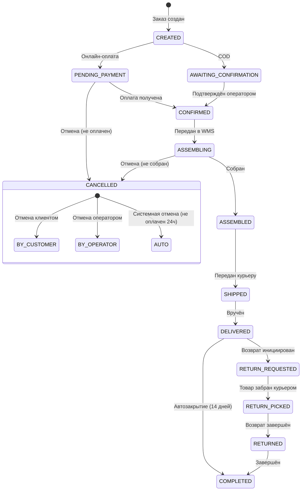

:::info[TL;DR]
Спроектируйте state-machine заказа в OMS: 10+ статусов, переходы, события, side-эффекты (уведомления, интеграции). Условие: мульти-брендовый магазин, оплата картой/Cash+COD, самовывоз/доставка, возвраты. Результат: Mermaid-диаграмма + спецификация статусов в таблице.
:::

## Предпосылки

Вы — системный аналитик в e-commerce компании «Модный Склад». Задача: спроектировать state-machine заказа в OMS.

**Требования:**

- Оплата: онлайн (картой) + наличные (при получении, COD)
- Доставка: курьером, самовывоз (ПВЗ), Почта России
- Поддержка возвратов (полный / частичный)
- Отмена заказа — до момента отгрузки
- Интеграция с WMS (склад) и ERP

## Задание

Необходимо:

1. **State-machine diagram** — Mermaid stateDiagram всех статусов заказа c переходами
2. **Спецификация статусов** — таблица: статус, описание, триггер перехода, side-эффекты, допустимость отмены
3. **Event-таблица** — события, которые OMS публикует при изменении статуса
4. **Текстовое описание** — 2 сценария: "Успешная доставка" и "Возврат после отказа"

## Решение

### 1. State-machine diagram

### 2. Спецификация статусов

| Статус | Описание | Триггер входа | Side-эффекты | Отмена? |
|--------|----------|--------------|-------------|---------|
| **CREATED** | Заказ создан, ожидание оплаты/подтверждения | Клиент нажал «Оформить» | Уведомление клиенту (email/SMS) | ✅ |
| **PENDING_PAYMENT** | Ожидание онлайн-оплаты | Выбран способ «карта» | Редирект на платёжный шлюз | ✅ |
| **AWAITING_CONFIRMATION** | Ожидание подтверждения (COD) | Выбран способ «наличные» | Уведомление оператору | ✅ |
| **CONFIRMED** | Заказ подтверждён | Оплата прошла / оператор подтвердил | Резервирование товара в WMS | ✅ (до сборки) |
| **ASSEMBLING** | Сборка на складе | WMS принял задание | Нет | ❌ |
| **ASSEMBLED** | Товар собран и упакован | WMS подтвердил сборку | Расчёт стоимости доставки | ❌ |
| **SHIPPED** | Передан в доставку | Курьер забрал | Трекинг-номер, уведомление | ❌ |
| **DELIVERED** | Вручён получателю | Подпись / сканирование ПВЗ | Уведомление, проводка в ERP | ❌ |
| **RETURN_REQUESTED** | Клиент запросил возврат | Форма возврата на сайте | Задание курьеру на забор | ❌ |
| **RETURN_PICKED** | Товар забран курьером | Курьер отметил забор | Нет | ❌ |
| **RETURNED** | Возврат завершён | Товар принят на складе | Возврат денег, проводка в ERP | ❌ |
| **CANCELLED** | Заказ отменён | Клиент / оператор / система | Отмена резерва, возврат денег | — |
| **COMPLETED** | Заказ завершён | 14 дней после DELIVERED | Архивация | ❌ |

### 3. Event-таблица

События, которые OMS публикует в шину (Kafka):

| Событие | Payload | Получатель |
|---------|---------|-----------|
| `order.created` | order_id, customer, items, total | WMS, ERP |
| `order.payment_received` | order_id, amount, method | ERP |
| `order.confirmed` | order_id | WMS |
| `order.assembled` | order_id, weight, dimensions | TMS (доставка) |
| `order.shipped` | order_id, tracking_number | Клиент (email), ERP |
| `order.delivered` | order_id | ERP, Лояльность |
| `order.return_requested` | order_id, items | WMS, ERP |
| `order.returned` | order_id, refund_amount | ERP, Лояльность (сторно) |
| `order.cancelled` | order_id, reason | ERP (сторно проводок) |

### 4. Сценарии

**Сценарий 1: Успешный заказ (онлайн-оплата)**
1. Клиент оформляет заказ → CREATED
2. Оплачивает картой → PENDING_PAYMENT → CONFIRMED
3. WMS собирает → ASSEMBLING → ASSEMBLED
4. Курьер забирает → SHIPPED
5. Клиент получает → DELIVERED
6. Через 14 дней → COMPLETED

**Сценарий 2: Возврат после доставки**
1-5 как выше до DELIVERED
6. Клиент заполняет форму возврата (брак) → RETURN_REQUESTED
7. Курьер забирает товар → RETURN_PICKED
8. Склад принимает, проверяет → RETURNED
9. ERP: сторно проводки, возврат денег

## Критерии приемки

- ✅ State-machine с 10+ статусами и переходами
- ✅ Таблица с описанием каждого статуса и side-эффектами
- ✅ Event-таблица (Kafka-топики)
- ✅ 2 текстовых сценария
- ✅ Учтены: онлайн-оплата, COD, возвраты, отмена
