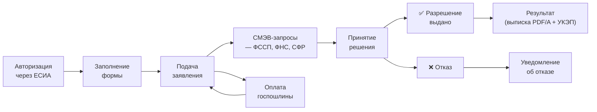

:::info[TL;DR]
Спроектировать госуслугу «Выдача разрешения на такси» на портале ЕПГУ: схема жизненного цикла, ЕСИА-интеграция, СМЭВ-запросы (ФССП, ФНС, СФР), форма заявления (10+ полей), результат (выписка с УКЭП). Заявитель — ИП/юрлицо, услуга полностью электронная.
:::

## Контекст

Региональный МФЦ запускает услугу «Выдача разрешения на такси» на портале госуслуг.

**Характеристики:**
- Заявитель: ИП или юрлицо, авторизованное через ЕСИА
- Услуга полностью электронная (без личного визита)
- Срок: 15 рабочих дней (по 59-ФЗ)
- СМЭВ-запросы: долги (ФССП), ИНН (ФНС), статус (СФР)
- Результат: выписка о выдаче разрешения (PDF/A + УКЭП)

## Цель задачи

Спроектировать услугу: схема lifecycle, ЕСИА-интеграция, СМЭВ-запросы, форма, результат.

## Пошаговый подход

### Шаг 1: Жизненный цикл услуги



**Статусная модель:**

| Статус | Описание | Ответственный |
|--------|----------|--------------|
| Черновик | Форма не отправлена | Заявитель |
| Подано | Заявление отправлено, пошлина оплачена | Система (авто) |
| СМЭВ-запросы | Межведомственные запросы в работе | Система (авто) |
| На рассмотрении | МФЦ обрабатывает | Оператор МФЦ |
| Разрешение выдано | Положительное решение | МФЦ |
| Отказ | Отрицательное решение | МФЦ |
| Результат отправлен | Выписка/уведомление в ЛК | Система (авто) |

### Шаг 2: ЕСИА-интеграция

**Данные из ЕСИА (автозаполнение):**

| Поле | Из ЕСИА | Источник |
|------|---------|----------|
| ФИО | ✅ | SAML-ответ |
| СНИЛС | ✅ | SAML-ответ |
| ИНН | ✅ | SAML-ответ (если зарегистрирован) |
| Дата рождения | ✅ | SAML-ответ |
| Телефон | ✅ | ЕСИА-профиль |
| Email | ✅ | ЕСИА-профиль |

**Данные, которые запрашиваются у заявителя (не в ЕСИА):**

| Поле | Тип | Обязательно |
|------|-----|-------------|
| Марка автомобиля | Текст | Да |
| Модель автомобиля | Текст | Да |
| Госномер | Текст (формат A123AA77) | Да |
| VIN | Текст (17 символов) | Да |
| Год выпуска | Число (2000-2025) | Да |
| Тип топлива | Выбор: бензин/дизель/электро/гибрид | Да |
| Количество мест | Число (4-8) | Да |
| Наличие таксометра | Да/Нет | Да |
| Район работы | Выбор из списка районов | Да |
| Согласие на обработку ПД | Чекбокс | Да |

### Шаг 3: СМЭВ-запросы

| Вид сведений | Поставщик | Тип | Таймаут | Что проверяем |
|-------------|-----------|-----|---------|--------------|
| Наличие задолженностей | ФССП | Синхронный | 10 сек | ИП/юрлицо не должно быть в списке должников |
| ИНН / статус ИП | ФНС | Синхронный | 10 сек | ИП существует, не закрыто |
| СНИЛС / статус | СФР | Синхронный | 10 сек | СНИЛС действителен, нет долгов по взносам |

**Правила обработки:**

| Результат | Действие |
|-----------|----------|
| Все СМЭВ-запросы успешны | → Статус «На рассмотрении» |
| Есть долги (ФССП) | → Автоматический отказ: «Заявитель имеет непогашенные задолженности» |
| ИП не найден (ФНС) | → Отказ: «ИП не зарегистрировано» |
| Один из запросов упал (таймаут) | → Retry 2 раза, если не успех → статус «Ожидание оператора» (ручная проверка) |

### Шаг 4: Форма заявления

**Структура формы (10+ полей):**

```
Раздел 1: Данные заявителя (из ЕСИА, нередактируемые)
  1. ФИО — заполнено из ЕСИА
  2. ИНН — заполнено из ЕСИА
  3. СНИЛС — заполнено из ЕСИА

Раздел 2: Данные автомобиля
  4. Марка — text, required
  5. Модель — text, required
  6. Госномер — regex: [A-Z]{1}\d{3}[A-Z]{2}\d{2,3}, required
  7. VIN — regex: [A-HJ-NPR-Z0-9]{17}, required
  8. Год выпуска — number, 2000-2025, required
  9. Тип топлива — select: бензин/дизель/электро/гибрид
  10. Количество мест — number 4-8
  11. Наличие таксометра — checkbox

Раздел 3: Документы (прикрепление файлов)
  12. СТС — сканированная копия (PDF, до 10 MB)
  13. Договор лизинга (если авто не в собственности) — PDF, до 10 MB

Раздел 4: Подтверждение
  14. Согласие на обработку ПД — checkbox, required
  15. Код подтверждения из SMS — верификация
```

### Шаг 5: Результат

**При положительном решении:**

```
Формат: PDF/A-2 (ISO 19005-2) + откреплённая УКЭП (.sig)
Состав:
  - Номер разрешения: LICENSE-2025-00123
  - ФИО / ИНН заявителя
  - Госномер, марка, модель автомобиля
  - Срок действия: 5 лет
  - Дата выдачи: 2025-01-01
  - Подпись УКЭП уполномоченного МФЦ (КриптоПро, Рутокен)
  - QR-код со ссылкой на проверку подлинности

Способ получения:
  1. Личный кабинет ЕПГУ → скачать
  2. Email (дубликат)
  3. Запись в реестр выданных разрешений (внутренний реестр)
```

**При отказе:**

```
Формат: PDF/A + УКЭП
Содержание:
  - Причина отказа (со ссылкой на НПА):
    - «Заявитель имеет непогашенные задолженности (ФССП)»
    - «ИП не зарегистрировано (ФНС)»
    - «Автомобиль не соответствует требованиям»
  - Срок обжалования: 30 дней (КоАП РФ)
```

## Критерии приемки

- [ ] Схема жизненного цикла содержит 6 статусов
- [ ] ЕСИА: 6 полей из профиля, 10+ полей в форме
- [ ] СМЭВ-запросы: 3 запроса с видом сведений, поставщиком, таймаутом
- [ ] Форма: 15 полей с описанием (тип, required, формат)
- [ ] Результат: PDF/A + УКЭП, описан состав выписки

## Пример хорошего результата

**Фрагмент спецификации:**

```
Услуга: Выдача разрешения на такси
Срок: 15 рабочих дней (59-ФЗ)
Пошлина: 5 000 ₽ (ГИС ГМП)

ЕСИА: ФИО, СНИЛС, ИНН, дата рождения, телефон, email — автозаполнение
Форма: марка, модель, госномер (A123AA77), VIN (17 символов), год (2000+), тип топлива

СМЭВ:
  1. ФССП — долги (синхр., 10 сек) → если есть → отказ
  2. ФНС — ИНН/статус (синхр., 10 сек) → если закрыт → отказ
  3. СФР — СНИЛС (синхр., 10 сек) → если недействителен → отказ

Результат: PDF/A-2 + УКЭП, ЛК + email
  Содержит: номер, ФИО, госномер, срок, QR-код
```

## Типичные ошибки

- **Данные из ЕСИА не используются.** Форма просит ввести ФИО, паспорт, СНИЛС — хотя всё это есть в ЕСИА. Нарушение 210-ФЗ (принцип однократности).
- **СМЭВ-запрос без проверки полномочий.** Система запрашивает данные, на которые у неё нет права → 403. Нужно заранее настроить ЕСИА-полномочия.
- **Форма без валидации.** VIN из 10 символов → ошибка в ФНС. Должен быть regex-контроль.
- **Результат без УКЭП.** PDF без подписи не имеет юридической силы. Документ обязан быть подписан УКЭП уполномоченного лица.
- **Нет контроля срока по 59-ФЗ.** Если услуга не оказана за 30 дней — штраф. Система должна отслеживать просрочку и уведомлять руководителя.

## Связанные материалы

- [Статья: Госуслуги и порталы](/docs/specialization/govtech-portal) — теория порталов
- [Статья: СМЭВ](/docs/specialization/govtech-smev) — межведомственные запросы
- [Технология: Криптография](/tech/crypto) — УКЭП для результата
- [Задача: Интеграция с СМЭВ](/tasks/gov-smev-integration) — детальная спецификация СМЭВ
- [Задача: Аттестация ГИС](/tasks/gov-security-audit) — защита услуги по ФСТЭК
